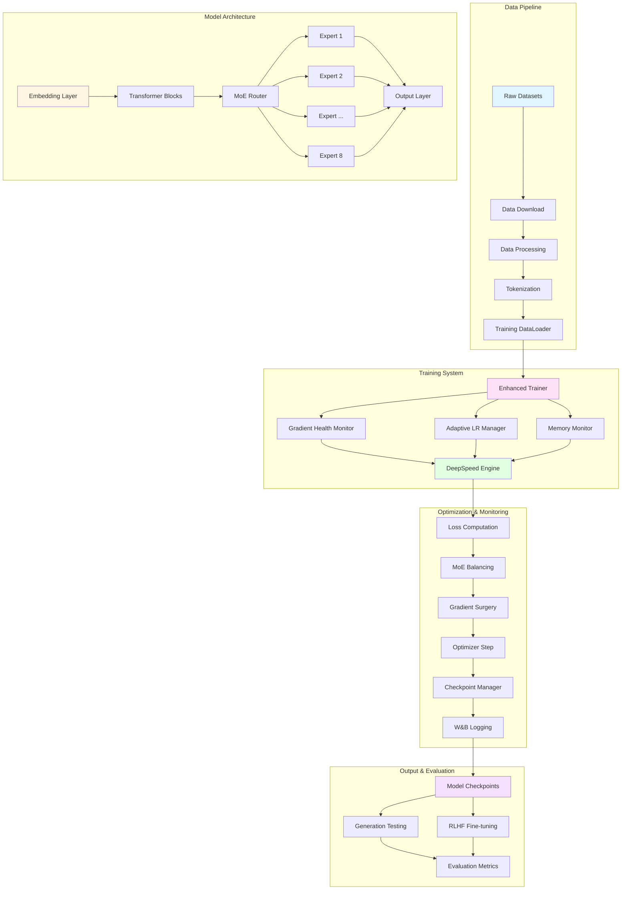
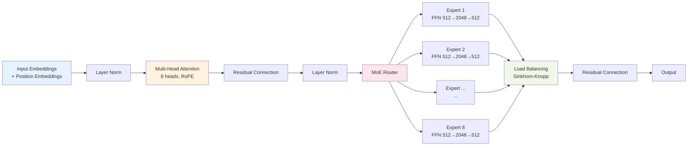
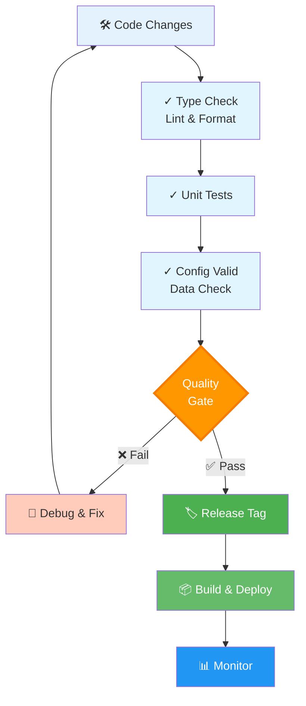
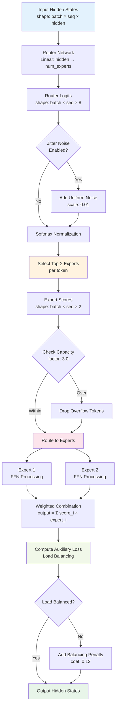
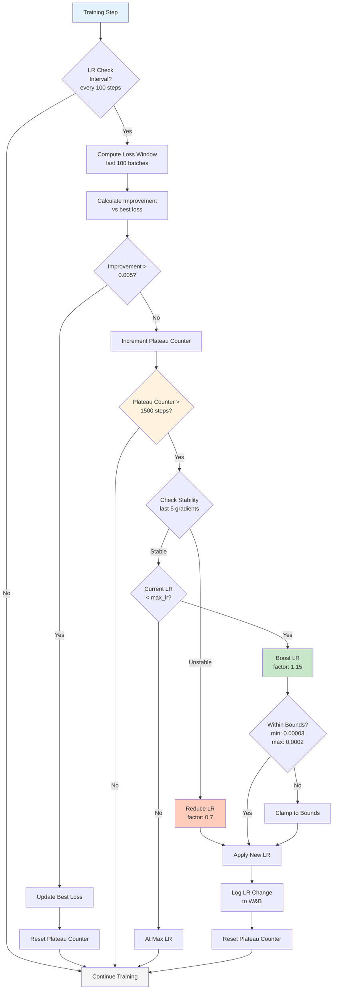
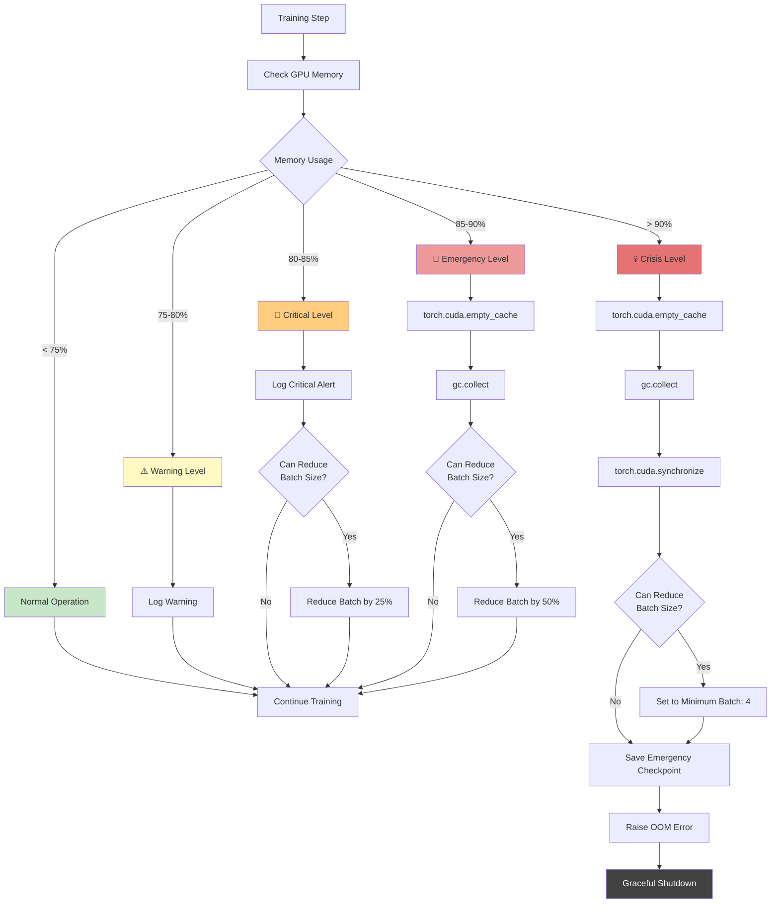
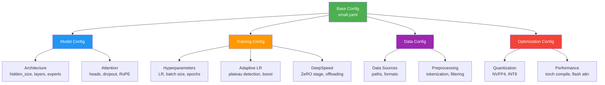

# Ava LLM Training Framework

> Production-ready framework for training state-of-the-art Mixture of Experts (MoE) language models with comprehensive stability enhancements, distributed training support, and advanced optimization techniques.

[]()
[]()
[]()
[]()

---

## Table of Contents

- [Overview](#overview)
- [Architecture](#architecture)
- [Development Pipeline](#development-pipeline)
- [Training Pipeline Flowcharts](#training-pipeline-flowcharts)
- [Quick Start](#quick-start)
- [Model Sizes & Requirements](#model-sizes--requirements)
- [Key Features](#key-features)
- [Project Structure](#project-structure)
- [Configuration System](#configuration-system)
- [Training Stages](#training-stages)
- [Advanced Features](#advanced-features)
- [Troubleshooting](#troubleshooting)
- [Documentation](#documentation)

---

## Overview

Ava is a comprehensive LLM training framework implementing **8 phases of critical enhancements** for stable and efficient Mixture of Experts (MoE) model training. The framework contains ~32,772 lines of Python across 50+ active modules and is designed for both research and production use.

### Key Highlights

- **MoE Architecture**: Switch Transformer-based routing with 8 experts (configurable)
- **Production-Ready**: Battle-tested with comprehensive stability fixes
- **Distributed Training**: DeepSpeed integration with ZeRO optimization
- **RLHF Support**: Full Proximal Policy Optimization (PPO) pipeline
- **Advanced Optimization**: Adaptive learning rates, gradient surgery, quantization
- **Comprehensive Monitoring**: Real-time health dashboard and W&B integration

---

## Architecture

### High-Level System Architecture



### Transformer Layer Architecture



---

## Development Pipeline

### Overview

The Ava development pipeline encompasses the complete workflow from local development through testing, integration, and production deployment. This section documents best practices, tools, and automation for maintaining code quality and enabling rapid iteration.

### Development Pipeline Architecture



### Development Workflow Steps

#### 1. Local Development Environment Setup

```bash
# Clone and install
git clone https://github.com/yourusername/ava-llm.git
cd ava-llm

# Create virtual environment
python -m venv venv
source venv/bin/activate  # On macOS/Linux
# or
python -m venv venv
venv\Scripts\activate  # On Windows

# Install development dependencies
pip install -r requirements.txt
pip install -r requirements-dev.txt  # Optional: dev tools

# Install pre-commit hooks
pre-commit install
```

#### 2. Code Development & Testing

```bash
# Make code changes in your feature branch
git checkout -b feature/your-feature

# Type checking with Pyright
pyright code/src/Ava/

# Format code with Black
black code/src/Ava/
black code/scripts/

# Sort imports with isort
isort code/src/Ava/
isort code/scripts/

# Lint with Ruff
ruff check code/src/Ava/ --fix
ruff check code/scripts/ --fix

# Run unit tests
pytest tests/ -v
pytest tests/ --cov=code/src/Ava/  # With coverage
```

#### 3. Pre-Flight Validation

Before training, run validation checks:

```bash
# Configuration validation
python -c "
from code.src.Ava.config import ConfigValidator
validator = ConfigValidator()
validator.validate_config('code/configs/gpu/small.yaml')
validator.generate_report()
"

# Data pipeline validation
python code/scripts/2_data_prep/process_all_data.py --validate-only

# Feature compatibility check
python -c "
from code.src.Ava.config import CompatibilityMatrix
matrix = CompatibilityMatrix()
matrix.check_compatibility('code/configs/gpu/small.yaml')
matrix.print_report()
"
```

#### 4. Quick Integration Test (Optional)

For rapid iteration, run a quick training smoke test:

```bash
# Quick test: 100 steps with tiny model
python code/scripts/5_training/train.py \
  --config code/configs/gpu/tiny.yaml \
  --max-steps 100 \
  --eval-steps 50 \
  --save-steps 100 \
  --experiment-name test_ci
```

#### 5. Documentation & Commit

```bash
# Update documentation if needed
# - Update code/docs/ if feature adds new capability
# - Update CHANGELOG.md with changes
# - Update README.md for user-facing changes

# Stage and commit
git add .
git commit -m "feat: add amazing feature"

# Follow conventional commits:
# feat: new feature
# fix: bug fix
# docs: documentation
# test: tests
# refactor: code refactoring
# perf: performance improvement
```

#### 6. Create Pull Request

```bash
# Push to remote
git push origin feature/your-feature

# Create PR on GitHub with:
# - Clear description of changes
# - Link to related issues
# - Test results and screenshots (if UI changes)
# - Reviewer checklist completion
```

#### 7. Code Review & Merge

```bash
# Address review feedback
git add .
git commit -m "refactor: address review feedback"
git push origin feature/your-feature

# After approval, merge to main
git checkout main
git pull origin main
git merge feature/your-feature
git push origin main
```

### CI/CD Pipeline Configuration

#### GitHub Actions Workflow

Create `.github/workflows/ci.yml`:

```yaml
name: CI Pipeline

on:
  push:
    branches: [ main, develop ]
  pull_request:
    branches: [ main, develop ]

jobs:
  code-quality:
    runs-on: ubuntu-latest
    steps:
      - uses: actions/checkout@v3
      
      - name: Set up Python
        uses: actions/setup-python@v4
        with:
          python-version: '3.10'
      
      - name: Install dependencies
        run: |
          pip install -r requirements.txt
          pip install -r requirements-dev.txt
      
      - name: Type checking (Pyright)
        run: pyright code/src/Ava/
      
      - name: Linting (Ruff)
        run: |
          ruff check code/src/Ava/
          ruff check code/scripts/
      
      - name: Format check (Black)
        run: black --check code/src/Ava/
      
      - name: Import sorting (isort)
        run: isort --check-only code/src/Ava/

  unit-tests:
    runs-on: ubuntu-latest
    strategy:
      matrix:
        python-version: ['3.8', '3.9', '3.10', '3.11']
    
    steps:
      - uses: actions/checkout@v3
      
      - name: Set up Python ${{ matrix.python-version }}
        uses: actions/setup-python@v4
        with:
          python-version: ${{ matrix.python-version }}
      
      - name: Install dependencies
        run: |
          pip install -r requirements.txt
          pip install pytest pytest-cov
      
      - name: Run tests
        run: pytest tests/ -v --cov=code/src/Ava/
      
      - name: Upload coverage
        uses: codecov/codecov-action@v3

  integration-tests:
    runs-on: ubuntu-latest
    if: github.event_name == 'pull_request'
    
    steps:
      - uses: actions/checkout@v3
      
      - name: Set up Python
        uses: actions/setup-python@v4
        with:
          python-version: '3.10'
      
      - name: Install dependencies
        run: |
          pip install -r requirements.txt
      
      - name: Config validation
        run: |
          python -c "
          from code.src.Ava.config import ConfigValidator
          validator = ConfigValidator()
          for config in ['tiny', 'small', 'base']:
              validator.validate_config(f'code/configs/gpu/{config}.yaml')
          "
      
      - name: Data pipeline test
        run: python code/scripts/2_data_prep/process_all_data.py --validate-only
      
      - name: Quick training smoke test
        run: |
          python code/scripts/5_training/train.py \
            --config code/configs/gpu/tiny.yaml \
            --max-steps 10 \
            --experiment-name ci_test
```

### Development Best Practices

#### Code Quality Standards

**Type Hints:**
```python
# Good: Clear type hints
def process_batch(
    batch: Dict[str, torch.Tensor],
    model: nn.Module,
    loss_fn: Callable[[torch.Tensor, torch.Tensor], torch.Tensor]
) -> Dict[str, float]:
    """Process a batch and return metrics."""
    outputs = model(batch)
    loss = loss_fn(outputs, batch["labels"])
    return {"loss": loss.item()}

# Avoid: No type hints
def process_batch(batch, model, loss_fn):
    outputs = model(batch)
    loss = loss_fn(outputs, batch["labels"])
    return {"loss": loss.item()}
```

**Docstrings:**
```python
def adaptive_lr_update(
    current_loss: float,
    best_loss: float,
    patience: int,
    learning_rate: float
) -> Tuple[float, int, bool]:
    """
    Update learning rate based on loss plateau.
    
    Args:
        current_loss: Current validation loss
        best_loss: Best validation loss seen
        patience: Steps without improvement
        learning_rate: Current learning rate
    
    Returns:
        Tuple of:
        - new_learning_rate: Updated learning rate
        - new_patience: Updated patience counter
        - should_reduce: Whether LR was reduced
    
    Example:
        >>> new_lr, new_pat, reduced = adaptive_lr_update(
        ...     current_loss=5.2, best_loss=5.0, patience=100, learning_rate=0.0001
        ... )
    """
    improvement = best_loss - current_loss
    if improvement > 0.005:
        return learning_rate, 0, False
    else:
        return learning_rate * 0.7, patience + 1, True
```

**Error Handling:**
```python
# Good: Specific exceptions with context
try:
    data = load_dataset(path)
except FileNotFoundError as e:
    logger.error(f"Data file not found at {path}: {e}")
    raise
except ValueError as e:
    logger.error(f"Invalid data format: {e}")
    # Fallback or recovery
    data = load_default_data()

# Avoid: Bare except
try:
    data = load_dataset(path)
except:
    pass
```

#### Testing Best Practices

**Unit Test Structure:**
```python
# tests/test_adaptive_lr.py
import pytest
from code.src.Ava.training.adaptive_lr import AdaptiveLRManager

class TestAdaptiveLRManager:
    """Test suite for AdaptiveLRManager."""
    
    @pytest.fixture
    def manager(self):
        """Create manager instance."""
        return AdaptiveLRManager(
            initial_lr=0.0001,
            min_lr=0.00003,
            max_lr=0.0002
        )
    
    def test_reduce_lr_on_plateau(self, manager):
        """Test LR reduction on plateau."""
        original_lr = manager.current_lr
        manager.update(loss=5.0, is_improvement=False, plateau_steps=100)
        assert manager.current_lr < original_lr
    
    def test_increase_lr_on_recovery(self, manager):
        """Test LR increase on loss improvement."""
        manager.current_lr = 0.00005
        manager.update(loss=4.8, is_improvement=True, plateau_steps=0)
        assert manager.current_lr > 0.00005
    
    def test_bounds_enforcement(self, manager):
        """Test LR stays within bounds."""
        manager.update(loss=3.0, is_improvement=True, plateau_steps=0)
        assert manager.current_lr <= manager.max_lr
        
        manager.update(loss=10.0, is_improvement=False, plateau_steps=2000)
        assert manager.current_lr >= manager.min_lr
```

**Mocking External Dependencies:**
```python
from unittest.mock import Mock, patch

def test_training_with_mock_dataloader():
    """Test training with mocked dataloader."""
    mock_dataloader = Mock()
    mock_dataloader.__iter__.return_value = [
        {"input_ids": torch.randn(4, 256), "labels": torch.randn(4, 256)}
        for _ in range(10)
    ]
    
    trainer = EnhancedTrainer(model=model, dataloader=mock_dataloader)
    trainer.train_step()
    
    assert mock_dataloader.__iter__.called
```

### Release Management

#### Version Numbering (Semantic Versioning)

```
MAJOR.MINOR.PATCH[-prerelease][+metadata]

Examples:
- 2.3.0      # Release
- 2.4.0-rc1  # Release candidate
- 2.4.0-dev  # Development
```

**When to increment:**
- `MAJOR`: Breaking changes (incompatible API changes)
- `MINOR`: New features (backward compatible)
- `PATCH`: Bug fixes (backward compatible)

#### Release Checklist

```markdown
# Release v2.4.0 Checklist

## Pre-Release
- [ ] All tests passing on main branch
- [ ] Code reviewed and approved
- [ ] Documentation updated
- [ ] CHANGELOG.md updated with all changes
- [ ] Dependencies updated and tested
- [ ] Performance benchmarks run and documented

## Release
- [ ] Create git tag: `git tag -a v2.4.0 -m "Release v2.4.0"`
- [ ] Push tag: `git push origin v2.4.0`
- [ ] Create GitHub Release with changelog
- [ ] Build release artifacts
- [ ] Upload to PyPI (if applicable)

## Post-Release
- [ ] Update version in code/pyproject.toml
- [ ] Create v2.5.0-dev branch
- [ ] Announce release in discussions
- [ ] Monitor for issues
```

#### CHANGELOG Format

```markdown
# Changelog

All notable changes to this project will be documented in this file.

The format is based on [Keep a Changelog](https://keepachangelog.com/en/1.0.0/),
and this project adheres to [Semantic Versioning](https://semver.org/spec/v2.0.0.html).

## [2.4.0] - 2025-02-15

### Added
- Adaptive multi-token prediction for faster inference
- RAG integration with vector database support
- Quantization with NVFP4 format
- Gradient surgery (PCGrad, GradNorm) support
- Performance dashboard for real-time monitoring

### Changed
- Improved memory efficiency in MoE routing (8% reduction)
- Enhanced gradient health monitoring with adaptive thresholds
- Simplified configuration system with better validation

### Fixed
- Fixed OOM on distributed training with ZeRO-3
- Corrected learning rate scheduler edge cases
- Resolved data pipeline corruption handling

### Deprecated
- `legacy_router.py` - Use new DeepSeek router instead

## [2.3.0] - 2025-01-20
...
```

### Monitoring & Observability

#### Logging Strategy

```python
from code.src.Ava.logging import get_logger

logger = get_logger(__name__, level="INFO")

# Log levels:
logger.debug("Detailed diagnostic information")      # Development only
logger.info("General informational messages")        # Training progress
logger.warning("Warning messages for issues")        # Memory warnings
logger.error("Error messages for failures")          # Training failures
logger.critical("Critical errors requiring action")  # System failures
```

#### Metrics to Track

```python
# Training metrics
metrics = {
    "loss/train": float,           # Training loss
    "loss/validation": float,      # Validation loss
    "learning_rate": float,        # Current LR
    "gradient_norm": float,        # Global gradient norm
    "expert_load": Dict[int, float], # Expert utilization
    "throughput_tokens_per_sec": float,
    "memory_usage_gb": float,
    "steps_per_second": float
}

# Quality metrics
quality_metrics = {
    "perplexity": float,           # Lower is better
    "distinct_2": float,           # 0-1, higher is better (diversity)
    "coherence_score": float,      # 0-100, higher is better
    "repetition_rate": float,      # 0-1, lower is better
    "entropy": float               # Information content
}
```

#### Weights & Biases Integration

```python
import wandb

# Initialize W&B
wandb.init(
    project="ava-llm",
    name="experiment_name",
    config=config_dict,
    tags=["training", "small-model"],
    notes="Experiment description"
)

# Log metrics during training
wandb.log({
    "loss/train": train_loss,
    "loss/validation": val_loss,
    "learning_rate": current_lr,
    "gradient_norm": grad_norm,
    "step": step
})

# Log evaluation results
wandb.log({
    "eval/perplexity": perplexity,
    "eval/distinct_2": distinct_2,
    "eval/coherence": coherence_score
})

# Save artifacts
wandb.save("checkpoints/model.pt")
wandb.save("logs/training.log")

# Finish run
wandb.finish()
```

---

## Training Pipeline Flowcharts

### Complete Training Flow

```mermaid
flowchart TD
    Start([Start Training]) --> Init[Initialize Configuration]
    Init --> PreFlight{Pre-Flight Validation}

    PreFlight -->|Failed| ErrorReport[Generate Error Report]
    ErrorReport --> End([Exit])

    PreFlight -->|Passed| DataSetup[Setup Data Pipeline]
    DataSetup --> ModelInit[Initialize Model]
    ModelInit --> OptimizerSetup[Setup Optimizer & Scheduler]
    OptimizerSetup --> DeepSpeed[Initialize DeepSpeed Engine]

    DeepSpeed --> WarmupPhase[Warmup Phase<br/>3% of total steps]
    WarmupPhase --> TrainingLoop{Training Loop}

    TrainingLoop --> ForwardPass[Forward Pass]
    ForwardPass --> LossCalc[Loss Calculation<br/>+ MoE Balancing]
    LossCalc --> GradHealthCheck{Gradient Health OK?}

    GradHealthCheck -->|Unhealthy| ReduceLR[Reduce Learning Rate]
    ReduceLR --> BackwardPass
    GradHealthCheck -->|Healthy| BackwardPass[Backward Pass]

    BackwardPass --> GradSurgery{Gradient Surgery<br/>Enabled?}
    GradSurgery -->|Yes| ApplySurgery[Apply PCGrad/GradNorm]
    GradSurgery -->|No| GradClip
    ApplySurgery --> GradClip[Gradient Clipping]

    GradClip --> OptimizerStep[Optimizer Step]
    OptimizerStep --> MemCheck{Memory Check}

    MemCheck -->|>90% Usage| EmergencyClean[Emergency Cache Clear]
    MemCheck -->|OK| AdaptiveLR
    EmergencyClean --> AdaptiveLR{Adaptive LR<br/>Enabled?}

    AdaptiveLR -->|Yes + Plateau| BoostLR[Boost LR by 15%]
    AdaptiveLR -->|No Plateau| Logging
    BoostLR --> Logging[Log Metrics to W&B]

    Logging --> EvalCheck{Evaluation<br/>Step?}
    EvalCheck -->|Yes| Evaluate[Run Validation]
    EvalCheck -->|No| SaveCheck
    Evaluate --> SaveCheck{Save<br/>Checkpoint?}

    SaveCheck -->|Yes| SaveModel[Save Model + Metadata]
    SaveCheck -->|No| MoreSteps
    SaveModel --> MoreSteps{More Steps?}

    MoreSteps -->|Yes| TrainingLoop
    MoreSteps -->|No| FinalEval[Final Evaluation]

    FinalEval --> SaveFinal[Save Final Checkpoint]
    SaveFinal --> Complete([Training Complete])

    style Start fill:#4caf50,color:#fff
    style PreFlight fill:#ff9800,color:#fff
    style TrainingLoop fill:#2196f3,color:#fff
    style Complete fill:#4caf50,color:#fff
    style ErrorReport fill:#f44336,color:#fff
```



### Data Pipeline Flow

```mermaid
flowchart LR
    subgraph "Stage 1: Download"
        A[HuggingFace Datasets] --> B[unified_download.py]
        B --> C[Priority Tier 1<br/>10 datasets]
        B --> D[Priority Tier 2<br/>20 datasets]
        B --> E[Priority Tier 3<br/>20+ datasets]
    end

    subgraph "Stage 2: Processing"
        C --> F[Format Detection<br/>10-sample confidence]
        D --> F
        E --> F
        F --> G{Format Type?}
        G -->|JSONL| H[Parse JSONL]
        G -->|Arrow| I[Load Arrow]
        G -->|Parquet| J[Load Parquet]
        H --> K[Validation]
        I --> K
        J --> K
    end

    subgraph "Stage 3: Tokenization"
        K --> L[BPE Tokenizer<br/>65,536 vocab]
        L --> M[Multi-Column Support]
        M --> N[Quality Filters]
        N --> O[Min Length: 10 tokens]
        N --> P[Max Repetition: 60%]
        N --> Q[Max Consecutive: 10]
    end

    subgraph "Stage 4: Loading"
        O --> R[Training Split<br/>85%]
        P --> R
        Q --> R
        R --> S[Validation Split<br/>15%]
        R --> T[Streaming DataLoader]
        S --> T
        T --> U[Batch Formation<br/>Size: 12]
    end

    style A fill:#e1f5ff
    style F fill:#fff4e1
    style L fill:#ffe1f5
    style U fill:#e1ffe1
```



### RLHF Training Flow

```mermaid
flowchart TD
    Start([Start RLHF]) --> LoadPolicy[Load Policy Model<br/>from checkpoint]
    LoadPolicy --> LoadReward[Load/Initialize<br/>Reward Model]
    LoadReward --> LoadPrompts[Load Prompt Dataset]

    LoadPrompts --> EpochLoop{For Each Epoch}
    EpochLoop --> RolloutPhase[Rollout Phase]

    RolloutPhase --> GenResponses[Generate Responses<br/>for Batch of Prompts]
    GenResponses --> GetRewards[Compute Rewards<br/>Judge Model Scoring]
    GetRewards --> ComputeAdvantages[Compute Advantages<br/>GAE with λ=0.95]

    ComputeAdvantages --> PPOLoop{PPO Update Loop<br/>4 epochs}

    PPOLoop --> ComputeRatio[Compute Probability Ratios<br/>π_new/π_old]
    ComputeRatio --> ClipRatio[Clip Ratios<br/>ε=0.2]
    ClipRatio --> PolicyLoss[Policy Loss<br/>PPO Objective]
    PolicyLoss --> ValueLoss[Value Loss<br/>MSE]
    ValueLoss --> EntropyBonus[Entropy Bonus<br/>coef=0.01]

    EntropyBonus --> TotalLoss[Total Loss]
    TotalLoss --> BackProp[Backward Pass<br/>Gradient Clipping: 0.5]
    BackProp --> OptimStep[Optimizer Step<br/>LR: 5e-7]

    OptimStep --> KLCheck{KL Divergence<br/>< 0.01?}
    KLCheck -->|No| AdjustKL[Adjust KL Penalty]
    KLCheck -->|Yes| NextMiniBatch
    AdjustKL --> NextMiniBatch{More Mini-Batches?}

    NextMiniBatch -->|Yes| PPOLoop
    NextMiniBatch -->|No| EvalCheck{Evaluation Step?}

    EvalCheck -->|Yes| EvalPrompts[Evaluate on<br/>50 Test Prompts]
    EvalCheck -->|No| SaveCheck
    EvalPrompts --> SaveCheck{Save Step?}

    SaveCheck -->|Yes| SaveCheckpoint[Save Policy + Value<br/>+ Metadata]
    SaveCheck -->|No| MoreRollouts
    SaveCheckpoint --> MoreRollouts{More Rollouts?}

    MoreRollouts -->|Yes| RolloutPhase
    MoreRollouts -->|No| MoreEpochs{More Epochs?}

    MoreEpochs -->|Yes| EpochLoop
    MoreEpochs -->|No| FinalSave[Save Final Model]
    FinalSave --> Complete([RLHF Complete])

    style Start fill:#4caf50,color:#fff
    style RolloutPhase fill:#2196f3,color:#fff
    style PPOLoop fill:#ff9800,color:#fff
    style Complete fill:#4caf50,color:#fff
```



### MoE Router Decision Flow



### Adaptive Learning Rate Flow



### Memory Management Flow



---

## Quick Start

### Installation

```bash
# Clone repository
git clone https://github.com/yourusername/ava-llm.git
cd ava-llm

# Install dependencies
pip install -r requirements.txt

# Install PyTorch with CUDA support (adjust for your CUDA version)
pip install torch torchvision torchaudio --index-url https://download.pytorch.org/whl/cu118
```

### Option 1: Train from Scratch (Recommended)

```bash
# Download and prepare data
python code/scripts/1_data_download/unified_download.py
python code/scripts/2_data_prep/process_all_data.py

# Train tokenizer (optional - pre-trained available)
python code/scripts/3_tokenizer/train_tokenizer.py

# Start training
python code/scripts/5_training/train.py --config code/configs/gpu/small.yaml
```

### Option 2: Resume from Checkpoint

```bash
python code/scripts/5_training/train.py \
  --config code/configs/gpu/small.yaml \
  --resume code/outputs/runs/latest/checkpoints/best_model.pt
```

### Option 3: RLHF Fine-tuning

```bash
python code/scripts/6_rhlf_Finetuning/train_rlhf.py \
  --config code/configs/gpu/small.yaml
```

### Test Generation

```bash
python code/scripts/7_generation/generate.py \
  --model code/outputs/runs/latest/checkpoints/best_model.pt \
  --prompt "Once upon a time"
```

---

## Model Sizes & Requirements

| Size | Parameters | Hidden Size | Layers | Heads | Experts | Memory (Training) | Memory (Inference) | Speed | Use Case |
|------|-----------|-------------|--------|-------|---------|-------------------|-------------------|-------|----------|
| **tiny** | 100M | 384 | 10 | 6 | 4 | 4-8 GB | 2-4 GB | ⚡⚡⚡ | Development, Testing |
| **small** | 233M | 512 | 14 | 8 | 8 | 8-12 GB | 4-6 GB | ⚡⚡ | **Production Default** |
| **base** | 500M | 768 | 18 | 12 | 8 | 16-24 GB | 8-12 GB | ⚡ | Research, High Quality |
| **large** | 1.3B | 1024 | 24 | 16 | 16 | 24-40 GB | 12-20 GB | 🐌 | Maximum Quality |

### Hardware Recommendations

**Minimum Requirements:**
- GPU: NVIDIA RTX 3060 (12GB VRAM) for `tiny`
- RAM: 16GB
- Storage: 50GB free space
- CUDA: 11.8+

**Recommended Setup:**
- GPU: NVIDIA RTX 3090 Ti (24GB VRAM) for `small`
- RAM: 32GB
- Storage: 100GB SSD
- CUDA: 12.0+

**Production Setup:**
- GPU: NVIDIA A100 (40GB/80GB) for `base`/`large`
- RAM: 64GB+
- Storage: 500GB NVMe SSD
- Multi-GPU: DeepSpeed with ZeRO-2/3

---

## Key Features

### Model Architecture

- **MoE Design**: Switch Transformer with configurable experts (4-16)
- **Attention**: Multi-head attention with Rotary Position Embeddings (RoPE)
- **Expert Routing**: DeepSeek router with top-K selection
- **Load Balancing**: Sinkhorn-Knopp algorithm with auxiliary loss
- **Activation**: GELU with optional Mixture of Activations (MoA)

### Training Enhancements (8 Phases)

1. **Stability Fixes**
   - Gradient health monitoring with explosion detection
   - Adaptive gradient clipping (warmup from 2.0 to final value)
   - Loss health tracking (NaN/Inf detection and recovery)
   - Emergency memory management

2. **Data Pipeline Fixes**
   - Multi-format support (.jsonl, .arrow, .parquet)
   - 10-sample confidence-based format detection
   - Corruption handling with graceful fallbacks
   - Minimum samples validation

3. **Training Loop Fixes**
   - Percentage-based LR warmup (default 3% of steps)
   - Adaptive LR with plateau detection
   - Automatic LR boost on plateaus (15% increase)
   - Cosine schedule with restarts

4. **Distributed Fixes**
   - Collective OOM detection across ranks
   - Synchronized checkpointing with barriers
   - Rank-aware error handling
   - Graceful distributed cleanup

5. **Progressive Training**
   - Sequence length scaling (128 → 2048)
   - Dynamic batch sizing with GPU monitoring
   - Curriculum learning with difficulty scoring
   - Binary search OOM recovery

6. **Feature Compatibility**
   - Compatibility validation matrix
   - Feature conflict detection (critical/error/warning)
   - Dependency checking
   - Pre-flight validation reports

7. **Observability**
   - Hierarchical logging (training/evaluation/errors/debug)
   - Real-time health dashboard
   - Comprehensive metrics (gradient norms, expert utilization)
   - W&B integration with automatic logging

8. **Testing & Validation**
   - Pre-flight checks (GPU, data, config)
   - Continuous monitoring during training
   - Checkpoint resume smoke tests
   - Integration test framework

### Optimization Features

- **Mixed Precision**: FP16/BF16/FP8 support
- **Quantization**: INT4/INT8 weight quantization with NVFP4
- **Gradient Surgery**: PCGrad and GradNorm for multi-task learning
- **Flash Attention**: Memory-efficient attention (optional)
- **Torch Compile**: JIT compilation with max-autotune
- **DeepSpeed**: ZeRO stages 1/2/3 with CPU/NVMe offloading

### Advanced Features

- **Adaptive Multi-Token Prediction (MTP)**: Predict multiple future tokens
- **Retrieval-Augmented Generation (RAG)**: Knowledge base integration
- **Mixture of Heads (MoH)**: Dynamic attention head selection
- **Mixture of Activations (MoA)**: Per-layer activation function selection
- **Episodic Memory**: Experience replay for continual learning
- **Custom Tokenizers**: BPE tokenizer with 65,536 vocabulary

---

## Project Structure

```
/project/
├── code/
│   ├── configs/                    # Configuration files
│   │   ├── gpu/                   # GPU-specific configs
│   │   │   ├── tiny.yaml         # 100M model
│   │   │   ├── small.yaml        # 233M model (default)
│   │   │   ├── base.yaml         # 500M model
│   │   │   └── large.yaml        # 1.3B model
│   │   ├── distributed/           # DeepSpeed configs
│   │   ├── hardware/              # Hardware-specific (A100, H100)
│   │   └── research/              # Experimental features
│   │
│   ├── src/Ava/                   # Core framework (32K+ LOC)
│   │   ├── models/               # Model architectures
│   │   │   ├── adaptive_mtp_model.py
│   │   │   ├── confidence_gate.py
│   │   │   └── prediction_heads.py
│   │   ├── training/             # Training utilities (21 modules)
│   │   │   ├── enhanced_trainer.py
│   │   │   ├── adaptive_lr.py
│   │   │   ├── gradient_health.py
│   │   │   ├── memory_monitor.py
│   │   │   ├── progressive_training.py
│   │   │   ├── run_manager.py
│   │   │   └── ...
│   │   ├── losses/               # Loss functions (6 types)
│   │   │   ├── unified_loss.py
│   │   │   ├── deepseek_loss.py
│   │   │   ├── anti_repetition_loss.py
│   │   │   └── ...
│   │   ├── data/                 # Data loading
│   │   │   └── dataloader.py
│   │   ├── generation/           # Text generation
│   │   │   └── generator.py
│   │   └── optimization/         # Optimizers & quantization
│   │
│   ├── scripts/                  # Training & evaluation scripts
│   │   ├── 1_data_download/
│   │   │   └── unified_download.py
│   │   ├── 2_data_prep/
│   │   │   └── process_all_data.py
│   │   ├── 3_tokenizer/
│   │   │   └── train_tokenizer.py
│   │   ├── 4_lr_finding/
│   │   │   └── run_lr_finder_enhanced.py
│   │   ├── 5_training/
│   │   │   └── train.py          # Main training script
│   │   ├── 6_rhlf_Finetuning/
│   │   │   └── train_rlhf.py
│   │   ├── 7_generation/
│   │   │   └── generate.py
│   │   └── evaluation/
│   │       ├── measure_coherence.py
│   │       └── test_generation.py
│   │
│   ├── data/                     # Training data
│   │   ├── processed/            # Tokenized datasets
│   │   ├── combined/             # Combined datasets
│   │   └── rlhf/                 # RLHF prompts
│   │
│   ├── models/                   # Model artifacts
│   │   └── tokenizer/
│   │       └── enhanced-65536/   # Pre-trained tokenizer
│   │
│   └── outputs/                  # Training outputs
│       └── runs/
│           └── run_YYYYMMDD_HHMMSS_<id>/
│               ├── checkpoints/
│               │   ├── best_model.pt
│               │   ├── latest_model.pt
│               │   └── step_N/
│               ├── logs/
│               │   ├── training.log
│               │   ├── evaluation.log
│               │   ├── errors.log
│               │   └── debug.log
│               ├── configs/
│               │   └── config.yaml
│               └── metadata.json
│
├── claude_docs/                  # Comprehensive documentation
│   ├── CODEBASE_OVERVIEW.md
│   ├── LOGGING_FIX_SUMMARY.md
│   ├── OOM_FIX_GUIDE.md
│   ├── SPIKE_ANALYSIS.md
│   └── TECHNICAL_ANALYSIS.md
│
└── README.md                     # This file
```

---

## Configuration System

### Configuration Hierarchy



### Key Configuration Parameters

**Model Architecture:**
```yaml
model:
  hidden_size: 512              # Embedding dimension
  num_layers: 14                # Transformer layers
  num_attention_heads: 8        # Attention heads
  intermediate_size: 2048       # FFN hidden size
  num_experts: 8                # MoE experts
  num_experts_per_token: 2      # Top-K routing
  expert_capacity_factor: 3.0   # Load balancing
  router_aux_loss_coef: 0.12    # Balancing loss weight
```

**Training:**
```yaml
training:
  batch_size: 12                    # Per-device batch size
  gradient_accumulation_steps: 4    # Effective batch: 48
  learning_rate: 0.00015            # Base learning rate
  lr_scheduler_type: cosine_with_restarts
  num_cycles: 2                     # LR restart cycles
  warmup_steps: 1000                # Warmup duration
  max_gradient_norm: 2.0            # Gradient clipping

  adaptive_lr:
    enabled: true                   # Enable adaptive LR
    plateau_patience: 1500          # Steps before LR boost
    plateau_factor: 1.15            # LR boost multiplier
    min_lr: 0.00003                 # Minimum LR
    max_lr: 0.0002                  # Maximum LR
```

**Data:**
```yaml
data:
  data_dir: /project/code/data/processed
  max_length: 256                   # Sequence length
  tokenizer_name: /project/code/models/tokenizer/enhanced-65536
  val_split_ratio: 0.15             # Validation split
  min_sequence_length: 10           # Quality filter
  max_sequence_repetition_rate: 0.6
```

### Configuration Examples

**High-Quality Training (Slow but Better):**
```yaml
training:
  batch_size: 8
  learning_rate: 0.0001
  mixed_precision: bf16

model:
  num_experts: 16
  expert_capacity_factor: 4.0
  attention_dropout: 0.05
```

**Fast Training (Development):**
```yaml
training:
  batch_size: 16
  mixed_precision: fp16

  performance:
    ultra_fast_mode: true
    torch_compile:
      enabled: true
      mode: reduce-overhead
```

**Memory-Constrained (8GB GPU):**
```yaml
training:
  batch_size: 4
  gradient_accumulation_steps: 12

  deepspeed:
    zero_stage: 2
    cpu_offload: true

  memory:
    enable_cpu_offload: true
    clear_cache_frequency: 10
```

---

## Training Stages

### Stage 1: Data Download

Downloads 50+ datasets from HuggingFace in priority tiers:

```bash
python code/scripts/1_data_download/unified_download.py
```

**Priority Tiers:**
- **Tier 1** (10 datasets): High-quality conversational data
- **Tier 2** (20 datasets): General instruction-following
- **Tier 3** (20+ datasets): Domain-specific and specialized

### Stage 2: Data Preparation

Processes and validates all downloaded data:

```bash
python code/scripts/2_data_prep/process_all_data.py
```

**Features:**
- Auto-format detection (JSONL, Arrow, Parquet)
- Quality filtering (length, repetition)
- Multi-column dataset support
- Corruption handling

### Stage 3: Tokenizer Training

Trains a custom BPE tokenizer with 65,536 vocabulary:

```bash
python code/scripts/3_tokenizer/train_tokenizer.py
```

**Pre-trained tokenizer available:** Skip this step if using default.

### Stage 4: LR Finding

Automatically finds optimal learning rate:

```bash
python code/scripts/4_lr_finding/run_lr_finder_enhanced.py \
  --config code/configs/gpu/small.yaml
```

**Features:**
- Range: 1e-8 to 0.01
- FastAI suggestion method
- Savitzky-Golay filtering
- Steepest descent detection

### Stage 5: Training

Main training with all 8 phases of enhancements:

```bash
python code/scripts/5_training/train.py \
  --config code/configs/gpu/small.yaml
```

**Monitoring:** View real-time metrics at https://wandb.ai

### Stage 6: RLHF Fine-tuning

Proximal Policy Optimization (PPO) fine-tuning:

```bash
python code/scripts/6_rhlf_Finetuning/train_rlhf.py \
  --config code/configs/gpu/small.yaml
```

**Features:**
- Judge model for reward scoring
- Advantage estimation (GAE)
- KL divergence penalty
- Adaptive KL coefficient

### Stage 7: Generation & Evaluation

Test model generation quality:

```bash
python code/scripts/7_generation/generate.py \
  --model code/outputs/runs/latest/checkpoints/best_model.pt \
  --prompt "Once upon a time" \
  --temperature 0.8 \
  --top_p 0.9 \
  --max_length 200
```

**Evaluation metrics:**
- Perplexity
- Distinct-2 (diversity)
- Coherence score
- Repetition rate
- Entropy

---

## Advanced Features

### Adaptive Multi-Token Prediction (MTP)

Predicts multiple future tokens simultaneously:

```yaml
training:
  enhanced_features:
    losses:
      use_multi_token_prediction: true
      num_future_tokens: 3
      mtp_weight: 0.1

    adaptive_mtp:
      use_adaptive_mtp: true
      num_prediction_heads: 3
      confidence_threshold_train: 0.6
```

**Benefits:**
- Faster inference (multiple tokens per forward pass)
- Better long-range dependencies
- Improved generation quality

### Retrieval-Augmented Generation (RAG)

Integrate external knowledge base:

```yaml
training:
  enhanced_features:
    rag:
      enabled: true
      knowledge_base_path: /path/to/vector_db
      max_retrieved_docs: 5
      rag_fusion_type: concatenate
```

### Mixture of Heads (MoH)

Dynamic attention head selection:

```yaml
training:
  enhanced_features:
    architecture:
      use_moh: true
```

### Quantization

Reduce model size with minimal quality loss:

```yaml
training:
  enhanced_features:
    quantization:
      quantization_aware: true
      use_nvfp4: true              # NVIDIA FP4 format
      nvfp4_mode: weight_only       # or "weight_activation"
      bit_width: 4
```

**Results:**
- 4x smaller model size
- 2-3x faster inference
- <1% perplexity degradation

### Gradient Surgery

Optimize multi-task learning:

```yaml
training:
  enhanced_features:
    gradient:
      gradient_surgery: true
      gradient_surgery_method: pcgrad  # or "gradnorm"
```

---

## Troubleshooting

### Common Issues & Solutions

#### Issue: Out of Memory (OOM)

**Symptoms:**
```
RuntimeError: CUDA out of memory
```

**Solutions:**
1. Reduce batch size:
   ```yaml
   training:
     batch_size: 8  # or lower
   ```

2. Enable gradient checkpointing:
   ```yaml
   output:
     gradient_checkpointing: true
   ```

3. Use DeepSpeed ZeRO-2 or ZeRO-3:
   ```yaml
   training:
     deepspeed:
       zero_stage: 2
       cpu_offload: true
   ```

4. Enable CPU offloading:
   ```yaml
   training:
     memory:
       enable_cpu_offload: true
   ```

#### Issue: Loss Spikes

**Symptoms:**
- Sudden loss increases during training
- Training divergence

**Solutions:**
1. Enable gradient health monitoring (default):
   ```yaml
   training:
     gradient_health:
       enabled: true
       explosion_threshold: 3.0
       auto_reduce_lr: true
   ```

2. Reduce learning rate:
   ```yaml
   training:
     learning_rate: 0.0001  # lower
   ```

3. Increase warmup steps:
   ```yaml
   training:
     warmup_steps: 2000  # longer warmup
   ```

#### Issue: Poor Generation Quality

**Symptoms:**
- Repetitive text
- Incoherent output
- Mode collapse

**Solutions:**
1. Adjust generation parameters:
   ```yaml
   generation:
     temperature: 0.9        # increase randomness
     top_p: 0.92             # nucleus sampling
     repetition_penalty: 1.5  # penalize repetition
     no_repeat_ngram_size: 3
   ```

2. Enable anti-repetition loss:
   ```yaml
   training:
     repetition_penalty_weight: 0.5
     immediate_repetition_weight: 1.0
   ```

3. Increase entropy regularization:
   ```yaml
   training:
     entropy_regularization: 0.2
     output_diversity_weight: 1.0
   ```

#### Issue: Slow Training

**Symptoms:**
- Low GPU utilization
- Slow steps per second

**Solutions:**
1. Enable ultra-fast mode:
   ```yaml
   training:
     performance:
       ultra_fast_mode: true
       torch_compile:
         enabled: true
         mode: max-autotune
   ```

2. Increase batch size:
   ```yaml
   training:
     batch_size: 16
   ```

3. Reduce dataloader workers if CPU-bound:
   ```yaml
   training:
     dataloader_num_workers: 4
   ```

#### Issue: Training Plateau

**Symptoms:**
- Loss stops decreasing
- Validation metrics stagnant

**Solutions:**
1. Enable adaptive LR (default):
   ```yaml
   training:
     adaptive_lr:
       enabled: true
       plateau_patience: 1500
       plateau_factor: 1.15
   ```

2. Use cosine schedule with restarts:
   ```yaml
   training:
     lr_scheduler_type: cosine_with_restarts
     num_cycles: 2
   ```

3. Reduce batch size for stronger gradient signal:
   ```yaml
   training:
     batch_size: 8
   ```

### Debug Checklist

- [ ] **GPU Available:** `nvidia-smi` shows GPU
- [ ] **CUDA Version:** PyTorch CUDA version matches system CUDA
- [ ] **Data Path:** Data directory exists and contains .jsonl/.arrow files
- [ ] **Tokenizer:** Tokenizer path is valid
- [ ] **Disk Space:** Sufficient space for checkpoints (20GB+)
- [ ] **Memory:** Batch size fits in GPU memory
- [ ] **Config Valid:** YAML syntax is correct
- [ ] **Dependencies:** All packages installed (`pip list`)

### Emergency Recovery

**Save checkpoint before crash:**
```python
# Training automatically saves emergency checkpoint on OOM
# Resume with:
python code/scripts/5_training/train.py \
  --config code/configs/gpu/small.yaml \
  --resume code/outputs/runs/latest/checkpoints/emergency.pt
```

**Reset optimizer state:**
```bash
# If optimizer state is corrupted, reset it:
python code/scripts/5_training/train.py \
  --config code/configs/gpu/small.yaml \
  --resume code/outputs/runs/latest/checkpoints/best_model.pt \
  --reset-optimizer
```

---

## Documentation

### 📚 Complete Documentation Hub

**[→ Full Documentation Index](code/docs/README.md)** - All documentation organized by topic

### 🚀 Quick Start Documentation

1. **[QUICK_REFERENCE.md](code/docs/QUICK_REFERENCE.md)** ⭐ **START HERE!**
   - Fast decision trees for all common tasks
   - Command cheat sheets
   - Optimizer/loss/config selection guides
   - Troubleshooting quick fixes

2. **[01_ARCHITECTURE.md](code/docs/01_ARCHITECTURE.md)**
   - Complete system architecture with diagrams
   - MoE model structure and components
   - Layer-by-layer breakdown

3. **[02_TRAINING_GUIDE.md](code/docs/02_TRAINING_GUIDE.md)**
   - End-to-end training walkthrough
   - Configuration and setup
   - Monitoring and debugging

### 📖 Comprehensive Guides with Flowcharts

4. **[04_LOSS_FUNCTIONS.md](code/docs/04_LOSS_FUNCTIONS.md)**
   - UnifiedLoss system architecture
   - Loss composition flowcharts
   - Configuration examples for all scenarios

5. **[05_OPTIMIZATION_GUIDE.md](code/docs/05_OPTIMIZATION_GUIDE.md)**
   - Optimizer comparison (Lion, Sophia, AdaFactor)
   - Learning rate management pipelines
   - Gradient operations and monitoring

6. **[06_EVALUATION_GENERATION.md](code/docs/06_EVALUATION_GENERATION.md)**
   - Evaluation metrics and workflows
   - Text generation strategies
   - RLHF training pipeline

7. **[07_CONFIGURATION_SYSTEM.md](code/docs/07_CONFIGURATION_SYSTEM.md)**
   - Configuration hierarchy and override system
   - Hardware-specific configs (A100, H100)
   - Distributed training setup (DeepSpeed ZeRO)

### 🔧 Specialized Guides

8. **[03_MEMORY_OPTIMIZATION.md](code/docs/03_MEMORY_OPTIMIZATION.md)**
   - Out-of-memory solutions
   - Memory optimization strategies
   - Emergency recovery procedures

9. **[FLOWCHARTS_VISUAL.md](code/docs/FLOWCHARTS_VISUAL.md)**
   - Visual flowcharts with emoji annotations
   - Training pipeline visualization
   - Component interaction diagrams

10. **[LOSSES_README.md](code/docs/LOSSES_README.md)** & **[LOSSES_USAGE_GUIDE.md](code/docs/LOSSES_USAGE_GUIDE.md)**
    - Detailed loss function reference
    - Usage examples and patterns

### 📂 Legacy Documentation

Located in [`claude_docs/`](claude_docs/):

- **[CODEBASE_OVERVIEW.md](claude_docs/CODEBASE_OVERVIEW.md)** - System architecture overview
- **[LOGGING_FIX_SUMMARY.md](claude_docs/LOGGING_FIX_SUMMARY.md)** - Logging system details
- **[OOM_FIX_GUIDE.md](claude_docs/OOM_FIX_GUIDE.md)** - Memory troubleshooting (see new guide above)
- **[SPIKE_ANALYSIS.md](claude_docs/SPIKE_ANALYSIS.md)** - Loss spike investigation
- **[TECHNICAL_ANALYSIS.md](claude_docs/TECHNICAL_ANALYSIS.md)** - Technical analysis

### API Documentation

**Key Classes:**

```python
from Ava.training import EnhancedTrainer
from Ava.models import EnhancedMoEModel
from Ava.data import MultiColumnDataLoader
from Ava.losses import UnifiedLoss
from Ava.training import AdaptiveLRManager

# Initialize trainer
trainer = EnhancedTrainer(
    model=model,
    config=config,
    train_dataloader=train_dl,
    val_dataloader=val_dl
)

# Train with all enhancements
trainer.train()
```

### Configuration Reference

See [code/configs/gpu/small.yaml](code/configs/gpu/small.yaml) for complete parameter documentation with inline comments.

---

## Performance Benchmarks

### Training Speed

| Model | GPU | Batch Size | Tokens/sec | Steps/sec | Memory |
|-------|-----|------------|------------|-----------|--------|
| tiny | RTX 3090 Ti | 16 | 24,576 | 6.0 | 8 GB |
| small | RTX 3090 Ti | 12 | 18,432 | 4.0 | 12 GB |
| base | A100 40GB | 16 | 49,152 | 4.0 | 32 GB |
| large | A100 80GB | 8 | 32,768 | 2.0 | 64 GB |

### Generation Quality

**Metrics after 30K steps (small model):**
- **Perplexity**: 8.2
- **Distinct-2**: 0.73 (high diversity)
- **Coherence**: 68/100 (moderate)
- **Repetition Rate**: 0.18 (low)

### Memory Efficiency

**DeepSpeed ZeRO-2 vs Standard:**
- **Model Size**: 233M parameters
- **Standard Training**: 18 GB VRAM
- **ZeRO-2**: 12 GB VRAM (-33%)
- **ZeRO-3 + CPU Offload**: 8 GB VRAM (-56%)

---

## Contributing

We welcome contributions! Please follow these guidelines:

1. **Fork** the repository
2. **Create** a feature branch (`git checkout -b feature/amazing-feature`)
3. **Commit** changes (`git commit -m 'Add amazing feature'`)
4. **Push** to branch (`git push origin feature/amazing-feature`)
5. **Open** a Pull Request

### Development Setup

```bash
# Install development dependencies
pip install -r requirements-dev.txt

# Run tests
pytest tests/

# Format code
black code/src/Ava/
isort code/src/Ava/

# Type checking
mypy code/src/Ava/
```

---

## License

This project is licensed under the MIT License - see the [LICENSE](LICENSE) file for details.

---

## Citation

If you use this framework in your research, please cite:

```bibtex
@software{ava_llm_2025,
  title={Ava: Production-Ready MoE Language Model Training Framework},
  author={Your Name},
  year={2025},
  url={https://github.com/yourusername/ava-llm}
}
```

---

## Acknowledgments

- **DeepSpeed** - Distributed training optimization
- **HuggingFace** - Transformers library and datasets
- **Weights & Biases** - Experiment tracking
- **PyTorch** - Deep learning framework

---

## Support

- **Issues**: [GitHub Issues](https://github.com/yourusername/ava-llm/issues)
- **Discussions**: [GitHub Discussions](https://github.com/yourusername/ava-llm/discussions)
- **Email**: support@example.com

---

## Roadmap

### Version 2.4.0 (Q2 2025)

- [ ] Multi-modal support (vision + language)
- [ ] Improved RLHF with DPO (Direct Preference Optimization)
- [ ] Automatic hyperparameter tuning
- [ ] Model compression (pruning + distillation)
- [ ] Extended context length (4K → 32K tokens)

### Version 3.0.0 (Q4 2025)

- [ ] Full distributed training across clusters
- [ ] Cloud integration (AWS, GCP, Azure)
- [ ] Web UI for training monitoring
- [ ] Pre-trained checkpoints release
- [ ] Production inference server

---

<div align="center">

**Built with ❤️ for the AI research community**

[⭐ Star on GitHub](https://github.com/yourusername/ava-llm) | [📖 Documentation](claude_docs/) | [🐛 Report Bug](https://github.com/yourusername/ava-llm/issues)

</div>
