# Ava LLM Training Framework

> Production-ready framework for training state-of-the-art Mixture of Experts (MoE) language models with comprehensive stability enhancements, distributed training support, and advanced optimization techniques.

[]()
[]()
[]()
[]()

---

## Table of Contents

- [Overview](#overview)
- [Architecture](#architecture)
- [Training Pipeline Flowcharts](#training-pipeline-flowcharts)
- [Quick Start](#quick-start)
- [Model Sizes & Requirements](#model-sizes--requirements)
- [Key Features](#key-features)
- [Project Structure](#project-structure)
- [Configuration System](#configuration-system)
- [Training Stages](#training-stages)
- [Advanced Features](#advanced-features)
- [Troubleshooting](#troubleshooting)
- [Documentation](#documentation)

---

## Overview

Ava is a comprehensive LLM training framework implementing **8 phases of critical enhancements** for stable and efficient Mixture of Experts (MoE) model training. The framework contains ~32,772 lines of Python across 50+ active modules and is designed for both research and production use.

### Key Highlights

- **MoE Architecture**: Switch Transformer-based routing with 8 experts (configurable)
- **Production-Ready**: Battle-tested with comprehensive stability fixes
- **Distributed Training**: DeepSpeed integration with ZeRO optimization
- **RLHF Support**: Full Proximal Policy Optimization (PPO) pipeline
- **Advanced Optimization**: Adaptive learning rates, gradient surgery, quantization
- **Comprehensive Monitoring**: Real-time health dashboard and W&B integration

---

## Architecture

### High-Level System Architecture


### Transformer Layer Architecture

```mermaid
graph LR
    A[Input Embeddings<br/>+ Position Embeddings] --> B[Layer Norm]
    B --> C[Multi-Head Attention<br/>8 heads, RoPE]
    C --> D[Residual Connection]
    D --> E[Layer Norm]
    E --> F[MoE Router]
    F --> G1[Expert 1<br/>FFN 512→2048→512]
    F --> G2[Expert 2<br/>FFN 512→2048→512]
    F --> G3[Expert ...<br/>...]
    F --> G8[Expert 8<br/>FFN 512→2048→512]
    G1 --> H[Load Balancing<br/>Sinkhorn-Knopp]
    G2 --> H
    G3 --> H
    G8 --> H
    H --> I[Residual Connection]
    I --> J[Output]

    style A fill:#e3f2fd
    style C fill:#fff3e0
    style F fill:#fce4ec
    style H fill:#f1f8e9
```



---

## Training Pipeline Flowcharts

### Complete Training Flow


### Data Pipeline Flow


### RLHF Training Flow


### MoE Router Decision Flow

```mermaid
flowchart TD
    Input[Input Hidden States<br/>shape: batch × seq × hidden] --> RouterNet[Router Network<br/>Linear: hidden → num_experts]
    RouterNet --> Logits[Router Logits<br/>shape: batch × seq × 8]

    Logits --> Jitter{Jitter Noise<br/>Enabled?}
    Jitter -->|Yes| AddNoise[Add Uniform Noise<br/>scale: 0.01]
    Jitter -->|No| Softmax
    AddNoise --> Softmax[Softmax Normalization]

    Softmax --> TopK[Select Top-2 Experts<br/>per token]
    TopK --> Scores[Expert Scores<br/>shape: batch × seq × 2]

    Scores --> Capacity{Check Capacity<br/>factor: 3.0}
    Capacity -->|Over| DropTokens[Drop Overflow Tokens]
    Capacity -->|Within| Route
    DropTokens --> Route[Route to Experts]

    Route --> Expert1[Expert 1<br/>FFN Processing]
    Route --> Expert2[Expert 2<br/>FFN Processing]

    Expert1 --> Combine[Weighted Combination<br/>output = Σ score_i × expert_i]
    Expert2 --> Combine

    Combine --> AuxLoss[Compute Auxiliary Loss<br/>Load Balancing]
    AuxLoss --> Balance{Load Balanced?}

    Balance -->|No| Penalty[Add Balancing Penalty<br/>coef: 0.12]
    Balance -->|Yes| Output
    Penalty --> Output[Output Hidden States]

    style Input fill:#e3f2fd
    style TopK fill:#fff3e0
    style Route fill:#fce4ec
    style AuxLoss fill:#f1f8e9
    style Output fill:#e8f5e9
```



### Adaptive Learning Rate Flow


### Memory Management Flow

```mermaid
flowchart TD
    TrainStep[Training Step] --> MemCheck[Check GPU Memory]
    MemCheck --> Usage{Memory Usage}

    Usage -->|< 75%| Normal[Normal Operation]
    Usage -->|75-80%| Warning[⚠️ Warning Level]
    Usage -->|80-85%| Critical[🔶 Critical Level]
    Usage -->|85-90%| Emergency[🔴 Emergency Level]
    Usage -->|> 90%| Crisis[💀 Crisis Level]

    Normal --> Continue[Continue Training]

    Warning --> Log1[Log Warning]
    Log1 --> Continue

    Critical --> Log2[Log Critical Alert]
    Log2 --> Reduce1{Can Reduce<br/>Batch Size?}
    Reduce1 -->|Yes| ReduceBatch1[Reduce Batch by 25%]
    Reduce1 -->|No| Continue
    ReduceBatch1 --> Continue

    Emergency --> ClearCache1[torch.cuda.empty_cache]
    ClearCache1 --> GC1[gc.collect]
    GC1 --> Reduce2{Can Reduce<br/>Batch Size?}
    Reduce2 -->|Yes| ReduceBatch2[Reduce Batch by 50%]
    Reduce2 -->|No| Continue
    ReduceBatch2 --> Continue

    Crisis --> ClearCache2[torch.cuda.empty_cache]
    ClearCache2 --> GC2[gc.collect]
    GC2 --> SyncCUDA[torch.cuda.synchronize]
    SyncCUDA --> Reduce3{Can Reduce<br/>Batch Size?}
    Reduce3 -->|Yes| MinBatch[Set to Minimum Batch: 4]
    Reduce3 -->|No| Checkpoint[Save Emergency Checkpoint]
    MinBatch --> Checkpoint
    Checkpoint --> RaiseOOM[Raise OOM Error]
    RaiseOOM --> GracefulShutdown[Graceful Shutdown]

    style Normal fill:#c8e6c9
    style Warning fill:#fff9c4
    style Critical fill:#ffcc80
    style Emergency fill:#ef9a9a
    style Crisis fill:#e57373
    style GracefulShutdown fill:#424242,color:#fff
```



---

## Quick Start

### Installation

```bash
# Clone repository
git clone https://github.com/yourusername/ava-llm.git
cd ava-llm

# Install dependencies
pip install -r requirements.txt

# Install PyTorch with CUDA support (adjust for your CUDA version)
pip install torch torchvision torchaudio --index-url https://download.pytorch.org/whl/cu118
```

### Option 1: Train from Scratch (Recommended)

```bash
# Download and prepare data
python code/scripts/1_data_download/unified_download.py
python code/scripts/2_data_prep/process_all_data.py

# Train tokenizer (optional - pre-trained available)
python code/scripts/3_tokenizer/train_tokenizer.py

# Start training
python code/scripts/5_training/train.py --config code/configs/gpu/small.yaml
```

### Option 2: Resume from Checkpoint

```bash
python code/scripts/5_training/train.py \
  --config code/configs/gpu/small.yaml \
  --resume code/outputs/runs/latest/checkpoints/best_model.pt
```

### Option 3: RLHF Fine-tuning

```bash
python code/scripts/6_rhlf_Finetuning/train_rlhf.py \
  --config code/configs/gpu/small.yaml
```

### Test Generation

```bash
python code/scripts/7_generation/generate.py \
  --model code/outputs/runs/latest/checkpoints/best_model.pt \
  --prompt "Once upon a time"
```

---

## Model Sizes & Requirements

| Size | Parameters | Hidden Size | Layers | Heads | Experts | Memory (Training) | Memory (Inference) | Speed | Use Case |
|------|-----------|-------------|--------|-------|---------|-------------------|-------------------|-------|----------|
| **tiny** | 100M | 384 | 10 | 6 | 4 | 4-8 GB | 2-4 GB | ⚡⚡⚡ | Development, Testing |
| **small** | 233M | 512 | 14 | 8 | 8 | 8-12 GB | 4-6 GB | ⚡⚡ | **Production Default** |
| **base** | 500M | 768 | 18 | 12 | 8 | 16-24 GB | 8-12 GB | ⚡ | Research, High Quality |
| **large** | 1.3B | 1024 | 24 | 16 | 16 | 24-40 GB | 12-20 GB | 🐌 | Maximum Quality |

### Hardware Recommendations

**Minimum Requirements:**
- GPU: NVIDIA RTX 3060 (12GB VRAM) for `tiny`
- RAM: 16GB
- Storage: 50GB free space
- CUDA: 11.8+

**Recommended Setup:**
- GPU: NVIDIA RTX 3090 Ti (24GB VRAM) for `small`
- RAM: 32GB
- Storage: 100GB SSD
- CUDA: 12.0+

**Production Setup:**
- GPU: NVIDIA A100 (40GB/80GB) for `base`/`large`
- RAM: 64GB+
- Storage: 500GB NVMe SSD
- Multi-GPU: DeepSpeed with ZeRO-2/3

---

## Key Features

### Model Architecture

- **MoE Design**: Switch Transformer with configurable experts (4-16)
- **Attention**: Multi-head attention with Rotary Position Embeddings (RoPE)
- **Expert Routing**: DeepSeek router with top-K selection
- **Load Balancing**: Sinkhorn-Knopp algorithm with auxiliary loss
- **Activation**: GELU with optional Mixture of Activations (MoA)

### Training Enhancements (8 Phases)

1. **Stability Fixes**
   - Gradient health monitoring with explosion detection
   - Adaptive gradient clipping (warmup from 2.0 to final value)
   - Loss health tracking (NaN/Inf detection and recovery)
   - Emergency memory management

2. **Data Pipeline Fixes**
   - Multi-format support (.jsonl, .arrow, .parquet)
   - 10-sample confidence-based format detection
   - Corruption handling with graceful fallbacks
   - Minimum samples validation

3. **Training Loop Fixes**
   - Percentage-based LR warmup (default 3% of steps)
   - Adaptive LR with plateau detection
   - Automatic LR boost on plateaus (15% increase)
   - Cosine schedule with restarts

4. **Distributed Fixes**
   - Collective OOM detection across ranks
   - Synchronized checkpointing with barriers
   - Rank-aware error handling
   - Graceful distributed cleanup

5. **Progressive Training**
   - Sequence length scaling (128 → 2048)
   - Dynamic batch sizing with GPU monitoring
   - Curriculum learning with difficulty scoring
   - Binary search OOM recovery

6. **Feature Compatibility**
   - Compatibility validation matrix
   - Feature conflict detection (critical/error/warning)
   - Dependency checking
   - Pre-flight validation reports

7. **Observability**
   - Hierarchical logging (training/evaluation/errors/debug)
   - Real-time health dashboard
   - Comprehensive metrics (gradient norms, expert utilization)
   - W&B integration with automatic logging

8. **Testing & Validation**
   - Pre-flight checks (GPU, data, config)
   - Continuous monitoring during training
   - Checkpoint resume smoke tests
   - Integration test framework

### Optimization Features

- **Mixed Precision**: FP16/BF16/FP8 support
- **Quantization**: INT4/INT8 weight quantization with NVFP4
- **Gradient Surgery**: PCGrad and GradNorm for multi-task learning
- **Flash Attention**: Memory-efficient attention (optional)
- **Torch Compile**: JIT compilation with max-autotune
- **DeepSpeed**: ZeRO stages 1/2/3 with CPU/NVMe offloading

### Advanced Features

- **Adaptive Multi-Token Prediction (MTP)**: Predict multiple future tokens
- **Retrieval-Augmented Generation (RAG)**: Knowledge base integration
- **Mixture of Heads (MoH)**: Dynamic attention head selection
- **Mixture of Activations (MoA)**: Per-layer activation function selection
- **Episodic Memory**: Experience replay for continual learning
- **Custom Tokenizers**: BPE tokenizer with 65,536 vocabulary

---

## Project Structure

```
/project/
├── code/
│   ├── configs/                    # Configuration files
│   │   ├── gpu/                   # GPU-specific configs
│   │   │   ├── tiny.yaml         # 100M model
│   │   │   ├── small.yaml        # 233M model (default)
│   │   │   ├── base.yaml         # 500M model
│   │   │   └── large.yaml        # 1.3B model
│   │   ├── distributed/           # DeepSpeed configs
│   │   ├── hardware/              # Hardware-specific (A100, H100)
│   │   └── research/              # Experimental features
│   │
│   ├── src/Ava/                   # Core framework (32K+ LOC)
│   │   ├── models/               # Model architectures
│   │   │   ├── adaptive_mtp_model.py
│   │   │   ├── confidence_gate.py
│   │   │   └── prediction_heads.py
│   │   ├── training/             # Training utilities (21 modules)
│   │   │   ├── enhanced_trainer.py
│   │   │   ├── adaptive_lr.py
│   │   │   ├── gradient_health.py
│   │   │   ├── memory_monitor.py
│   │   │   ├── progressive_training.py
│   │   │   ├── run_manager.py
│   │   │   └── ...
│   │   ├── losses/               # Loss functions (6 types)
│   │   │   ├── unified_loss.py
│   │   │   ├── deepseek_loss.py
│   │   │   ├── anti_repetition_loss.py
│   │   │   └── ...
│   │   ├── data/                 # Data loading
│   │   │   └── dataloader.py
│   │   ├── generation/           # Text generation
│   │   │   └── generator.py
│   │   └── optimization/         # Optimizers & quantization
│   │
│   ├── scripts/                  # Training & evaluation scripts
│   │   ├── 1_data_download/
│   │   │   └── unified_download.py
│   │   ├── 2_data_prep/
│   │   │   └── process_all_data.py
│   │   ├── 3_tokenizer/
│   │   │   └── train_tokenizer.py
│   │   ├── 4_lr_finding/
│   │   │   └── run_lr_finder_enhanced.py
│   │   ├── 5_training/
│   │   │   └── train.py          # Main training script
│   │   ├── 6_rhlf_Finetuning/
│   │   │   └── train_rlhf.py
│   │   ├── 7_generation/
│   │   │   └── generate.py
│   │   └── evaluation/
│   │       ├── measure_coherence.py
│   │       └── test_generation.py
│   │
│   ├── data/                     # Training data
│   │   ├── processed/            # Tokenized datasets
│   │   ├── combined/             # Combined datasets
│   │   └── rlhf/                 # RLHF prompts
│   │
│   ├── models/                   # Model artifacts
│   │   └── tokenizer/
│   │       └── enhanced-65536/   # Pre-trained tokenizer
│   │
│   └── outputs/                  # Training outputs
│       └── runs/
│           └── run_YYYYMMDD_HHMMSS_<id>/
│               ├── checkpoints/
│               │   ├── best_model.pt
│               │   ├── latest_model.pt
│               │   └── step_N/
│               ├── logs/
│               │   ├── training.log
│               │   ├── evaluation.log
│               │   ├── errors.log
│               │   └── debug.log
│               ├── configs/
│               │   └── config.yaml
│               └── metadata.json
│
├── claude_docs/                  # Comprehensive documentation
│   ├── CODEBASE_OVERVIEW.md
│   ├── LOGGING_FIX_SUMMARY.md
│   ├── OOM_FIX_GUIDE.md
│   ├── SPIKE_ANALYSIS.md
│   └── TECHNICAL_ANALYSIS.md
│
└── README.md                     # This file
```

---

## Configuration System

### Configuration Hierarchy


### Key Configuration Parameters

**Model Architecture:**
```yaml
model:
  hidden_size: 512              # Embedding dimension
  num_layers: 14                # Transformer layers
  num_attention_heads: 8        # Attention heads
  intermediate_size: 2048       # FFN hidden size
  num_experts: 8                # MoE experts
  num_experts_per_token: 2      # Top-K routing
  expert_capacity_factor: 3.0   # Load balancing
  router_aux_loss_coef: 0.12    # Balancing loss weight
```

**Training:**
```yaml
training:
  batch_size: 12                    # Per-device batch size
  gradient_accumulation_steps: 4    # Effective batch: 48
  learning_rate: 0.00015            # Base learning rate
  lr_scheduler_type: cosine_with_restarts
  num_cycles: 2                     # LR restart cycles
  warmup_steps: 1000                # Warmup duration
  max_gradient_norm: 2.0            # Gradient clipping

  adaptive_lr:
    enabled: true                   # Enable adaptive LR
    plateau_patience: 1500          # Steps before LR boost
    plateau_factor: 1.15            # LR boost multiplier
    min_lr: 0.00003                 # Minimum LR
    max_lr: 0.0002                  # Maximum LR
```

**Data:**
```yaml
data:
  data_dir: /project/code/data/processed
  max_length: 256                   # Sequence length
  tokenizer_name: /project/code/models/tokenizer/enhanced-65536
  val_split_ratio: 0.15             # Validation split
  min_sequence_length: 10           # Quality filter
  max_sequence_repetition_rate: 0.6
```

### Configuration Examples

**High-Quality Training (Slow but Better):**
```yaml
training:
  batch_size: 8
  learning_rate: 0.0001
  mixed_precision: bf16

model:
  num_experts: 16
  expert_capacity_factor: 4.0
  attention_dropout: 0.05
```

**Fast Training (Development):**
```yaml
training:
  batch_size: 16
  mixed_precision: fp16

  performance:
    ultra_fast_mode: true
    torch_compile:
      enabled: true
      mode: reduce-overhead
```

**Memory-Constrained (8GB GPU):**
```yaml
training:
  batch_size: 4
  gradient_accumulation_steps: 12

  deepspeed:
    zero_stage: 2
    cpu_offload: true

  memory:
    enable_cpu_offload: true
    clear_cache_frequency: 10
```

---

## Training Stages

### Stage 1: Data Download

Downloads 50+ datasets from HuggingFace in priority tiers:

```bash
python code/scripts/1_data_download/unified_download.py
```

**Priority Tiers:**
- **Tier 1** (10 datasets): High-quality conversational data
- **Tier 2** (20 datasets): General instruction-following
- **Tier 3** (20+ datasets): Domain-specific and specialized

### Stage 2: Data Preparation

Processes and validates all downloaded data:

```bash
python code/scripts/2_data_prep/process_all_data.py
```

**Features:**
- Auto-format detection (JSONL, Arrow, Parquet)
- Quality filtering (length, repetition)
- Multi-column dataset support
- Corruption handling

### Stage 3: Tokenizer Training

Trains a custom BPE tokenizer with 65,536 vocabulary:

```bash
python code/scripts/3_tokenizer/train_tokenizer.py
```

**Pre-trained tokenizer available:** Skip this step if using default.

### Stage 4: LR Finding

Automatically finds optimal learning rate:

```bash
python code/scripts/4_lr_finding/run_lr_finder_enhanced.py \
  --config code/configs/gpu/small.yaml
```

**Features:**
- Range: 1e-8 to 0.01
- FastAI suggestion method
- Savitzky-Golay filtering
- Steepest descent detection

### Stage 5: Training

Main training with all 8 phases of enhancements:

```bash
python code/scripts/5_training/train.py \
  --config code/configs/gpu/small.yaml
```

**Monitoring:** View real-time metrics at https://wandb.ai

### Stage 6: RLHF Fine-tuning

Proximal Policy Optimization (PPO) fine-tuning:

```bash
python code/scripts/6_rhlf_Finetuning/train_rlhf.py \
  --config code/configs/gpu/small.yaml
```

**Features:**
- Judge model for reward scoring
- Advantage estimation (GAE)
- KL divergence penalty
- Adaptive KL coefficient

### Stage 7: Generation & Evaluation

Test model generation quality:

```bash
python code/scripts/7_generation/generate.py \
  --model code/outputs/runs/latest/checkpoints/best_model.pt \
  --prompt "Once upon a time" \
  --temperature 0.8 \
  --top_p 0.9 \
  --max_length 200
```

**Evaluation metrics:**
- Perplexity
- Distinct-2 (diversity)
- Coherence score
- Repetition rate
- Entropy

---

## Advanced Features

### Adaptive Multi-Token Prediction (MTP)

Predicts multiple future tokens simultaneously:

```yaml
training:
  enhanced_features:
    losses:
      use_multi_token_prediction: true
      num_future_tokens: 3
      mtp_weight: 0.1

    adaptive_mtp:
      use_adaptive_mtp: true
      num_prediction_heads: 3
      confidence_threshold_train: 0.6
```

**Benefits:**
- Faster inference (multiple tokens per forward pass)
- Better long-range dependencies
- Improved generation quality

### Retrieval-Augmented Generation (RAG)

Integrate external knowledge base:

```yaml
training:
  enhanced_features:
    rag:
      enabled: true
      knowledge_base_path: /path/to/vector_db
      max_retrieved_docs: 5
      rag_fusion_type: concatenate
```

### Mixture of Heads (MoH)

Dynamic attention head selection:

```yaml
training:
  enhanced_features:
    architecture:
      use_moh: true
```

### Quantization

Reduce model size with minimal quality loss:

```yaml
training:
  enhanced_features:
    quantization:
      quantization_aware: true
      use_nvfp4: true              # NVIDIA FP4 format
      nvfp4_mode: weight_only       # or "weight_activation"
      bit_width: 4
```

**Results:**
- 4x smaller model size
- 2-3x faster inference
- <1% perplexity degradation

### Gradient Surgery

Optimize multi-task learning:

```yaml
training:
  enhanced_features:
    gradient:
      gradient_surgery: true
      gradient_surgery_method: pcgrad  # or "gradnorm"
```

---

## Troubleshooting

### Common Issues & Solutions

#### Issue: Out of Memory (OOM)

**Symptoms:**
```
RuntimeError: CUDA out of memory
```

**Solutions:**
1. Reduce batch size:
   ```yaml
   training:
     batch_size: 8  # or lower
   ```

2. Enable gradient checkpointing:
   ```yaml
   output:
     gradient_checkpointing: true
   ```

3. Use DeepSpeed ZeRO-2 or ZeRO-3:
   ```yaml
   training:
     deepspeed:
       zero_stage: 2
       cpu_offload: true
   ```

4. Enable CPU offloading:
   ```yaml
   training:
     memory:
       enable_cpu_offload: true
   ```

#### Issue: Loss Spikes

**Symptoms:**
- Sudden loss increases during training
- Training divergence

**Solutions:**
1. Enable gradient health monitoring (default):
   ```yaml
   training:
     gradient_health:
       enabled: true
       explosion_threshold: 3.0
       auto_reduce_lr: true
   ```

2. Reduce learning rate:
   ```yaml
   training:
     learning_rate: 0.0001  # lower
   ```

3. Increase warmup steps:
   ```yaml
   training:
     warmup_steps: 2000  # longer warmup
   ```

#### Issue: Poor Generation Quality

**Symptoms:**
- Repetitive text
- Incoherent output
- Mode collapse

**Solutions:**
1. Adjust generation parameters:
   ```yaml
   generation:
     temperature: 0.9        # increase randomness
     top_p: 0.92             # nucleus sampling
     repetition_penalty: 1.5  # penalize repetition
     no_repeat_ngram_size: 3
   ```

2. Enable anti-repetition loss:
   ```yaml
   training:
     repetition_penalty_weight: 0.5
     immediate_repetition_weight: 1.0
   ```

3. Increase entropy regularization:
   ```yaml
   training:
     entropy_regularization: 0.2
     output_diversity_weight: 1.0
   ```

#### Issue: Slow Training

**Symptoms:**
- Low GPU utilization
- Slow steps per second

**Solutions:**
1. Enable ultra-fast mode:
   ```yaml
   training:
     performance:
       ultra_fast_mode: true
       torch_compile:
         enabled: true
         mode: max-autotune
   ```

2. Increase batch size:
   ```yaml
   training:
     batch_size: 16
   ```

3. Reduce dataloader workers if CPU-bound:
   ```yaml
   training:
     dataloader_num_workers: 4
   ```

#### Issue: Training Plateau

**Symptoms:**
- Loss stops decreasing
- Validation metrics stagnant

**Solutions:**
1. Enable adaptive LR (default):
   ```yaml
   training:
     adaptive_lr:
       enabled: true
       plateau_patience: 1500
       plateau_factor: 1.15
   ```

2. Use cosine schedule with restarts:
   ```yaml
   training:
     lr_scheduler_type: cosine_with_restarts
     num_cycles: 2
   ```

3. Reduce batch size for stronger gradient signal:
   ```yaml
   training:
     batch_size: 8
   ```

### Debug Checklist

- [ ] **GPU Available:** `nvidia-smi` shows GPU
- [ ] **CUDA Version:** PyTorch CUDA version matches system CUDA
- [ ] **Data Path:** Data directory exists and contains .jsonl/.arrow files
- [ ] **Tokenizer:** Tokenizer path is valid
- [ ] **Disk Space:** Sufficient space for checkpoints (20GB+)
- [ ] **Memory:** Batch size fits in GPU memory
- [ ] **Config Valid:** YAML syntax is correct
- [ ] **Dependencies:** All packages installed (`pip list`)

### Emergency Recovery

**Save checkpoint before crash:**
```python
# Training automatically saves emergency checkpoint on OOM
# Resume with:
python code/scripts/5_training/train.py \
  --config code/configs/gpu/small.yaml \
  --resume code/outputs/runs/latest/checkpoints/emergency.pt
```

**Reset optimizer state:**
```bash
# If optimizer state is corrupted, reset it:
python code/scripts/5_training/train.py \
  --config code/configs/gpu/small.yaml \
  --resume code/outputs/runs/latest/checkpoints/best_model.pt \
  --reset-optimizer
```

---

## Documentation

### 📚 Complete Documentation Hub

**[→ Full Documentation Index](code/docs/README.md)** - All documentation organized by topic

### 🚀 Quick Start Documentation

1. **[QUICK_REFERENCE.md](code/docs/QUICK_REFERENCE.md)** ⭐ **START HERE!**
   - Fast decision trees for all common tasks
   - Command cheat sheets
   - Optimizer/loss/config selection guides
   - Troubleshooting quick fixes

2. **[01_ARCHITECTURE.md](code/docs/01_ARCHITECTURE.md)**
   - Complete system architecture with diagrams
   - MoE model structure and components
   - Layer-by-layer breakdown

3. **[02_TRAINING_GUIDE.md](code/docs/02_TRAINING_GUIDE.md)**
   - End-to-end training walkthrough
   - Configuration and setup
   - Monitoring and debugging

### 📖 Comprehensive Guides with Flowcharts

4. **[04_LOSS_FUNCTIONS.md](code/docs/04_LOSS_FUNCTIONS.md)**
   - UnifiedLoss system architecture
   - Loss composition flowcharts
   - Configuration examples for all scenarios

5. **[05_OPTIMIZATION_GUIDE.md](code/docs/05_OPTIMIZATION_GUIDE.md)**
   - Optimizer comparison (Lion, Sophia, AdaFactor)
   - Learning rate management pipelines
   - Gradient operations and monitoring

6. **[06_EVALUATION_GENERATION.md](code/docs/06_EVALUATION_GENERATION.md)**
   - Evaluation metrics and workflows
   - Text generation strategies
   - RLHF training pipeline

7. **[07_CONFIGURATION_SYSTEM.md](code/docs/07_CONFIGURATION_SYSTEM.md)**
   - Configuration hierarchy and override system
   - Hardware-specific configs (A100, H100)
   - Distributed training setup (DeepSpeed ZeRO)

### 🔧 Specialized Guides

8. **[03_MEMORY_OPTIMIZATION.md](code/docs/03_MEMORY_OPTIMIZATION.md)**
   - Out-of-memory solutions
   - Memory optimization strategies
   - Emergency recovery procedures

9. **[FLOWCHARTS_VISUAL.md](code/docs/FLOWCHARTS_VISUAL.md)**
   - Visual flowcharts with emoji annotations
   - Training pipeline visualization
   - Component interaction diagrams

10. **[LOSSES_README.md](code/docs/LOSSES_README.md)** & **[LOSSES_USAGE_GUIDE.md](code/docs/LOSSES_USAGE_GUIDE.md)**
    - Detailed loss function reference
    - Usage examples and patterns

### 📂 Legacy Documentation

Located in [`claude_docs/`](claude_docs/):

- **[CODEBASE_OVERVIEW.md](claude_docs/CODEBASE_OVERVIEW.md)** - System architecture overview
- **[LOGGING_FIX_SUMMARY.md](claude_docs/LOGGING_FIX_SUMMARY.md)** - Logging system details
- **[OOM_FIX_GUIDE.md](claude_docs/OOM_FIX_GUIDE.md)** - Memory troubleshooting (see new guide above)
- **[SPIKE_ANALYSIS.md](claude_docs/SPIKE_ANALYSIS.md)** - Loss spike investigation
- **[TECHNICAL_ANALYSIS.md](claude_docs/TECHNICAL_ANALYSIS.md)** - Technical analysis

### API Documentation

**Key Classes:**

```python
from Ava.training import EnhancedTrainer
from Ava.models import EnhancedMoEModel
from Ava.data import MultiColumnDataLoader
from Ava.losses import UnifiedLoss
from Ava.training import AdaptiveLRManager

# Initialize trainer
trainer = EnhancedTrainer(
    model=model,
    config=config,
    train_dataloader=train_dl,
    val_dataloader=val_dl
)

# Train with all enhancements
trainer.train()
```

### Configuration Reference

See [code/configs/gpu/small.yaml](code/configs/gpu/small.yaml) for complete parameter documentation with inline comments.

---

## Performance Benchmarks

### Training Speed

| Model | GPU | Batch Size | Tokens/sec | Steps/sec | Memory |
|-------|-----|------------|------------|-----------|--------|
| tiny | RTX 3090 Ti | 16 | 24,576 | 6.0 | 8 GB |
| small | RTX 3090 Ti | 12 | 18,432 | 4.0 | 12 GB |
| base | A100 40GB | 16 | 49,152 | 4.0 | 32 GB |
| large | A100 80GB | 8 | 32,768 | 2.0 | 64 GB |

### Generation Quality

**Metrics after 30K steps (small model):**
- **Perplexity**: 8.2
- **Distinct-2**: 0.73 (high diversity)
- **Coherence**: 68/100 (moderate)
- **Repetition Rate**: 0.18 (low)

### Memory Efficiency

**DeepSpeed ZeRO-2 vs Standard:**
- **Model Size**: 233M parameters
- **Standard Training**: 18 GB VRAM
- **ZeRO-2**: 12 GB VRAM (-33%)
- **ZeRO-3 + CPU Offload**: 8 GB VRAM (-56%)

---

## Contributing

We welcome contributions! Please follow these guidelines:

1. **Fork** the repository
2. **Create** a feature branch (`git checkout -b feature/amazing-feature`)
3. **Commit** changes (`git commit -m 'Add amazing feature'`)
4. **Push** to branch (`git push origin feature/amazing-feature`)
5. **Open** a Pull Request

### Development Setup

```bash
# Install development dependencies
pip install -r requirements-dev.txt

# Run tests
pytest tests/

# Format code
black code/src/Ava/
isort code/src/Ava/

# Type checking
mypy code/src/Ava/
```

---

## License

This project is licensed under the MIT License - see the [LICENSE](LICENSE) file for details.

---

## Citation

If you use this framework in your research, please cite:

```bibtex
@software{ava_llm_2025,
  title={Ava: Production-Ready MoE Language Model Training Framework},
  author={Your Name},
  year={2025},
  url={https://github.com/yourusername/ava-llm}
}
```

---

## Acknowledgments

- **DeepSpeed** - Distributed training optimization
- **HuggingFace** - Transformers library and datasets
- **Weights & Biases** - Experiment tracking
- **PyTorch** - Deep learning framework

---

## Support

- **Issues**: [GitHub Issues](https://github.com/yourusername/ava-llm/issues)
- **Discussions**: [GitHub Discussions](https://github.com/yourusername/ava-llm/discussions)
- **Email**: support@example.com

---

## Roadmap

### Version 2.4.0 (Q2 2025)

- [ ] Multi-modal support (vision + language)
- [ ] Improved RLHF with DPO (Direct Preference Optimization)
- [ ] Automatic hyperparameter tuning
- [ ] Model compression (pruning + distillation)
- [ ] Extended context length (4K → 32K tokens)

### Version 3.0.0 (Q4 2025)

- [ ] Full distributed training across clusters
- [ ] Cloud integration (AWS, GCP, Azure)
- [ ] Web UI for training monitoring
- [ ] Pre-trained checkpoints release
- [ ] Production inference server

---

<div align="center">

**Built with ❤️ for the AI research community**

[⭐ Star on GitHub](https://github.com/yourusername/ava-llm) | [📖 Documentation](claude_docs/) | [🐛 Report Bug](https://github.com/yourusername/ava-llm/issues)

</div>
