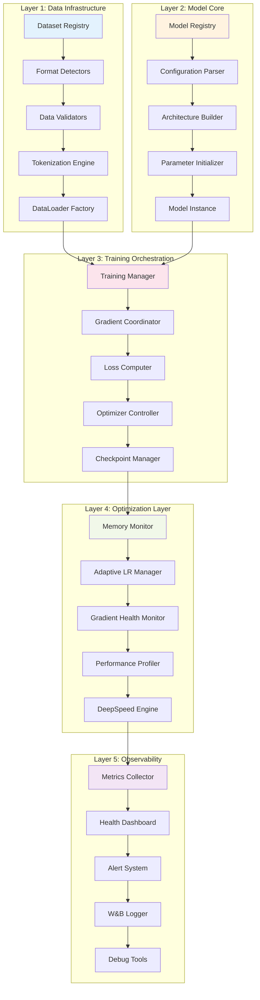
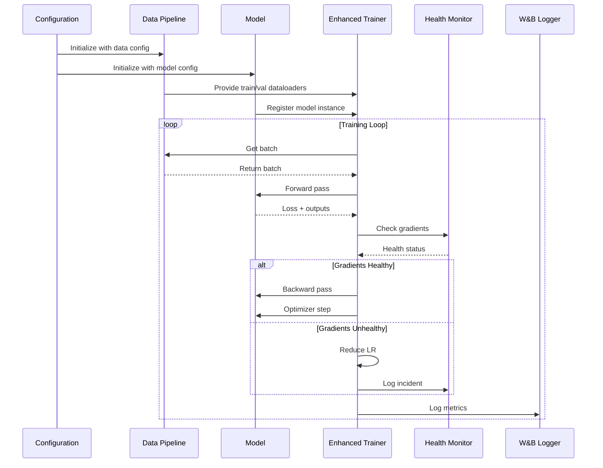
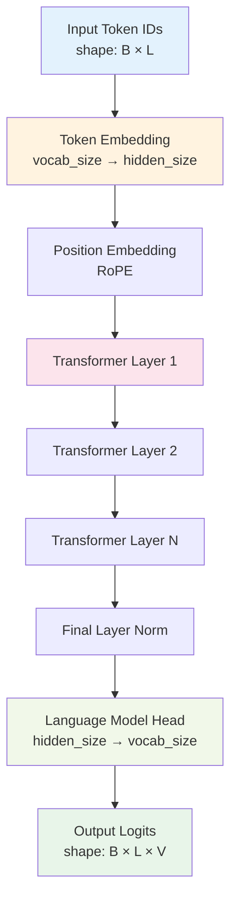
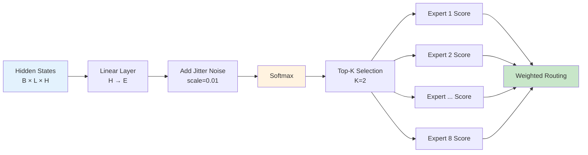
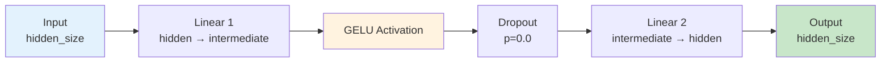
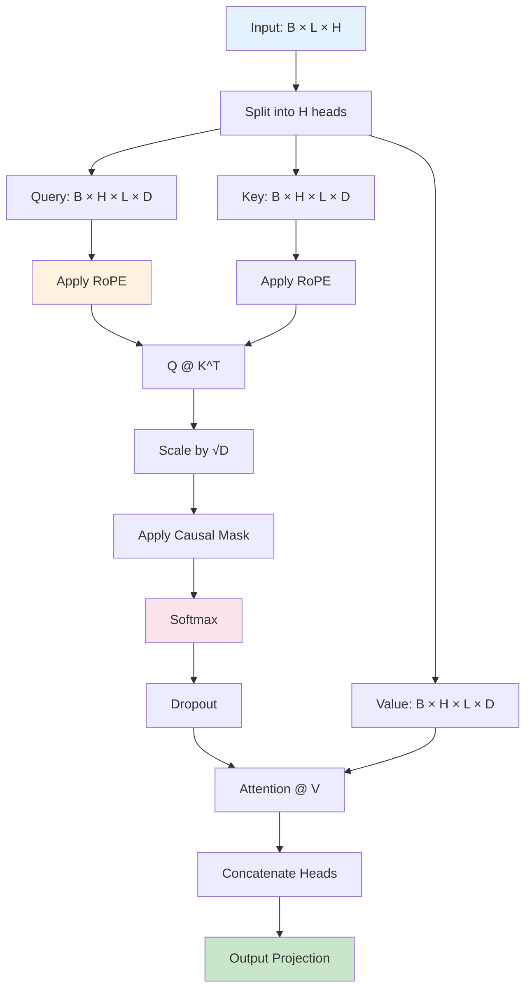
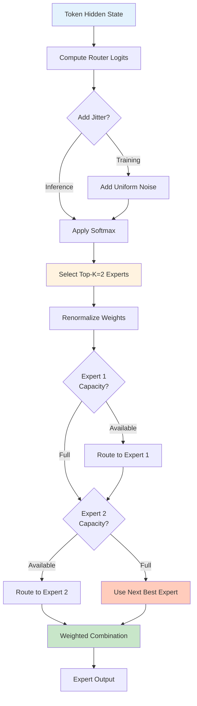
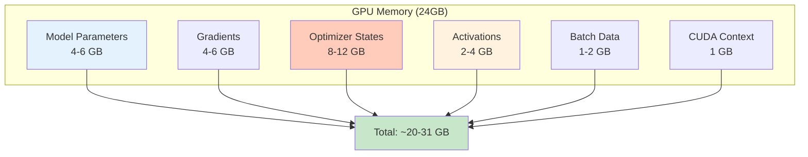
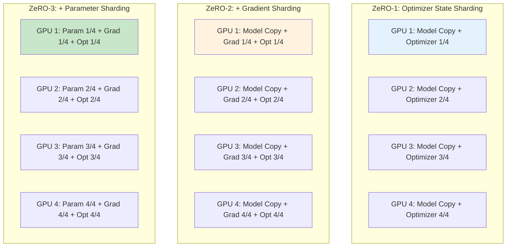
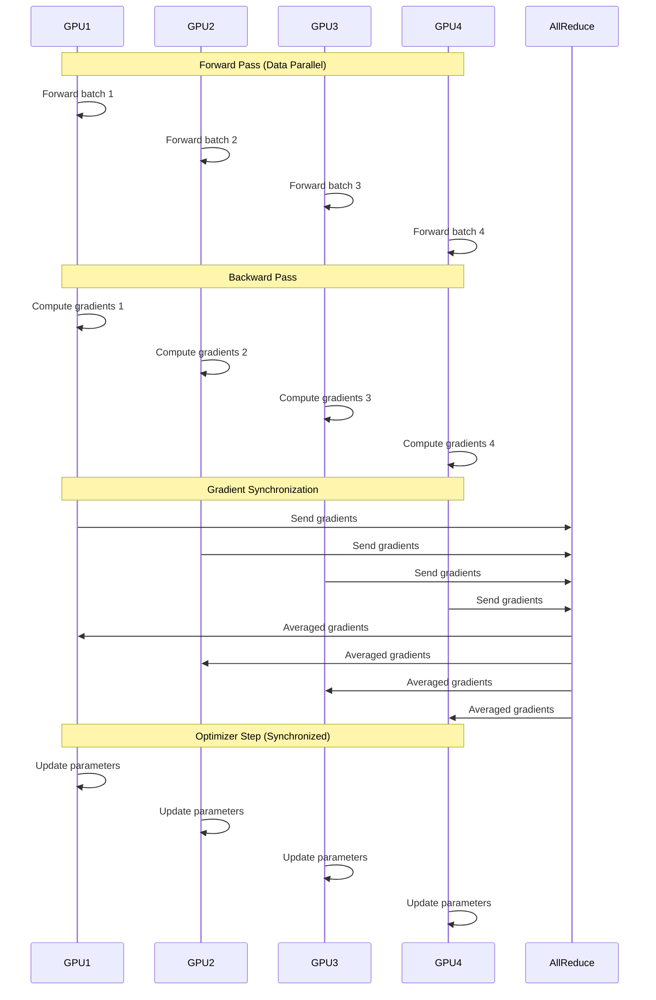

# Ava LLM Training Framework - Architecture Deep Dive

## Table of Contents

- [Overview](#overview)
- [System Architecture](#system-architecture)
- [Model Architecture](#model-architecture)
- [MoE (Mixture of Experts) Design](#moe-mixture-of-experts-design)
- [Attention Mechanism](#attention-mechanism)
- [Expert Routing](#expert-routing)
- [Load Balancing](#load-balancing)
- [Memory Architecture](#memory-architecture)
- [Distributed Architecture](#distributed-architecture)

---

## Overview

The Ava framework is built on a modular, layered architecture that separates concerns across data processing, model computation, training orchestration, and optimization. This document provides an in-depth technical analysis of each architectural component.

### Design Principles

1. **Modularity**: Each component is self-contained and replaceable
2. **Scalability**: Designed for single-GPU to multi-node training
3. **Observability**: Built-in monitoring at every layer
4. **Fault Tolerance**: Graceful degradation and recovery mechanisms
5. **Performance**: Optimized for maximum GPU utilization

---

## System Architecture

### High-Level Component Diagram



### Component Interaction Flow



---

## Model Architecture

### Transformer Block Structure

The Ava model uses a modified transformer architecture with MoE layers:



### Single Transformer Layer Detail

Each transformer layer consists of:

1. **Pre-LayerNorm**: Normalization before attention
2. **Multi-Head Attention**: 8 heads with RoPE
3. **Residual Connection 1**: Skip connection around attention
4. **Pre-LayerNorm 2**: Normalization before MoE
5. **MoE Layer**: Router + 8 expert FFNs
6. **Residual Connection 2**: Skip connection around MoE

```python
class TransformerLayer(nn.Module):
    def __init__(self, config):
        self.ln1 = LayerNorm(config.hidden_size)
        self.attention = MultiHeadAttention(config)
        self.ln2 = LayerNorm(config.hidden_size)
        self.moe = MixtureOfExperts(config)

    def forward(self, x, attention_mask=None):
        # Attention block
        residual = x
        x = self.ln1(x)
        x = self.attention(x, attention_mask)
        x = residual + x

        # MoE block
        residual = x
        x = self.ln2(x)
        x, router_loss, router_probs = self.moe(x)
        x = residual + x

        return x, router_loss, router_probs
```

### Model Dimensions

| Model Size | Hidden Size | Layers | Heads | Head Dim | FFN Size | Experts | Parameters |
|------------|-------------|--------|-------|----------|----------|---------|------------|
| tiny       | 384         | 10     | 6     | 64       | 1536     | 4       | 100M       |
| small      | 512         | 14     | 8     | 64       | 2048     | 8       | 233M       |
| base       | 768         | 18     | 12    | 64       | 3072     | 8       | 500M       |
| large      | 1024        | 24     | 16    | 64       | 4096     | 16      | 1.3B       |

**Parameter Calculation:**

```
Embedding: vocab_size × hidden_size = 65,536 × 512 = 33.5M
Position Encoding: Computed on-the-fly (RoPE)

Per Layer:
  - Attention: 4 × hidden² = 4 × 512² = 1.05M
  - MoE Router: hidden × num_experts = 512 × 8 = 4K
  - Each Expert FFN: 2 × hidden × intermediate = 2 × 512 × 2048 = 2.1M
  - Total Experts: 8 × 2.1M = 16.8M
  - Layer Total: ~17.9M

14 Layers: 14 × 17.9M = 250.6M

Output Head: vocab_size × hidden_size = 33.5M (tied with embedding)

Total: 33.5M + 250.6M = ~284M (effective ~233M with parameter sharing)
```

---

## MoE (Mixture of Experts) Design

### Router Architecture

The router determines which experts process each token:



**Router Implementation:**

```python
class DeepSeekRouter(nn.Module):
    def __init__(self, config):
        self.hidden_size = config.hidden_size
        self.num_experts = config.num_experts
        self.top_k = config.num_experts_per_token
        self.jitter_noise = config.router_jitter_noise

        # Router linear layer
        self.gate = nn.Linear(self.hidden_size, self.num_experts, bias=False)

    def forward(self, hidden_states):
        batch_size, seq_len, hidden_size = hidden_states.shape

        # Compute router logits
        router_logits = self.gate(hidden_states)  # [B, L, E]

        # Add jitter noise for exploration
        if self.training and self.jitter_noise > 0:
            noise = torch.rand_like(router_logits) * self.jitter_noise
            router_logits = router_logits + noise

        # Softmax normalization
        routing_weights = F.softmax(router_logits, dim=-1)

        # Select top-k experts
        routing_weights, selected_experts = torch.topk(
            routing_weights, self.top_k, dim=-1
        )

        # Renormalize
        routing_weights = routing_weights / routing_weights.sum(dim=-1, keepdim=True)

        return routing_weights, selected_experts
```

### Expert Network Structure

Each expert is an independent Feed-Forward Network (FFN):



**Expert Implementation:**

```python
class Expert(nn.Module):
    def __init__(self, config):
        self.fc1 = nn.Linear(config.hidden_size, config.intermediate_size)
        self.activation = nn.GELU()
        self.dropout = nn.Dropout(config.expert_dropout)
        self.fc2 = nn.Linear(config.intermediate_size, config.hidden_size)

    def forward(self, x):
        x = self.fc1(x)
        x = self.activation(x)
        x = self.dropout(x)
        x = self.fc2(x)
        return x
```

### Token Routing Strategy

**Top-K Routing:**
- Each token is routed to **K=2** experts
- Selected based on highest router probabilities
- Allows token-level specialization

**Capacity Factor:**
- Limits tokens per expert: `capacity = (total_tokens / num_experts) × capacity_factor`
- Default capacity factor: **3.0**
- Prevents load imbalance

**Overflow Handling:**
- Tokens exceeding capacity are either:
  1. **Dropped** (overflow loss)
  2. **Routed to next best expert**
  3. **Processed by residual FFN**

```python
def compute_capacity(num_tokens, num_experts, capacity_factor):
    """
    Compute expert capacity with safety margin.

    Args:
        num_tokens: Total number of tokens in batch
        num_experts: Number of experts
        capacity_factor: Overprovisioning factor (typically 1.5-3.0)

    Returns:
        capacity: Maximum tokens per expert
    """
    capacity = (num_tokens / num_experts) * capacity_factor
    capacity = int(capacity)
    return capacity
```

---

## Attention Mechanism

### Multi-Head Attention with RoPE



### Rotary Position Embeddings (RoPE)

RoPE encodes position information by rotating query/key vectors:

```python
def apply_rotary_pos_emb(q, k, cos, sin, position_ids):
    """
    Apply Rotary Position Embeddings to query and key tensors.

    Args:
        q: Query tensor [batch, heads, seq_len, head_dim]
        k: Key tensor [batch, heads, seq_len, head_dim]
        cos: Cosine values [1, 1, seq_len, head_dim]
        sin: Sine values [1, 1, seq_len, head_dim]
        position_ids: Position indices [batch, seq_len]

    Returns:
        q_embed: Rotated query
        k_embed: Rotated key
    """
    # Gather cos/sin for positions
    cos = cos[..., position_ids, :]
    sin = sin[..., position_ids, :]

    # Split q and k into two halves
    q_half1, q_half2 = q.chunk(2, dim=-1)
    k_half1, k_half2 = k.chunk(2, dim=-1)

    # Apply rotation
    q_embed = torch.cat([
        q_half1 * cos - q_half2 * sin,
        q_half1 * sin + q_half2 * cos
    ], dim=-1)

    k_embed = torch.cat([
        k_half1 * cos - k_half2 * sin,
        k_half1 * sin + k_half2 * cos
    ], dim=-1)

    return q_embed, k_embed
```

**RoPE Benefits:**
1. **Relative Position Encoding**: Naturally captures relative distances
2. **Extrapolation**: Better generalization to longer sequences
3. **Efficiency**: No learned parameters, computed on-the-fly
4. **Flexibility**: Works with any sequence length

**RoPE Computation:**

```python
def precompute_freqs_cis(dim, max_position, theta=10000.0):
    """
    Precompute cos and sin frequency tables for RoPE.

    Args:
        dim: Head dimension
        max_position: Maximum sequence length
        theta: Rotation base (default 10000)

    Returns:
        cos, sin: Frequency tables
    """
    freqs = 1.0 / (theta ** (torch.arange(0, dim, 2).float() / dim))
    t = torch.arange(max_position)
    freqs = torch.outer(t, freqs)

    cos = torch.cos(freqs)
    sin = torch.sin(freqs)

    return cos, sin
```

---

## Expert Routing

### Routing Decision Tree



### Routing Strategies Comparison

| Strategy | Description | Pros | Cons | Used In |
|----------|-------------|------|------|---------|
| **Switch** | Top-1 expert per token | Fast, efficient | Limited capacity | Switch Transformer |
| **Top-K** | Top-K experts (K=2) | Better quality, redundancy | 2x compute | Ava (default) |
| **Expert Choice** | Experts choose tokens | Perfect load balance | Complex implementation | Recent research |
| **Soft Routing** | All experts, weighted | Maximum quality | Very expensive | Research only |

**Ava Uses Top-K (K=2) Routing:**

```python
class MixtureOfExperts(nn.Module):
    def forward(self, hidden_states):
        batch_size, seq_len, hidden_size = hidden_states.shape

        # Get routing weights and expert indices
        routing_weights, selected_experts = self.router(hidden_states)
        # routing_weights: [B, L, K=2]
        # selected_experts: [B, L, K=2]

        # Initialize output
        final_output = torch.zeros_like(hidden_states)

        # Route tokens to selected experts
        for k in range(self.top_k):
            # Get k-th expert for each token
            expert_idx = selected_experts[:, :, k]  # [B, L]
            expert_weight = routing_weights[:, :, k:k+1]  # [B, L, 1]

            # Process each expert
            for expert_id in range(self.num_experts):
                # Find tokens assigned to this expert
                mask = (expert_idx == expert_id)

                if mask.any():
                    # Extract tokens for this expert
                    tokens = hidden_states[mask]

                    # Check capacity
                    if len(tokens) > self.expert_capacity:
                        # Handle overflow
                        tokens = tokens[:self.expert_capacity]

                    # Process through expert
                    expert_output = self.experts[expert_id](tokens)

                    # Add weighted output back
                    final_output[mask] += expert_weight[mask] * expert_output

        return final_output
```

---

## Load Balancing

### Load Balancing Loss

The auxiliary loss encourages balanced expert utilization:

```python
def compute_load_balancing_loss(router_probs, expert_indices, num_experts):
    """
    Compute load balancing auxiliary loss.

    Args:
        router_probs: Router probabilities [B, L, E]
        expert_indices: Selected experts [B, L, K]
        num_experts: Total number of experts

    Returns:
        loss: Load balancing loss (scalar)
    """
    # Compute fraction of tokens routed to each expert
    expert_mask = F.one_hot(expert_indices, num_experts).float()
    # expert_mask: [B, L, K, E]

    tokens_per_expert = expert_mask.sum(dim=[0, 1, 2])  # [E]
    total_tokens = expert_mask.shape[0] * expert_mask.shape[1] * expert_mask.shape[2]
    expert_fraction = tokens_per_expert / total_tokens  # [E]

    # Compute average router probability per expert
    router_prob_per_expert = router_probs.mean(dim=[0, 1])  # [E]

    # Auxiliary loss: product of fractions and probabilities
    # Minimizing this encourages uniform distribution
    loss = (expert_fraction * router_prob_per_expert).sum() * num_experts

    return loss
```

### Sinkhorn-Knopp Algorithm

For perfect load balancing, we use iterative normalization:

```python
def sinkhorn_knopp(logits, num_iters=3):
    """
    Apply Sinkhorn-Knopp algorithm for balanced routing.

    Args:
        logits: Router logits [B, L, E]
        num_iters: Number of iterations

    Returns:
        balanced_probs: Balanced probabilities [B, L, E]
    """
    Q = torch.exp(logits)

    for _ in range(num_iters):
        # Normalize across experts (columns)
        Q = Q / Q.sum(dim=-1, keepdim=True)

        # Normalize across tokens (rows)
        Q = Q / Q.sum(dim=1, keepdim=True)

    return Q
```

### Expert Utilization Metrics

```python
def compute_expert_metrics(expert_indices, num_experts):
    """
    Compute comprehensive expert utilization metrics.

    Args:
        expert_indices: Selected experts [B, L, K]
        num_experts: Total number of experts

    Returns:
        metrics: Dictionary of utilization metrics
    """
    # Flatten expert indices
    flat_indices = expert_indices.flatten()

    # Count tokens per expert
    counts = torch.bincount(flat_indices, minlength=num_experts)

    # Compute metrics
    total_tokens = len(flat_indices)
    utilization = counts.float() / total_tokens

    metrics = {
        'mean_utilization': utilization.mean().item(),
        'std_utilization': utilization.std().item(),
        'min_utilization': utilization.min().item(),
        'max_utilization': utilization.max().item(),
        'gini_coefficient': compute_gini(utilization),
        'entropy': -(utilization * torch.log(utilization + 1e-10)).sum().item(),
    }

    return metrics

def compute_gini(utilization):
    """Compute Gini coefficient for load balance (0=perfect, 1=worst)."""
    sorted_util = torch.sort(utilization)[0]
    n = len(sorted_util)
    index = torch.arange(1, n + 1, device=utilization.device)
    return ((2 * index - n - 1) * sorted_util).sum() / (n * sorted_util.sum())
```

---

## Memory Architecture

### GPU Memory Layout



### Memory Optimization Techniques

1. **Gradient Checkpointing**: Recompute activations during backward pass
2. **Mixed Precision**: Use FP16 for compute, FP32 for accumulation
3. **Activation Offloading**: Move activations to CPU during forward pass
4. **Optimizer State Sharding**: Distribute optimizer states (DeepSpeed ZeRO)

**Memory Comparison:**

| Technique | Model Memory | Gradient Memory | Optimizer Memory | Total (small model) |
|-----------|--------------|-----------------|------------------|---------------------|
| Baseline FP32 | 4 GB | 4 GB | 16 GB | 24 GB |
| FP16 Mixed | 2 GB | 2 GB | 8 GB | 12 GB |
| + Gradient Checkpointing | 2 GB | 2 GB | 8 GB | 12 GB |
| + ZeRO-1 (Optimizer Sharding) | 2 GB | 2 GB | 2 GB | 6 GB |
| + ZeRO-2 (+ Gradient Sharding) | 2 GB | 0.5 GB | 2 GB | 4.5 GB |
| + ZeRO-3 (+ Parameter Sharding) | 0.5 GB | 0.5 GB | 2 GB | 3 GB |

---

## Distributed Architecture

### DeepSpeed ZeRO Stages



### Multi-GPU Training Flow



### Communication Patterns

**AllReduce**: Average gradients across all GPUs
```python
# Pseudo-code
gradients = compute_gradients()
averaged_gradients = torch.distributed.all_reduce(gradients, op=ReduceOp.SUM)
averaged_gradients = averaged_gradients / world_size
```

**Broadcast**: Send parameters from rank 0 to all ranks
```python
if rank == 0:
    parameters = load_checkpoint()
torch.distributed.broadcast(parameters, src=0)
```

**Gather/Scatter**: Collect/distribute data across ranks
```python
# Gather predictions from all GPUs to rank 0
if rank == 0:
    all_predictions = [torch.zeros_like(predictions) for _ in range(world_size)]
    torch.distributed.gather(predictions, all_predictions, dst=0)
```

---

## Performance Optimizations

### Torch Compile Integration

```python
# Enable torch.compile for faster execution
model = torch.compile(
    model,
    mode='max-autotune',  # Aggressive optimization
    fullgraph=False,      # Allow graph breaks
    dynamic=False,        # Static shapes for better optimization
    backend='inductor'    # Use TorchInductor backend
)
```

**Expected Speedup:**
- Forward pass: 1.3-1.5x faster
- Backward pass: 1.2-1.3x faster
- Overall training: 1.25-1.4x faster

### CUDA Optimizations

```python
# Set CUDA optimizations
torch.backends.cuda.matmul.allow_tf32 = True  # Use TF32 for matmul
torch.backends.cudnn.allow_tf32 = True        # Use TF32 for convolutions
torch.backends.cudnn.benchmark = True         # Auto-tune kernels
torch.backends.cudnn.deterministic = False    # Allow non-deterministic ops
```

### Memory Pool Management

```python
class MemoryPool:
    def __init__(self, size_gb=24):
        self.size_bytes = size_gb * 1024**3
        self.allocated = 0

    def allocate(self, tensor_size):
        if self.allocated + tensor_size > self.size_bytes:
            self.cleanup()
        self.allocated += tensor_size

    def cleanup(self):
        torch.cuda.empty_cache()
        gc.collect()
        self.allocated = 0
```

---

## Summary

The Ava architecture is designed with the following key characteristics:

1. **Modular Design**: Clean separation between data, model, training, and optimization layers
2. **MoE Efficiency**: Top-K routing with load balancing for optimal compute utilization
3. **Scalability**: Seamless scaling from single GPU to multi-node clusters
4. **Memory Efficiency**: Gradient checkpointing, mixed precision, and ZeRO sharding
5. **Observability**: Comprehensive monitoring at every layer
6. **Performance**: Torch compile, CUDA optimizations, and efficient implementations

This architecture enables training high-quality language models efficiently while maintaining stability and observability throughout the process.
