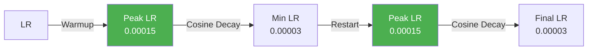
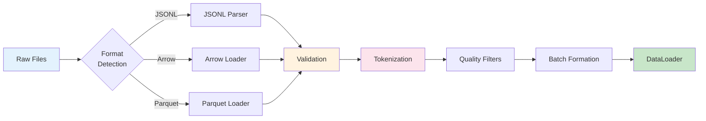

# Ava LLM Training Framework - Training Guide

## Table of Contents

- [Training Overview](#training-overview)
- [Pre-Training Preparation](#pre-training-preparation)
- [Training Workflows](#training-workflows)
- [8 Phases of Training Enhancements](#8-phases-of-training-enhancements)
- [Learning Rate Strategies](#learning-rate-strategies)
- [Data Pipeline](#data-pipeline)
- [Monitoring Training](#monitoring-training)
- [Checkpoint Management](#checkpoint-management)
- [RLHF Fine-Tuning](#rlhf-fine-tuning)
- [Advanced Training Techniques](#advanced-training-techniques)

---

## Training Overview

The Ava training system implements a sophisticated, production-ready training pipeline with 8 phases of enhancements covering stability, efficiency, and observability.

### Training Philosophy

1. **Stability First**: Prevent training failures before optimization
2. **Gradual Improvement**: Incremental enhancements over aggressive changes
3. **Full Observability**: Monitor everything, debug anything
4. **Fault Tolerance**: Graceful degradation and recovery
5. **Reproducibility**: Deterministic training with proper seeding

### Training Flow Overview

```mermaid
flowchart TD
    Start([Start]) --> PreFlight[Pre-Flight Checks]
    PreFlight --> DataLoad[Load & Validate Data]
    DataLoad --> ModelInit[Initialize Model]
    ModelInit --> OptimizerInit[Initialize Optimizer]
    OptimizerInit --> DeepSpeedInit[Initialize DeepSpeed]

    DeepSpeedInit --> Warmup[Warmup Phase<br/>1000 steps]
    Warmup --> TrainLoop[Main Training Loop]

    TrainLoop --> ForwardPass[Forward Pass]
    ForwardPass --> LossCompute[Compute Loss]
    LossCompute --> BackwardPass[Backward Pass]
    BackwardPass --> GradCheck{Gradient<br/>Health?}

    GradCheck -->|Healthy| OptStep[Optimizer Step]
    GradCheck -->|Unhealthy| ReduceLR[Reduce LR & Clip]

    ReduceLR --> OptStep
    OptStep --> MemCheck{Memory<br/>OK?}

    MemCheck -->|Yes| EvalCheck
    MemCheck -->|>85%| ClearCache[Clear Cache]
    ClearCache --> EvalCheck{Eval<br/>Step?}

    EvalCheck -->|Yes| RunEval[Run Validation]
    EvalCheck -->|No| SaveCheck
    RunEval --> SaveCheck{Save<br/>Step?}

    SaveCheck -->|Yes| SaveCkpt[Save Checkpoint]
    SaveCheck -->|No| MoreSteps
    SaveCkpt --> MoreSteps{More<br/>Steps?}

    MoreSteps -->|Yes| TrainLoop
    MoreSteps -->|No| FinalEval[Final Evaluation]
    FinalEval --> SaveFinal[Save Final Model]
    SaveFinal --> End([Complete])

    style Start fill:#4caf50,color:#fff
    style PreFlight fill:#ff9800
    style TrainLoop fill:#2196f3,color:#fff
    style End fill:#4caf50,color:#fff
```



---

## Pre-Training Preparation

### Step 1: Environment Setup

```bash
# Check GPU availability
nvidia-smi

# Verify CUDA version
python -c "import torch; print(f'PyTorch: {torch.__version__}, CUDA: {torch.version.cuda}')"

# Check disk space (need 50GB+)
df -h

# Verify dependencies
pip list | grep -E "torch|transformers|deepspeed|wandb"
```

### Step 2: Data Preparation

```bash
# Stage 1: Download datasets
cd /project/code/scripts/1_data_download
python unified_download.py

# Expected output: 50+ datasets downloaded to /project/code/data/raw

# Stage 2: Process and validate data
cd /project/code/scripts/2_data_prep
python process_all_data.py

# Expected output: Processed .jsonl files in /project/code/data/processed
```

**Data Validation Checklist:**

```python
import os
import json

def validate_data_directory(data_dir):
    """Validate data directory before training."""
    checks = []

    # Check directory exists
    checks.append(('Directory exists', os.path.exists(data_dir)))

    # Check for data files
    files = [f for f in os.listdir(data_dir) if f.endswith('.jsonl')]
    checks.append(('Has .jsonl files', len(files) > 0))
    checks.append(('Minimum 10 files', len(files) >= 10))

    # Check file sizes
    total_size = sum(os.path.getsize(os.path.join(data_dir, f)) for f in files)
    checks.append(('Total size > 1GB', total_size > 1e9))

    # Sample first file
    if files:
        with open(os.path.join(data_dir, files[0]), 'r') as f:
            first_line = f.readline()
            try:
                sample = json.loads(first_line)
                checks.append(('Valid JSON', True))
                checks.append(('Has text field', 'text' in sample or 'content' in sample))
            except:
                checks.append(('Valid JSON', False))

    # Print results
    for check, passed in checks:
        status = '✓' if passed else '✗'
        print(f'{status} {check}')

    return all(passed for _, passed in checks)

# Run validation
validate_data_directory('/project/code/data/processed')
```

### Step 3: Tokenizer Setup

**Option A: Use Pre-Trained Tokenizer (Recommended)**

```bash
# Verify tokenizer exists
ls -lh /project/code/models/tokenizer/enhanced-65536/

# Expected files:
# - tokenizer.json
# - tokenizer_config.json
# - special_tokens_map.json
```

**Option B: Train Custom Tokenizer**

```bash
cd /project/code/scripts/3_tokenizer
python train_tokenizer.py \
  --data-dir /project/code/data/processed \
  --vocab-size 65536 \
  --min-frequency 2 \
  --output-dir /project/code/models/tokenizer/custom
```

### Step 4: Configuration Review

```bash
# Review configuration
cat /project/code/configs/gpu/small.yaml

# Key parameters to verify:
# - data.data_dir: Correct path to processed data
# - data.tokenizer_name: Correct path to tokenizer
# - training.batch_size: Fits in GPU memory
# - wandb.project: Your W&B project name
```

### Step 5: Pre-Flight Checks

```python
#!/usr/bin/env python3
"""Pre-flight checks before training."""

import torch
import os
import sys

def run_preflight_checks():
    """Run comprehensive pre-flight checks."""
    all_passed = True

    print("=" * 60)
    print("PRE-FLIGHT CHECKS")
    print("=" * 60)

    # 1. GPU Check
    print("\n1. GPU Availability:")
    if torch.cuda.is_available():
        gpu_count = torch.cuda.device_count()
        print(f"   ✓ {gpu_count} GPU(s) available")
        for i in range(gpu_count):
            props = torch.cuda.get_device_properties(i)
            memory_gb = props.total_memory / 1024**3
            print(f"   - GPU {i}: {props.name}, {memory_gb:.1f} GB")
    else:
        print("   ✗ No GPU available")
        all_passed = False

    # 2. CUDA Version
    print("\n2. CUDA Version:")
    print(f"   ✓ PyTorch CUDA: {torch.version.cuda}")
    print(f"   ✓ cuDNN: {torch.backends.cudnn.version()}")

    # 3. Data Directory
    print("\n3. Data Directory:")
    data_dir = '/project/code/data/processed'
    if os.path.exists(data_dir):
        files = [f for f in os.listdir(data_dir) if f.endswith('.jsonl')]
        print(f"   ✓ Found {len(files)} .jsonl files")
    else:
        print(f"   ✗ Data directory not found: {data_dir}")
        all_passed = False

    # 4. Tokenizer
    print("\n4. Tokenizer:")
    tokenizer_path = '/project/code/models/tokenizer/enhanced-65536'
    if os.path.exists(tokenizer_path):
        print(f"   ✓ Tokenizer found at {tokenizer_path}")
    else:
        print(f"   ✗ Tokenizer not found: {tokenizer_path}")
        all_passed = False

    # 5. Disk Space
    print("\n5. Disk Space:")
    stat = os.statvfs('/project')
    free_gb = (stat.f_bavail * stat.f_frsize) / 1024**3
    if free_gb > 50:
        print(f"   ✓ {free_gb:.1f} GB free")
    else:
        print(f"   ⚠ Only {free_gb:.1f} GB free (recommend 50GB+)")

    # 6. Dependencies
    print("\n6. Dependencies:")
    try:
        import transformers
        import deepspeed
        import wandb
        print(f"   ✓ transformers {transformers.__version__}")
        print(f"   ✓ deepspeed {deepspeed.__version__}")
        print(f"   ✓ wandb {wandb.__version__}")
    except ImportError as e:
        print(f"   ✗ Missing dependency: {e}")
        all_passed = False

    print("\n" + "=" * 60)
    if all_passed:
        print("✓ ALL CHECKS PASSED - Ready to train!")
    else:
        print("✗ SOME CHECKS FAILED - Fix issues before training")
    print("=" * 60)

    return all_passed

if __name__ == '__main__':
    passed = run_preflight_checks()
    sys.exit(0 if passed else 1)
```

---

## Training Workflows

### Workflow 1: Training from Scratch

```bash
# Basic training with default config
python /project/code/scripts/5_training/train.py \
  --config /project/code/configs/gpu/small.yaml

# Training with custom data directory
python /project/code/scripts/5_training/train.py \
  --config /project/code/configs/gpu/small.yaml \
  --data-dir /path/to/custom/data

# Training with custom experiment name
python /project/code/scripts/5_training/train.py \
  --config /project/code/configs/gpu/small.yaml \
  --experiment-name "my-experiment-v1"
```

### Workflow 2: Resume from Checkpoint

```bash
# Resume from specific checkpoint
python /project/code/scripts/5_training/train.py \
  --config /project/code/configs/gpu/small.yaml \
  --resume /project/code/outputs/runs/run_20251103_120000/checkpoints/best_model.pt

# Resume from latest checkpoint (auto-find)
python /project/code/scripts/5_training/train.py \
  --config /project/code/configs/gpu/small.yaml \
  --resume latest

# Resume with reset optimizer (if optimizer state corrupted)
python /project/code/scripts/5_training/train.py \
  --config /project/code/configs/gpu/small.yaml \
  --resume latest \
  --reset-optimizer
```

### Workflow 3: Multi-GPU Training

```bash
# Training on 2 GPUs
torchrun --nproc_per_node=2 \
  /project/code/scripts/5_training/train.py \
  --config /project/code/configs/gpu/small.yaml

# Training on 4 GPUs with specific GPUs
CUDA_VISIBLE_DEVICES=0,1,2,3 torchrun --nproc_per_node=4 \
  /project/code/scripts/5_training/train.py \
  --config /project/code/configs/gpu/small.yaml

# Multi-node training (8 GPUs across 2 nodes)
# Node 0:
torchrun --nproc_per_node=4 \
  --nnodes=2 \
  --node_rank=0 \
  --master_addr=192.168.1.100 \
  --master_port=29500 \
  /project/code/scripts/5_training/train.py \
  --config /project/code/configs/gpu/small.yaml

# Node 1:
torchrun --nproc_per_node=4 \
  --nnodes=2 \
  --node_rank=1 \
  --master_addr=192.168.1.100 \
  --master_port=29500 \
  /project/code/scripts/5_training/train.py \
  --config /project/code/configs/gpu/small.yaml
```

### Workflow 4: Hyperparameter Sweep

```bash
# LR sweep
for lr in 0.0001 0.00015 0.0002; do
  python /project/code/scripts/5_training/train.py \
    --config /project/code/configs/gpu/small.yaml \
    --experiment-name "lr-sweep-${lr}" \
    --override "training.learning_rate=${lr}"
done

# Batch size sweep
for bs in 8 12 16; do
  python /project/code/scripts/5_training/train.py \
    --config /project/code/configs/gpu/small.yaml \
    --experiment-name "bs-sweep-${bs}" \
    --override "training.batch_size=${bs}"
done
```

### Workflow 5: LR Finding

```bash
# Find optimal learning rate
python /project/code/scripts/4_lr_finding/run_lr_finder_enhanced.py \
  --config /project/code/configs/gpu/small.yaml \
  --start-lr 1e-8 \
  --end-lr 0.01 \
  --num-iterations 1000

# Output: Suggested LR will be displayed and saved to config
# Example output:
# ✓ Suggested LR: 0.00015
# ✓ Steep Point: 0.00012
# ✓ Minimum Loss LR: 0.00018
```

---

## 8 Phases of Training Enhancements

### Phase 1: Critical Stability Fixes

**Problem**: Training failures from gradient explosions, NaN losses, OOM errors

**Solution**: Comprehensive health monitoring and recovery

```python
# Gradient Health Monitor
class GradientHealthMonitor:
    def check_gradients(self, model):
        total_norm = 0.0
        for p in model.parameters():
            if p.grad is not None:
                param_norm = p.grad.data.norm(2)
                total_norm += param_norm.item() ** 2
        total_norm = total_norm ** 0.5

        # Check for explosion
        if total_norm > self.explosion_threshold:
            self.explosion_count += 1
            if self.explosion_count >= self.explosion_window:
                # Reduce LR
                self.reduce_lr()
                self.explosion_count = 0

        return total_norm
```

**Key Components:**
- Gradient norm tracking
- NaN/Inf detection
- Automatic LR reduction on explosion
- Emergency memory cleanup

### Phase 2: Data Pipeline Fixes

**Problem**: Silent data corruption, format mismatches, empty dataloaders

**Solution**: Robust format detection and validation

```python
def detect_format_with_confidence(file_path, num_samples=10):
    """Detect file format with confidence scoring."""
    scores = {
        'jsonl': 0,
        'arrow': 0,
        'parquet': 0
    }

    # Try JSONL
    try:
        with open(file_path, 'r') as f:
            for _ in range(num_samples):
                line = f.readline()
                json.loads(line)
                scores['jsonl'] += 1
    except:
        pass

    # Try Arrow
    try:
        import pyarrow as pa
        with pa.memory_map(file_path, 'r') as source:
            table = pa.ipc.open_file(source).read_all()
            if len(table) > 0:
                scores['arrow'] = 10
    except:
        pass

    # Try Parquet
    try:
        import pyarrow.parquet as pq
        table = pq.read_table(file_path)
        if len(table) > 0:
            scores['parquet'] = 10
    except:
        pass

    # Return format with highest confidence
    return max(scores.items(), key=lambda x: x[1])
```

**Key Components:**
- Multi-format support (.jsonl, .arrow, .parquet)
- 10-sample confidence scoring
- Graceful fallback on corruption
- Minimum samples validation

### Phase 3: Training Loop Fixes

**Problem**: Poor LR warmup, training plateaus, no plateau detection

**Solution**: Adaptive LR management with automatic adjustments

```python
class AdaptiveLRManager:
    def step(self, current_loss):
        # Check for improvement
        improvement = self.best_loss - current_loss

        if improvement > self.min_improvement:
            self.best_loss = current_loss
            self.plateau_counter = 0
        else:
            self.plateau_counter += 1

        # Plateau detected
        if self.plateau_counter >= self.plateau_patience:
            # Check gradient stability
            if self.is_stable():
                # Boost LR to escape plateau
                new_lr = self.current_lr * self.plateau_factor
                new_lr = min(new_lr, self.max_lr)
                self.set_lr(new_lr)
            else:
                # Reduce LR for stability
                new_lr = self.current_lr * self.emergency_factor
                new_lr = max(new_lr, self.min_lr)
                self.set_lr(new_lr)

            self.plateau_counter = 0
```

**Key Components:**
- Percentage-based warmup (3% of total steps)
- Plateau detection (1500 steps without improvement)
- Automatic LR boost (15% increase)
- Cosine schedule with restarts

### Phase 4: Distributed & Parallel Fixes

**Problem**: OOM on one GPU crashes all ranks, inconsistent checkpoints

**Solution**: Collective error handling and synchronized operations

```python
def collective_oom_check(is_oom_local):
    """Check if any rank experienced OOM."""
    if torch.distributed.is_initialized():
        oom_tensor = torch.tensor([1.0 if is_oom_local else 0.0], device='cuda')
        torch.distributed.all_reduce(oom_tensor)
        return oom_tensor.item() > 0
    return is_oom_local

def synchronized_checkpoint_save(model, path):
    """Save checkpoint with barrier synchronization."""
    if torch.distributed.get_rank() == 0:
        torch.save(model.state_dict(), path)

    # Wait for rank 0 to finish
    if torch.distributed.is_initialized():
        torch.distributed.barrier()
```

**Key Components:**
- Collective OOM detection
- Synchronized checkpointing
- Rank-aware error handling
- Graceful distributed cleanup

### Phase 5: Progressive Training Fixes

**Problem**: OOM with long sequences, inefficient training on easy examples

**Solution**: Sequence scaling and curriculum learning

```python
def get_current_sequence_length(step, config):
    """Compute current sequence length based on schedule."""
    if not config.enable_sequence_scaling:
        return config.max_seq_length

    progress = step / config.total_steps
    if config.schedule == 'linear':
        current_length = (
            config.initial_seq_length +
            (config.final_seq_length - config.initial_seq_length) * progress
        )
    elif config.schedule == 'exponential':
        ratio = config.final_seq_length / config.initial_seq_length
        current_length = config.initial_seq_length * (ratio ** progress)

    return int(current_length)
```

**Key Components:**
- Sequence scaling (128 → 256 → 512 → 1024)
- Dynamic batch sizing
- Curriculum learning
- Binary search OOM recovery

### Phase 6: Feature Interaction Fixes

**Problem**: Incompatible feature combinations cause silent failures

**Solution**: Pre-flight compatibility validation

```python
COMPATIBILITY_MATRIX = {
    'torch_compile': {
        'conflicts': ['gradient_surgery'],
        'warnings': ['flash_attention']
    },
    'deepspeed_zero3': {
        'conflicts': ['torch_compile'],
        'requires': ['use_deepspeed']
    },
    'flash_attention': {
        'requires': ['fp16', 'or', 'bf16']
    }
}

def validate_config_compatibility(config):
    """Validate feature compatibility."""
    issues = []

    for feature, rules in COMPATIBILITY_MATRIX.items():
        if not is_enabled(config, feature):
            continue

        # Check conflicts
        for conflict in rules.get('conflicts', []):
            if is_enabled(config, conflict):
                issues.append(f'CONFLICT: {feature} incompatible with {conflict}')

        # Check requirements
        for req in rules.get('requires', []):
            if not is_enabled(config, req):
                issues.append(f'ERROR: {feature} requires {req}')

    return issues
```

**Key Components:**
- Compatibility matrix
- Conflict detection
- Dependency checking
- Pre-flight validation

### Phase 7: Observability & Debugging

**Problem**: Insufficient logging, hard to debug issues

**Solution**: Hierarchical logging with health dashboard

```python
# Hierarchical logging structure
/project/code/outputs/runs/run_20251103_120000/logs/
├── training.log      # Main training events
├── evaluation.log    # Validation metrics
├── errors.log        # Errors and warnings
└── debug.log         # Detailed debug info

# Real-time health dashboard
╔══════════════════════════════════════════════════╗
║         TRAINING HEALTH DASHBOARD                ║
╠══════════════════════════════════════════════════╣
║ Step: 15234/50000 (30.5%)                       ║
║ Loss: 2.342 (↓ -0.012)                          ║
║ LR: 0.00015 (stable)                            ║
║ Grad Norm: 1.23 (healthy)                       ║
║ Memory: 18.2GB / 24GB (76%, normal)             ║
║ Expert Util: [0.12, 0.13, 0.11, 0.14, ...]     ║
║ ETA: 2h 34m                                      ║
╚══════════════════════════════════════════════════╝
```

**Key Components:**
- 4-level logging (training/eval/errors/debug)
- Real-time health dashboard
- Metric visualization
- Alert system

### Phase 8: Testing & Validation

**Problem**: No automated testing, manual checkpoint validation

**Solution**: Comprehensive test suite and monitoring

```python
def run_checkpoint_smoke_test(checkpoint_path):
    """Quick smoke test for checkpoint."""
    tests = []

    # Test 1: Load checkpoint
    try:
        state_dict = torch.load(checkpoint_path)
        tests.append(('Load checkpoint', True))
    except Exception as e:
        tests.append(('Load checkpoint', False, str(e)))
        return tests

    # Test 2: Check required keys
    required_keys = ['model', 'optimizer', 'scheduler', 'step']
    for key in required_keys:
        tests.append((f'Has {key}', key in state_dict))

    # Test 3: Load into model
    try:
        model = create_model_from_config()
        model.load_state_dict(state_dict['model'])
        tests.append(('Load into model', True))
    except Exception as e:
        tests.append(('Load into model', False, str(e)))

    # Test 4: Forward pass
    try:
        model.eval()
        with torch.no_grad():
            dummy_input = torch.randint(0, 1000, (1, 10))
            output = model(dummy_input)
        tests.append(('Forward pass', True))
    except Exception as e:
        tests.append(('Forward pass', False, str(e)))

    return tests
```

**Key Components:**
- Pre-flight checks
- Continuous monitoring
- Checkpoint smoke tests
- Integration tests

---

## Learning Rate Strategies

### Strategy 1: Cosine with Restarts (Default)



**Configuration:**
```yaml
training:
  learning_rate: 0.00015
  lr_scheduler_type: cosine_with_restarts
  num_cycles: 2
  warmup_steps: 1000
  lr_end: 0.00003
```

**When to Use**: Default for most training runs. Restarts help escape local minima.

### Strategy 2: Linear with Warmup

```yaml
training:
  learning_rate: 0.0001
  lr_scheduler_type: linear
  warmup_steps: 2000
  lr_end: 0.00001
```

**When to Use**: Fine-tuning or when training is stable.

### Strategy 3: Polynomial Decay

```yaml
training:
  learning_rate: 0.0002
  lr_scheduler_type: polynomial
  warmup_steps: 1000
  lr_end: 0.00001
  power: 2.0
```

**When to Use**: Aggressive initial training with smooth decay.

### Strategy 4: Adaptive LR (Overlay)

```yaml
training:
  adaptive_lr:
    enabled: true
    min_lr: 0.00003
    max_lr: 0.0002
    plateau_patience: 1500
    plateau_factor: 1.15
```

**When to Use**: Always recommended as safety net on top of base scheduler.

### LR Schedule Comparison

| Schedule | Pros | Cons | Best For |
|----------|------|------|----------|
| Cosine | Smooth decay, proven | No exploration late | General training |
| Cosine + Restarts | Escapes plateaus | More hyperparams | Long training runs |
| Linear | Simple, predictable | Abrupt changes | Fine-tuning |
| Polynomial | Flexible shape | Requires tuning | Custom needs |
| Adaptive | Automatic adjustment | Can be unstable | Safety overlay |

---

## Data Pipeline

### Data Loading Flow



### Custom DataLoader Implementation

```python
class EnhancedDataLoader:
    def __init__(self, data_dir, tokenizer, config):
        self.data_dir = data_dir
        self.tokenizer = tokenizer
        self.config = config

        # Discover data files
        self.files = self.discover_files()

        # Validate minimum samples
        self.validate_minimum_samples()

    def discover_files(self):
        """Discover and categorize data files."""
        files = {'jsonl': [], 'arrow': [], 'parquet': []}

        for filename in os.listdir(self.data_dir):
            filepath = os.path.join(self.data_dir, filename)

            # Detect format with confidence
            format_type, confidence = detect_format_with_confidence(filepath)

            if confidence >= 7:  # High confidence threshold
                files[format_type].append(filepath)

        return files

    def __iter__(self):
        """Iterate over batches."""
        for file_list in self.files.values():
            for filepath in file_list:
                # Load file based on format
                samples = self.load_file(filepath)

                # Apply quality filters
                samples = self.filter_samples(samples)

                # Tokenize
                tokenized = self.tokenize_samples(samples)

                # Batch
                for batch in self.create_batches(tokenized):
                    yield batch

    def filter_samples(self, samples):
        """Apply quality filters."""
        filtered = []

        for sample in samples:
            text = sample.get('text', '')

            # Minimum length
            if len(text.split()) < self.config.min_sequence_length:
                continue

            # Maximum repetition
            repetition_rate = calculate_repetition_rate(text)
            if repetition_rate > self.config.max_sequence_repetition_rate:
                continue

            # Maximum consecutive repeats
            max_consecutive = calculate_max_consecutive_repeats(text)
            if max_consecutive > self.config.max_consecutive_repeats:
                continue

            filtered.append(sample)

        return filtered
```

### Data Preprocessing Pipeline

```python
def preprocess_sample(text, tokenizer, max_length):
    """Preprocess a single text sample."""

    # 1. Clean text
    text = clean_text(text)

    # 2. Tokenize
    tokens = tokenizer.encode(text, add_special_tokens=True)

    # 3. Truncate or pad
    if len(tokens) > max_length:
        tokens = tokens[:max_length]
    elif len(tokens) < max_length:
        tokens = tokens + [tokenizer.pad_token_id] * (max_length - len(tokens))

    # 4. Create attention mask
    attention_mask = [1 if token != tokenizer.pad_token_id else 0 for token in tokens]

    # 5. Create labels (shifted for causal LM)
    labels = tokens[1:] + [tokenizer.pad_token_id]

    return {
        'input_ids': torch.tensor(tokens),
        'attention_mask': torch.tensor(attention_mask),
        'labels': torch.tensor(labels)
    }
```

---

## Monitoring Training

### W&B Integration

```python
import wandb

# Initialize W&B
wandb.init(
    project='Ava',
    name=f'run-{timestamp}',
    config=config,
    tags=['gpu', 'small', 'enhanced']
)

# Log metrics during training
wandb.log({
    'train/loss': loss.item(),
    'train/learning_rate': current_lr,
    'train/gradient_norm': grad_norm,
    'train/perplexity': math.exp(loss.item()),
    'memory/allocated_gb': torch.cuda.memory_allocated() / 1e9,
    'memory/reserved_gb': torch.cuda.memory_reserved() / 1e9,
    'moe/expert_utilization': expert_util,
    'moe/routing_entropy': routing_entropy,
    'step': global_step
})

# Log evaluation metrics
wandb.log({
    'eval/loss': eval_loss,
    'eval/perplexity': eval_perplexity,
    'eval/accuracy': eval_accuracy,
    'step': global_step
})
```

### Key Metrics to Monitor

**Training Metrics:**
- Loss (should decrease smoothly)
- Perplexity (exp(loss), should decrease)
- Learning rate (follows schedule)
- Gradient norm (should be stable, typically 0.5-5.0)

**Memory Metrics:**
- GPU memory allocated (should be consistent)
- GPU memory reserved (should not grow)
- Peak memory usage (should be < 90%)

**MoE Metrics:**
- Expert utilization (should be balanced, ideally ~12.5% each for 8 experts)
- Routing entropy (higher is better, indicates diverse routing)
- Load balance loss (should decrease)

**Evaluation Metrics:**
- Validation loss (should decrease)
- Validation perplexity (should decrease)
- Generation quality (coherence, diversity)

### Health Dashboard

```python
def print_health_dashboard(metrics):
    """Print real-time health dashboard."""
    dashboard = f"""
    ╔══════════════════════════════════════════════════════════╗
    ║            TRAINING HEALTH DASHBOARD                     ║
    ╠══════════════════════════════════════════════════════════╣
    ║ Step: {metrics['step']:>6}/{metrics['total_steps']:>6} ({metrics['progress']:>5.1f}%)          ║
    ║                                                          ║
    ║ LOSS & LEARNING                                          ║
    ║   Loss: {metrics['loss']:>7.4f} ({metrics['loss_trend']:>6})            ║
    ║   Perplexity: {metrics['perplexity']:>7.2f}                            ║
    ║   Learning Rate: {metrics['lr']:>9.6f}                        ║
    ║                                                          ║
    ║ GRADIENTS                                                ║
    ║   Grad Norm: {metrics['grad_norm']:>7.4f} ({metrics['grad_health']})        ║
    ║   Explosions: {metrics['grad_explosions']:>2}                                  ║
    ║                                                          ║
    ║ MEMORY                                                   ║
    ║   Allocated: {metrics['mem_allocated_gb']:>5.2f} GB / {metrics['mem_total_gb']:>5.2f} GB         ║
    ║   Utilization: {metrics['mem_utilization']:>5.1f}% ({metrics['mem_status']})     ║
    ║                                                          ║
    ║ MoE EXPERTS                                              ║
    ║   Utilization: {metrics['expert_util_str']:>40} ║
    ║   Entropy: {metrics['routing_entropy']:>7.4f}                            ║
    ║   Balance Loss: {metrics['balance_loss']:>7.4f}                         ║
    ║                                                          ║
    ║ TIMING                                                   ║
    ║   Step Time: {metrics['step_time']:.2f}s                               ║
    ║   Tokens/sec: {metrics['tokens_per_sec']:.0f}                           ║
    ║   ETA: {metrics['eta']}                                      ║
    ╚══════════════════════════════════════════════════════════╝
    """
    print(dashboard)
```

---

## Checkpoint Management

### Checkpoint Structure

```python
checkpoint = {
    'model': model.state_dict(),
    'optimizer': optimizer.state_dict(),
    'scheduler': scheduler.state_dict(),
    'step': global_step,
    'epoch': current_epoch,
    'config': config,
    'metrics': {
        'train_loss': train_loss,
        'eval_loss': eval_loss,
        'best_eval_loss': best_eval_loss
    },
    'rng_states': {
        'python': random.getstate(),
        'numpy': np.random.get_state(),
        'torch': torch.get_rng_state(),
        'cuda': torch.cuda.get_rng_state_all()
    }
}
```

### Checkpoint Saving Strategy

```python
def save_checkpoint(model, optimizer, scheduler, step, config):
    """Save checkpoint with rotation."""
    checkpoint_dir = os.path.join(config.output_dir, 'checkpoints')
    os.makedirs(checkpoint_dir, exist_ok=True)

    # Save latest checkpoint
    latest_path = os.path.join(checkpoint_dir, 'latest_model.pt')
    torch.save(create_checkpoint(model, optimizer, scheduler, step), latest_path)

    # Save periodic checkpoint
    if step % config.save_steps == 0:
        step_path = os.path.join(checkpoint_dir, f'step_{step}', 'model.pt')
        os.makedirs(os.path.dirname(step_path), exist_ok=True)
        torch.save(create_checkpoint(model, optimizer, scheduler, step), step_path)

    # Save best checkpoint
    if is_best_model(step):
        best_path = os.path.join(checkpoint_dir, 'best_model.pt')
        torch.save(create_checkpoint(model, optimizer, scheduler, step), best_path)

    # Cleanup old checkpoints (keep last N)
    cleanup_old_checkpoints(checkpoint_dir, keep=config.save_total_limit)
```

### Checkpoint Loading

```python
def load_checkpoint(checkpoint_path, model, optimizer=None, scheduler=None):
    """Load checkpoint and restore training state."""
    print(f'Loading checkpoint from {checkpoint_path}')

    checkpoint = torch.load(checkpoint_path, map_location='cpu')

    # Load model
    model.load_state_dict(checkpoint['model'])
    print(f'✓ Loaded model from step {checkpoint["step"]}')

    # Load optimizer
    if optimizer is not None and 'optimizer' in checkpoint:
        optimizer.load_state_dict(checkpoint['optimizer'])
        print('✓ Loaded optimizer state')

    # Load scheduler
    if scheduler is not None and 'scheduler' in checkpoint:
        scheduler.load_state_dict(checkpoint['scheduler'])
        print('✓ Loaded scheduler state')

    # Restore RNG states for reproducibility
    if 'rng_states' in checkpoint:
        random.setstate(checkpoint['rng_states']['python'])
        np.random.set_state(checkpoint['rng_states']['numpy'])
        torch.set_rng_state(checkpoint['rng_states']['torch'])
        if torch.cuda.is_available():
            torch.cuda.set_rng_state_all(checkpoint['rng_states']['cuda'])
        print('✓ Restored RNG states')

    return checkpoint['step'], checkpoint.get('metrics', {})
```

---

## RLHF Fine-Tuning

### PPO Training Loop

```python
def ppo_training_loop(policy_model, reward_model, prompts, config):
    """PPO training loop for RLHF."""

    for epoch in range(config.num_epochs):
        for batch_idx in range(config.num_rollouts_per_epoch // config.batch_size):
            # 1. Rollout: Generate responses
            prompt_batch = sample_prompts(prompts, config.rollout_batch_size)
            responses = policy_model.generate(prompt_batch)

            # 2. Compute rewards
            rewards = reward_model.score(prompt_batch, responses)

            # 3. Compute advantages (GAE)
            values = value_model(prompt_batch, responses)
            advantages = compute_gae(rewards, values, config.gamma, config.lambda_)

            # 4. PPO update
            for ppo_epoch in range(config.ppo_epochs):
                # Mini-batch iteration
                for mini_batch in create_mini_batches(
                    prompt_batch, responses, advantages, config.mini_batch_size
                ):
                    # Compute log probs
                    log_probs = policy_model.log_prob(mini_batch)
                    old_log_probs = mini_batch['old_log_probs']

                    # Compute probability ratios
                    ratio = torch.exp(log_probs - old_log_probs)

                    # Clipped surrogate objective
                    surr1 = ratio * advantages
                    surr2 = torch.clamp(ratio, 1 - config.clip_range, 1 + config.clip_range) * advantages
                    policy_loss = -torch.min(surr1, surr2).mean()

                    # Value loss
                    value_pred = value_model(mini_batch)
                    value_loss = F.mse_loss(value_pred, mini_batch['returns'])

                    # Entropy bonus
                    entropy = policy_model.entropy(mini_batch)
                    entropy_loss = -config.entropy_coef * entropy.mean()

                    # Total loss
                    loss = policy_loss + config.value_loss_coef * value_loss + entropy_loss

                    # Backward and optimize
                    optimizer.zero_grad()
                    loss.backward()
                    torch.nn.utils.clip_grad_norm_(policy_model.parameters(), config.max_grad_norm)
                    optimizer.step()
```

---

## Advanced Training Techniques

### Gradient Accumulation

```python
def train_with_gradient_accumulation(model, dataloader, optimizer, config):
    """Training loop with gradient accumulation."""
    optimizer.zero_grad()

    for step, batch in enumerate(dataloader):
        # Forward pass
        outputs = model(**batch)
        loss = outputs.loss

        # Scale loss by accumulation steps
        loss = loss / config.gradient_accumulation_steps

        # Backward pass
        loss.backward()

        # Optimizer step every N accumulation steps
        if (step + 1) % config.gradient_accumulation_steps == 0:
            torch.nn.utils.clip_grad_norm_(model.parameters(), config.max_gradient_norm)
            optimizer.step()
            scheduler.step()
            optimizer.zero_grad()
```

### Mixed Precision Training

```python
from torch.cuda.amp import autocast, GradScaler

scaler = GradScaler()

for batch in dataloader:
    optimizer.zero_grad()

    # Forward pass with autocast
    with autocast():
        outputs = model(**batch)
        loss = outputs.loss

    # Backward pass with scaled gradients
    scaler.scale(loss).backward()

    # Unscale gradients and clip
    scaler.unscale_(optimizer)
    torch.nn.utils.clip_grad_norm_(model.parameters(), max_norm=1.0)

    # Optimizer step
    scaler.step(optimizer)
    scaler.update()
```

### Curriculum Learning

```python
def get_curriculum_batch(dataloader, difficulty_scores, step, config):
    """Sample batch based on curriculum schedule."""
    # Compute current difficulty threshold
    progress = step / config.total_steps
    threshold = config.min_difficulty + (config.max_difficulty - config.min_difficulty) * progress

    # Filter samples by difficulty
    valid_samples = [
        sample for sample, score in zip(dataloader.dataset, difficulty_scores)
        if score <= threshold
    ]

    # Sample batch
    batch_indices = random.sample(range(len(valid_samples)), config.batch_size)
    batch = [valid_samples[i] for i in batch_indices]

    return batch
```

---

## Summary

This training guide covers:
- Pre-training preparation and validation
- 5 training workflows (from scratch, resume, multi-GPU, sweep, LR finding)
- Detailed explanation of 8 training enhancement phases
- Learning rate strategies and schedules
- Data pipeline architecture
- Comprehensive monitoring with W&B
- Checkpoint management best practices
- RLHF fine-tuning with PPO
- Advanced techniques (gradient accumulation, mixed precision, curriculum learning)

Follow this guide to train high-quality language models with Ava's production-ready training system.
