# 04 - Loss Functions Guide

**Comprehensive Guide to Ava's Unified Loss System**

---

## Table of Contents

1. [Overview](#overview)
2. [Loss Hierarchy & Architecture](#loss-hierarchy--architecture)
3. [Primary Loss Types](#primary-loss-types)
4. [Loss Components](#loss-components)
5. [UnifiedLoss Composition](#unifiedloss-composition)
6. [Loss Computation Flow](#loss-computation-flow)
7. [Configuration Guide](#configuration-guide)
8. [Use Cases & Examples](#use-cases--examples)
9. [Performance Considerations](#performance-considerations)
10. [Troubleshooting](#troubleshooting)

---

## Overview

Ava's loss system is built around a **unified, modular architecture** that combines multiple loss components into a single, efficient loss function. All loss classes are consolidated in [code/src/Ava/losses/losses.py](../src/Ava/losses/losses.py).

### Key Features

- 🎯 **Three primary loss types**: Standard CE, DeepSeek-style, Adaptive MTP
- 🧩 **Modular components**: Enable/disable features independently
- ⚡ **Performance optimized**: Minimal overhead (~5-10% vs standard CE)
- 🔧 **Highly configurable**: 20+ tunable parameters
- 📊 **Detailed breakdown**: Monitor individual component contributions
- 🚀 **Distributed-ready**: Compatible with DDP, FSDP, DeepSpeed

---

## Loss Hierarchy & Architecture

### Overall System Architecture

```mermaid
graph TB
    subgraph "Unified Loss System"
        UL[UnifiedLoss<br/>Main Interface]

        subgraph "Primary Loss Selection"
            STD[Standard CE<br/>Simple & Fast]
            DS[DeepSeek Loss<br/>⭐ Recommended]
            AMTP[Adaptive MTP<br/>Confidence-Weighted]
        end

        subgraph "Optional Components"
            MTP[Multi-Token<br/>Prediction]
            NGRAM[N-gram<br/>Penalty]
            IMMED[Immediate<br/>Repetition]
            MOE[MoE Load<br/>Balancing]
            ADV[Advanced Losses<br/>Focal/Diversity/etc]
        end

        subgraph "Output"
            TOTAL[Total Loss<br/>Weighted Sum]
            DETAIL[Detailed Breakdown<br/>Per Component]
        end
    end

    UL --> STD
    UL --> DS
    UL --> AMTP
    UL --> MTP
    UL --> NGRAM
    UL --> IMMED
    UL --> MOE
    UL --> ADV

    STD --> TOTAL
    DS --> TOTAL
    AMTP --> TOTAL
    MTP --> TOTAL
    NGRAM --> TOTAL
    IMMED --> TOTAL
    MOE --> TOTAL
    ADV --> TOTAL

    TOTAL --> DETAIL

    style UL fill:#e3f2fd
    style DS fill:#c8e6c9
    style TOTAL fill:#fff3e0
    style DETAIL fill:#f3e5f5
```



### Component Hierarchy


---

## Primary Loss Types

### Decision Tree: Choosing Primary Loss

```mermaid
flowchart TD
    Start([Choose Primary Loss]) --> Q1{Have MTP<br/>prediction heads?}

    Q1 -->|Yes| Q2{Need confidence<br/>weighting?}
    Q1 -->|No| Q3{Need advanced<br/>features?}

    Q2 -->|Yes| AMTP[🎯 Adaptive MTP<br/>primary_loss_type='adaptive_mtp']
    Q2 -->|No| DS2[🎯 DeepSeek + MTP<br/>primary_loss_type='deepseek'<br/>use_mtp=True]

    Q3 -->|Yes| DS[⭐ DeepSeek<br/>primary_loss_type='deepseek'<br/>RECOMMENDED]
    Q3 -->|No| STD[Standard CE<br/>primary_loss_type='standard'<br/>Simple & Fast]

    DS --> Features[+ Temperature scaling<br/>+ Label smoothing<br/>+ EOS penalties<br/>+ Adaptive temp]

    style Start fill:#e3f2fd
    style DS fill:#c8e6c9
    style AMTP fill:#fff3e0
    style DS2 fill:#c8e6c9
    style Features fill:#f3e5f5
```



### 1. Standard Cross-Entropy

**When to use**: Baseline training, fast prototyping, simple models

```python
loss_fn = UnifiedLoss(
    vocab_size=50257,
    primary_loss_type="standard",
    label_smoothing=0.0  # Optional smoothing
)
```

**Features**:
- ✅ Fast and simple
- ✅ Minimal overhead
- ✅ Well-understood behavior
- ❌ No advanced features

### 2. DeepSeek-Style Loss ⭐ **RECOMMENDED**

**When to use**: Production training, models prone to repetition, need for stability

```python
loss_fn = UnifiedLoss(
    vocab_size=50257,
    primary_loss_type="deepseek",
    initial_temperature=1.0,
    adaptive_temperature=True,
    label_smoothing=0.1,
    eos_penalty_weight=0.05
)
```

**Features**:
- ✅ Temperature-scaled cross-entropy
- ✅ Adaptive temperature adjustment
- ✅ Label smoothing
- ✅ Early EOS penalties
- ✅ Better gradient flow
- ✅ Improved training stability

### 3. Adaptive MTP Loss

**When to use**: Models with multi-token prediction heads, need confidence weighting

```python
loss_fn = UnifiedLoss(
    vocab_size=50257,
    hidden_size=768,
    primary_loss_type="adaptive_mtp",
    adaptive_threshold=0.7,
    adaptive_weight_range=(0.5, 1.5)
)
```

**Features**:
- ✅ Confidence-weighted predictions
- ✅ Adaptive loss scaling
- ✅ Best for MTP-enabled models
- ⚠️ Requires hidden states input
- ⚠️ Higher computational cost

---

## Loss Components

### Multi-Token Prediction (MTP)

Predicts multiple future tokens simultaneously for better context learning.


**Configuration**:
```python
loss_fn = UnifiedLoss(
    vocab_size=50257,
    hidden_size=768,
    use_mtp=True,
    num_future_tokens=3,      # Predict 1-3 tokens ahead
    mtp_type="deepseek",       # or "adaptive"
    mtp_weight=0.1             # Weight relative to main loss
)
```

**Usage**:
```python
# Must provide hidden_states
loss = loss_fn(
    logits=outputs.logits,
    targets=batch['labels'],
    hidden_states=outputs.hidden_states[-1]  # Last layer hidden states
)
```

### Repetition Penalties

Prevents mode collapse and repetitive text generation.


#### N-gram Repetition Penalty

Detects and penalizes repeated n-grams (e.g., "the the the").

```python
loss_fn = UnifiedLoss(
    vocab_size=50257,
    use_ngram_penalty=True,
    ngram_size=4,                  # Check 4-grams
    ngram_penalty_weight=0.1,      # Penalty strength
    ngram_window_size=50           # Look-back window
)
```

#### Immediate Repetition Penalty

Penalizes consecutive identical tokens (e.g., "time time time").

```python
loss_fn = UnifiedLoss(
    vocab_size=50257,
    use_immediate_repetition_penalty=True,
    immediate_repetition_weight=0.5,
    immediate_repetition_threshold=2  # Trigger after 2 repeats
)
```

#### Early EOS Penalty

Prevents premature sequence termination.

```python
loss_fn = UnifiedLoss(
    vocab_size=50257,
    eos_token_id=50256,
    min_sequence_length=20,        # Don't allow EOS before position 20
    eos_penalty_weight=0.05
)
```

### MoE Load Balancing

Auxiliary-free gradient-based expert balancing for Mixture-of-Experts models.


**Configuration**:
```python
loss_fn = UnifiedLoss(
    vocab_size=50257,
    num_experts=8,
    use_moe_balancing=True,
    gradient_balance_weight=0.1,
    target_expert_usage=0.125  # 1/8 for 8 experts
)
```

**Usage**:
```python
# Pass MoE-specific outputs
loss = loss_fn(
    logits=outputs.logits,
    targets=batch['labels'],
    gate_logits=outputs.gate_logits,      # Router gate logits
    expert_indices=outputs.expert_indices, # Selected experts
    expert_outputs=outputs.expert_outputs  # Expert outputs
)
```

### Advanced Losses

Additional loss components for specialized training scenarios.


**Configuration**:
```python
loss_fn = UnifiedLoss(
    vocab_size=50257,
    use_focal_loss=True,
    focal_gamma=2.0,              # Focus factor
    use_diversity_loss=True,
    diversity_weight=0.05,
    use_contrastive_loss=True,
    contrastive_temperature=0.07
)
```

---

## UnifiedLoss Composition

### Complete Loss Computation Flow


### Loss Weighting & Combination


**Default Weights** (recommended starting points):

| Component | Default Weight | Range | Purpose |
|-----------|---------------|-------|---------|
| Primary Loss | 1.0 | Fixed | Main training objective |
| MTP Loss | 0.1 | 0.05-0.3 | Future token prediction |
| N-gram Penalty | 0.1 | 0.05-0.2 | Prevent repetitive n-grams |
| Immediate Penalty | 0.5 | 0.2-1.0 | Prevent token repetition |
| EOS Penalty | 0.05 | 0.01-0.1 | Prevent premature ending |
| MoE Balance | 0.1 | 0.05-0.2 | Expert load balancing |
| Focal Loss | 0.2 | 0.1-0.5 | Handle hard examples |
| Diversity Loss | 0.05 | 0.01-0.1 | Encourage variety |

---

## Loss Computation Flow

### Detailed Forward Pass


### Backward Pass & Gradient Flow

```mermaid
flowchart RL
    subgraph "Gradient Backward Pass"
        Loss[Total Loss<br/>Scalar] --> Grad[Compute Gradients<br/>loss.backward]

        Grad --> GP[Primary Loss<br/>∂L/∂θ_primary]
        Grad --> GM[MTP Loss<br/>∂L/∂θ_mtp]
        Grad --> GN[N-gram Penalty<br/>∂L/∂θ_ngram]
        Grad --> GI[Immediate Penalty<br/>∂L/∂θ_immediate]
        Grad --> GO[MoE Balance<br/>∂L/∂θ_moe]

        GP --> Model[Model Parameters θ]
        GM --> Model
        GN --> Model
        GI --> Model
        GO --> Model

        Model --> Update[Optimizer.step<br/>Update Parameters]
    end

    style Loss fill:#e3f2fd
    style Grad fill:#fff3e0
    style Model fill:#f3e5f5
    style Update fill:#c8e6c9
```



---

## Configuration Guide

### Configuration Decision Tree


### Standard LLM Training

```python
from Ava.losses import UnifiedLoss

loss_fn = UnifiedLoss(
    vocab_size=50257,
    primary_loss_type="deepseek",      # ⭐ Recommended

    # Temperature & smoothing
    initial_temperature=1.0,
    adaptive_temperature=True,
    label_smoothing=0.1,

    # Repetition prevention
    use_ngram_penalty=True,
    ngram_penalty_weight=0.1,
    use_immediate_repetition_penalty=True,
    immediate_repetition_weight=0.5,

    # EOS handling
    eos_token_id=tokenizer.eos_token_id,
    pad_token_id=tokenizer.pad_token_id,
    min_sequence_length=20,
    eos_penalty_weight=0.05
)
```

### MoE Model Training

```python
loss_fn = UnifiedLoss(
    vocab_size=50257,
    hidden_size=768,
    num_experts=8,

    # MoE-specific
    use_moe_balancing=True,
    gradient_balance_weight=0.1,
    target_expert_usage=0.125,  # 1/num_experts

    # Encourage diversity
    use_diversity_loss=True,
    diversity_weight=0.05,

    # Standard features
    primary_loss_type="deepseek",
    use_ngram_penalty=True
)

# Usage in training loop
outputs = model(**batch, output_hidden_states=True)
loss = loss_fn(
    logits=outputs.logits,
    targets=batch['labels'],
    gate_logits=outputs.gate_logits,      # MoE gates
    expert_indices=outputs.expert_indices, # Selected experts
    expert_outputs=outputs.expert_outputs  # Expert outputs
)
```

### Anti-Repetition Focus

```python
loss_fn = UnifiedLoss(
    vocab_size=50257,
    primary_loss_type="deepseek",

    # Strong repetition penalties
    use_ngram_penalty=True,
    ngram_size=4,
    ngram_penalty_weight=0.2,        # Higher weight
    ngram_window_size=100,

    use_immediate_repetition_penalty=True,
    immediate_repetition_weight=1.0,  # Much higher
    immediate_repetition_threshold=2,

    # Prevent early EOS
    eos_token_id=tokenizer.eos_token_id,
    min_sequence_length=30,           # Longer minimum
    eos_penalty_weight=0.1,

    # Temperature control
    initial_temperature=1.2,          # Slightly higher
    adaptive_temperature=True
)
```

### Multi-Token Prediction (MTP)

```python
loss_fn = UnifiedLoss(
    vocab_size=50257,
    hidden_size=768,
    primary_loss_type="deepseek",

    # Enable MTP
    use_mtp=True,
    num_future_tokens=3,
    mtp_type="deepseek",  # or "adaptive"
    mtp_weight=0.1,

    # Standard components
    use_ngram_penalty=True,
    eos_token_id=tokenizer.eos_token_id
)

# Must provide hidden states
outputs = model(**batch, output_hidden_states=True)
loss = loss_fn(
    logits=outputs.logits,
    targets=batch['labels'],
    hidden_states=outputs.hidden_states[-1],  # Required for MTP
    attention_mask=batch.get('attention_mask')
)
```

---

## Use Cases & Examples

### Training Loop Integration

```python
from Ava.losses import UnifiedLoss
import torch

# Initialize loss function
loss_fn = UnifiedLoss(
    vocab_size=config.vocab_size,
    hidden_size=config.hidden_size,
    primary_loss_type="deepseek",
    use_mtp=config.use_mtp,
    use_ngram_penalty=True,
    eos_token_id=tokenizer.eos_token_id,
    pad_token_id=tokenizer.pad_token_id
)

# Training loop
for epoch in range(num_epochs):
    for batch in dataloader:
        optimizer.zero_grad()

        # Forward pass
        outputs = model(**batch, output_hidden_states=config.use_mtp)

        # Compute loss
        loss = loss_fn(
            logits=outputs.logits,
            targets=batch['labels'],
            attention_mask=batch.get('attention_mask'),
            hidden_states=outputs.hidden_states[-1] if config.use_mtp else None
        )

        # Backward pass
        loss.backward()

        # Gradient clipping (recommended)
        torch.nn.utils.clip_grad_norm_(model.parameters(), max_norm=1.0)

        # Optimizer step
        optimizer.step()
        scheduler.step()

        # Logging
        if step % log_interval == 0:
            print(f"Step {step}, Loss: {loss.item():.4f}")
```

### Detailed Loss Monitoring

```python
# Get detailed breakdown
loss_dict = loss_fn(
    logits=outputs.logits,
    targets=batch['labels'],
    attention_mask=batch['attention_mask'],
    hidden_states=outputs.hidden_states[-1],
    return_detailed=True  # Return dictionary instead of scalar
)

# Access individual components
print(f"Main Loss: {loss_dict['main_loss'].item():.4f}")
print(f"MTP Loss: {loss_dict.get('mtp_loss', torch.tensor(0.0)).item():.4f}")
print(f"N-gram Penalty: {loss_dict.get('ngram_penalty', torch.tensor(0.0)).item():.4f}")
print(f"Immediate Penalty: {loss_dict.get('immediate_repetition_penalty', torch.tensor(0.0)).item():.4f}")
print(f"Total Loss: {loss_dict['total_loss'].item():.4f}")

# Backward on total loss
loss_dict['total_loss'].backward()

# Log to tensorboard/wandb
logger.log({
    'loss/main': loss_dict['main_loss'].item(),
    'loss/mtp': loss_dict.get('mtp_loss', torch.tensor(0.0)).item(),
    'loss/ngram': loss_dict.get('ngram_penalty', torch.tensor(0.0)).item(),
    'loss/total': loss_dict['total_loss'].item()
})
```

### Hyperparameter Tuning

```python
import optuna

def objective(trial):
    # Suggest hyperparameters
    ngram_weight = trial.suggest_float('ngram_weight', 0.05, 0.3)
    immediate_weight = trial.suggest_float('immediate_weight', 0.2, 1.5)
    temperature = trial.suggest_float('temperature', 0.8, 1.5)

    # Create loss function
    loss_fn = UnifiedLoss(
        vocab_size=50257,
        primary_loss_type="deepseek",
        initial_temperature=temperature,
        ngram_penalty_weight=ngram_weight,
        immediate_repetition_weight=immediate_weight,
        use_ngram_penalty=True,
        use_immediate_repetition_penalty=True
    )

    # Train and return validation loss
    val_loss = train_and_evaluate(model, loss_fn, train_loader, val_loader)
    return val_loss

# Run optimization
study = optuna.create_study(direction='minimize')
study.optimize(objective, n_trials=50)

print(f"Best hyperparameters: {study.best_params}")
```

---

## Performance Considerations

### Computational Overhead


**Key Insights**:
- ✅ Minimal overhead for most components (<5%)
- ⚠️ MTP has highest cost (~8% slower)
- ✅ Repetition penalties are very cheap (~1-3%)
- ✅ Total overhead with all features: ~10%

### Memory Usage

| Component | Memory Overhead | Notes |
|-----------|----------------|-------|
| Standard CE | Baseline | Reference point |
| DeepSeek | +0.5% | Temperature buffer only |
| MTP | +5-10% | Projection heads + intermediate tensors |
| N-gram Penalty | +1% | Small buffers for n-gram tracking |
| Immediate Penalty | <0.1% | Negligible |
| MoE Balancing | +2% | Expert statistics |
| **Total (all features)** | **+8-15%** | Acceptable for most setups |

### Optimization Tips


### Distributed Training Compatibility

| Framework | Compatible | Notes |
|-----------|-----------|-------|
| PyTorch DDP | ✅ Yes | Fully supported |
| FSDP | ✅ Yes | Works seamlessly |
| DeepSpeed ZeRO-1 | ✅ Yes | No issues |
| DeepSpeed ZeRO-2 | ✅ Yes | No issues |
| DeepSpeed ZeRO-3 | ✅ Yes | May need small adjustments for MTP |
| Gradient Accumulation | ✅ Yes | Fully compatible |
| Mixed Precision (AMP) | ✅ Yes | Recommended |
| bfloat16 | ✅ Yes | Best option |

---

## Troubleshooting

### Common Issues & Solutions


### NaN/Inf Loss Values

**Symptoms**: Loss becomes NaN or Inf during training

**Causes & Solutions**:

1. **Learning rate too high**
   ```python
   # Reduce learning rate
   optimizer = torch.optim.AdamW(model.parameters(), lr=1e-4)  # Lower LR
   ```

2. **Missing gradient clipping**
   ```python
   # Add gradient clipping
   loss.backward()
   torch.nn.utils.clip_grad_norm_(model.parameters(), max_norm=1.0)
   optimizer.step()
   ```

3. **Temperature too low/high**
   ```python
   # Use safe temperature bounds
   loss_fn = UnifiedLoss(
       vocab_size=50257,
       initial_temperature=1.0,  # Start at 1.0
       temperature_bounds=(0.7, 1.5)  # Narrow bounds
   )
   ```

4. **Invalid inputs**
   ```python
   # Check for NaN in inputs
   assert not torch.isnan(logits).any(), "NaN in logits"
   assert not torch.isnan(targets).any(), "NaN in targets"
   ```

### Poor Convergence / High Loss

**Symptoms**: Loss plateaus or doesn't decrease

**Solutions**:

1. **Enable more loss components**
   ```python
   loss_fn = UnifiedLoss(
       vocab_size=50257,
       primary_loss_type="deepseek",  # Switch to DeepSeek
       label_smoothing=0.1,            # Add smoothing
       use_ngram_penalty=True,         # Add penalties
       adaptive_temperature=True       # Enable adaptation
   )
   ```

2. **Increase penalty weights** (if model is repetitive)
   ```python
   loss_fn = UnifiedLoss(
       vocab_size=50257,
       ngram_penalty_weight=0.2,        # Increase from 0.1
       immediate_repetition_weight=1.0  # Increase from 0.5
   )
   ```

3. **Monitor component contributions**
   ```python
   # Use detailed breakdown to identify issues
   loss_dict = loss_fn(..., return_detailed=True)

   # Check if any component is dominating
   for key, value in loss_dict.items():
       if isinstance(value, torch.Tensor):
           print(f"{key}: {value.item():.4f}")
   ```

### Memory Errors (OOM)

**Symptoms**: CUDA out of memory errors

**Solutions**:

1. **Disable MTP** (biggest memory consumer)
   ```python
   loss_fn = UnifiedLoss(
       vocab_size=50257,
       use_mtp=False  # Saves 5-10% memory
   )
   ```

2. **Reduce future token predictions**
   ```python
   loss_fn = UnifiedLoss(
       vocab_size=50257,
       use_mtp=True,
       num_future_tokens=2,  # Reduce from 3 to 2
       shared_projection=True  # Share projection heads
   )
   ```

3. **Use gradient checkpointing**
   ```python
   # Enable in model
   model.gradient_checkpointing_enable()
   ```

4. **Reduce batch size or sequence length**

### Slow Training Speed

**Symptoms**: Training is slower than expected

**Solutions**:

1. **Profile components**
   ```python
   import time

   start = time.time()
   loss = loss_fn(logits, targets)
   print(f"Loss computation: {time.time() - start:.4f}s")
   ```

2. **Disable expensive components**
   ```python
   loss_fn = UnifiedLoss(
       vocab_size=50257,
       use_mtp=False,           # Disable MTP (8% speedup)
       use_focal_loss=False,    # Disable focal loss
       use_diversity_loss=False # Disable diversity loss
   )
   ```

3. **Reduce n-gram window size**
   ```python
   loss_fn = UnifiedLoss(
       vocab_size=50257,
       use_ngram_penalty=True,
       ngram_window_size=30  # Reduce from 50
   )
   ```

4. **Use standard CE for maximum speed**
   ```python
   loss_fn = UnifiedLoss(
       vocab_size=50257,
       primary_loss_type="standard",  # Fastest option
       use_ngram_penalty=True,        # Keep only cheap penalties
       use_immediate_repetition_penalty=True
   )
   ```

### Repetitive Outputs

**Symptoms**: Model generates repetitive text

**Solutions**:

1. **Strengthen repetition penalties**
   ```python
   loss_fn = UnifiedLoss(
       vocab_size=50257,
       use_ngram_penalty=True,
       ngram_penalty_weight=0.3,        # Much higher
       use_immediate_repetition_penalty=True,
       immediate_repetition_weight=1.5, # Much higher
       eos_penalty_weight=0.15          # Prevent early exit
   )
   ```

2. **Increase minimum sequence length**
   ```python
   loss_fn = UnifiedLoss(
       vocab_size=50257,
       min_sequence_length=50,  # Longer sequences
       eos_penalty_weight=0.1
   )
   ```

3. **Use diversity loss**
   ```python
   loss_fn = UnifiedLoss(
       vocab_size=50257,
       use_diversity_loss=True,
       diversity_weight=0.1  # Encourage varied outputs
   )
   ```

---

## Additional Resources

### Related Documentation

- **[LOSSES_README.md](LOSSES_README.md)** - Quick reference guide
- **[LOSSES_USAGE_GUIDE.md](LOSSES_USAGE_GUIDE.md)** - Comprehensive usage examples
- **[02_TRAINING_GUIDE.md](02_TRAINING_GUIDE.md)** - Training pipeline integration
- **[FLOWCHARTS_VISUAL.md](FLOWCHARTS_VISUAL.md)** - Visual training flowcharts

### Source Code

- **[losses.py](../src/Ava/losses/losses.py)** - Complete loss implementations
- **[__init__.py](../src/Ava/losses/__init__.py)** - Module exports
- **[test_unified_loss.py](../tests/test_unified_loss.py)** - Test suite

### Testing

Run the test suite to verify your loss configuration:

```bash
cd /project/code
python tests/test_unified_loss.py
```

All tests should pass with "All tests passed! ✓"

---

## Summary

### Key Takeaways

1. ⭐ **Use DeepSeek loss** as the primary loss type for most applications
2. 🧩 **Enable components incrementally** - start simple, add features as needed
3. 📊 **Monitor component contributions** with `return_detailed=True`
4. ⚡ **Minimal overhead** - only ~10% slower with all features
5. 🔧 **Highly tunable** - adjust weights based on your specific problem
6. 🚀 **Distributed-ready** - works with DDP, FSDP, DeepSpeed
7. 🎯 **Prevention is key** - use repetition penalties to avoid mode collapse

### Quick Configuration Matrix

| Use Case | Primary Loss | Key Components | Priority Features |
|----------|-------------|----------------|-------------------|
| **Standard LLM** | `deepseek` | N-gram, Immediate penalties | Temperature, Label smoothing |
| **MoE Model** | `deepseek` | MoE balancing, Diversity | Gradient balance, Expert usage |
| **Repetition Issues** | `deepseek` | Strong penalties, EOS control | Higher weights, Longer min length |
| **MTP Model** | `adaptive_mtp` | MTP loss, Future prediction | Confidence weighting, MTP heads |
| **Fast Prototyping** | `standard` | None (optional penalties) | Simple CE, Minimal overhead |
| **Production** | `deepseek` | N-gram, Immediate, EOS | All stability features |

---

**Last Updated**: 2025-11-03
**Version**: 1.0.0
**Maintainer**: Ava AI Team
