# 06 - Evaluation & Generation Guide

**Comprehensive Guide to Model Evaluation, Text Generation, and RLHF**

---

## Table of Contents

1. [Overview](#overview)
2. [Evaluation System](#evaluation-system)
3. [Generation Pipeline](#generation-pipeline)
4. [RLHF Training](#rlhf-training)
5. [Metrics & Monitoring](#metrics--monitoring)
6. [Best Practices](#best-practices)
7. [Troubleshooting](#troubleshooting)

---

## Overview

Ava provides comprehensive tools for evaluating trained models, generating text, and fine-tuning with Reinforcement Learning from Human Feedback (RLHF).

### Key Components

- 📊 **Comprehensive Evaluator**: Perplexity, accuracy, coherence metrics
- ✍️ **Text Generator**: Multiple sampling strategies, beam search, top-k/top-p
- 🎯 **RLHF System**: Reward models, PPO trainer, model-to-model feedback
- 📈 **Quality Metrics**: Coherence, diversity, fluency scoring
- 🔍 **Real-time Monitoring**: Track model performance during training

---

## Evaluation System

### Evaluation Pipeline Overview

```mermaid
flowchart TD
    subgraph "Complete Evaluation Pipeline"
        Start([Trained Model]) --> Load[Load Model<br/>& Tokenizer]

        Load --> Prepare[Prepare Evaluation<br/>Dataset]

        Prepare --> Eval[Run Evaluation]

        Eval --> Perplexity[Perplexity<br/>Evaluation]
        Eval --> Accuracy[Accuracy<br/>Evaluation]
        Eval --> Coherence[Coherence<br/>Metrics]
        Eval --> Generation[Generation<br/>Quality]

        Perplexity --> Compute1[Compute Loss<br/>on validation set]
        Compute1 --> PPL[Perplexity Score<br/>exp(loss)]

        Accuracy --> Compute2[Token-level<br/>Accuracy]
        Compute2 --> TopK[Top-1, Top-5<br/>Accuracy]

        Coherence --> Compute3[Coherence<br/>Analysis]
        Compute3 --> Scores[Fluency, Diversity<br/>Repetition scores]

        Generation --> Compute4[Generate<br/>Samples]
        Compute4 --> Quality[Manual/Automatic<br/>Quality Assessment]

        PPL --> Report[Comprehensive<br/>Evaluation Report]
        TopK --> Report
        Scores --> Report
        Quality --> Report

        Report --> Save[Save Results<br/>& Visualizations]
    end

    style Start fill:#e3f2fd
    style Eval fill:#fff3e0
    style Report fill:#c8e6c9
    style Save fill:#f3e5f5
```

### Evaluator Components


### Perplexity Evaluation

Measure how well the model predicts the validation set.

```mermaid
flowchart LR
    subgraph "Perplexity Computation"
        Input[Validation<br/>Batch] --> Forward[Forward Pass<br/>No Gradient]

        Forward --> Logits[Get Logits]
        Logits --> Loss[Compute<br/>Cross-Entropy]

        Loss --> Accumulate[Accumulate<br/>Losses]

        Accumulate --> Average[Average Loss<br/>over dataset]

        Average --> PPL[Perplexity =<br/>exp(avg_loss)]

        PPL --> Interpret{Perplexity<br/>Value?}

        Interpret -->|< 10| Excellent[⭐⭐⭐⭐⭐<br/>Excellent model]
        Interpret -->|10-30| Good[⭐⭐⭐⭐<br/>Good model]
        Interpret -->|30-100| Fair[⭐⭐⭐<br/>Fair model]
        Interpret -->|> 100| Poor[⭐⭐<br/>Needs improvement]
    end

    style Input fill:#e3f2fd
    style PPL fill:#fff3e0
    style Excellent fill:#c8e6c9
    style Poor fill:#ffccbc
```

**Usage**:
```python
from Ava.evaluation import PerplexityEvaluator

# Initialize evaluator
evaluator = PerplexityEvaluator(
    model=model,
    tokenizer=tokenizer,
    device='cuda'
)

# Evaluate on validation set
results = evaluator.evaluate(
    val_dataloader,
    max_batches=None  # Evaluate on entire dataset
)

print(f"Perplexity: {results['perplexity']:.2f}")
print(f"Average Loss: {results['loss']:.4f}")
print(f"Token Accuracy: {results['accuracy']:.2%}")
```

**Expected Values**:

| Model Quality | Perplexity Range | Use Case |
|--------------|------------------|----------|
| **Excellent** | < 10 | Production-ready, high quality |
| **Good** | 10-30 | Usable, may need fine-tuning |
| **Fair** | 30-100 | Needs improvement |
| **Poor** | > 100 | Requires significant training |

### Coherence Metrics

Evaluate generated text quality beyond perplexity.


**Usage**:
```python
from Ava.evaluation import CoherenceMetrics

# Initialize metrics
coherence = CoherenceMetrics(
    model=model,
    tokenizer=tokenizer
)

# Generate samples
prompts = [
    "Once upon a time",
    "The future of AI is",
    "In a world where"
]

generated_texts = model.generate(prompts)

# Evaluate coherence
metrics = coherence.evaluate_batch(generated_texts)

print(f"Fluency Score: {metrics['fluency']:.2f}")
print(f"Diversity Score: {metrics['diversity']:.2f}")
print(f"Repetition Score: {metrics['repetition']:.2f}")
print(f"Overall Coherence: {metrics['overall']:.2f}")
```

**Metric Interpretation**:


### Comprehensive Evaluation

Run complete evaluation with all metrics.

```python
from Ava.evaluation import ComprehensiveEvaluator

# Initialize comprehensive evaluator
evaluator = ComprehensiveEvaluator(
    model=model,
    tokenizer=tokenizer,
    device='cuda',
    eval_config={
        'perplexity': True,
        'accuracy': True,
        'coherence': True,
        'generation_samples': 100
    }
)

# Run full evaluation
results = evaluator.evaluate(
    val_dataloader=val_loader,
    test_prompts=test_prompts,
    save_path="evaluation_results.json"
)

# Access results
print("=" * 50)
print("COMPREHENSIVE EVALUATION RESULTS")
print("=" * 50)
print(f"\nLanguage Modeling:")
print(f"  Perplexity: {results['perplexity']:.2f}")
print(f"  Loss: {results['loss']:.4f}")
print(f"  Token Accuracy: {results['accuracy']:.2%}")

print(f"\nCoherence Metrics:")
print(f"  Fluency: {results['coherence']['fluency']:.2f}")
print(f"  Diversity: {results['coherence']['diversity']:.2f}")
print(f"  Repetition: {results['coherence']['repetition']:.2f}")

print(f"\nGeneration Quality:")
print(f"  Average Length: {results['generation']['avg_length']:.1f} tokens")
print(f"  Unique Tokens: {results['generation']['unique_tokens']}")
print(f"  Vocab Coverage: {results['generation']['vocab_coverage']:.2%}")

# Save detailed report
evaluator.save_report(
    results,
    output_path="evaluation_report.html"  # HTML report with visualizations
)
```

---

## Generation Pipeline

### Generation Strategies


### Strategy Comparison

```mermaid
graph TB
    subgraph "Generation Strategy Characteristics"
        subgraph "Quality"
            Q1[Greedy: ⭐⭐⭐]
            Q2[Beam Search: ⭐⭐⭐⭐]
            Q3[Sampling: ⭐⭐⭐]
            Q4[Top-k: ⭐⭐⭐⭐]
            Q5[Top-p: ⭐⭐⭐⭐⭐]
        end

        subgraph "Diversity"
            D1[Greedy: ⭐]
            D2[Beam Search: ⭐⭐]
            D3[Sampling: ⭐⭐⭐⭐⭐]
            D4[Top-k: ⭐⭐⭐⭐]
            D5[Top-p: ⭐⭐⭐⭐⭐]
        end

        subgraph "Speed"
            S1[Greedy: ⭐⭐⭐⭐⭐]
            S2[Beam Search: ⭐⭐]
            S3[Sampling: ⭐⭐⭐⭐⭐]
            S4[Top-k: ⭐⭐⭐⭐]
            S5[Top-p: ⭐⭐⭐⭐]
        end

        subgraph "Deterministic"
            DE1[Greedy: Yes]
            DE2[Beam Search: Yes]
            DE3[Sampling: No]
            DE4[Top-k: No]
            DE5[Top-p: No]
        end
    end

    style Q5 fill:#c8e6c9
    style D3 fill:#c8e6c9
    style D5 fill:#c8e6c9
    style S1 fill:#c8e6c9
    style S3 fill:#c8e6c9
```



### Generation Decision Tree

```mermaid
flowchart TD
    Start([Choose Generation<br/>Strategy]) --> Q1{Need<br/>deterministic?}

    Q1 -->|Yes| Q2{Multiple<br/>candidates?}
    Q1 -->|No| Q3{Need<br/>diversity?}

    Q2 -->|Yes| Beam[🎯 Beam Search<br/>num_beams=4-8]
    Q2 -->|No| Greedy[Greedy Decoding<br/>Fast but boring]

    Q3 -->|High| Q4{Control<br/>quality?}
    Q3 -->|Medium| TopK[Top-k Sampling<br/>k=40-50<br/>Good balance]

    Q4 -->|Yes| TopP[⭐ Top-p Nucleus<br/>p=0.9-0.95<br/>RECOMMENDED]
    Q4 -->|No| Sample[Pure Sampling<br/>temperature=1.0<br/>Very diverse]

    Beam --> Features1[+ High quality<br/>+ Coherent<br/>- Slow<br/>- Less diverse]
    TopP --> Features2[+ High quality<br/>+ Diverse<br/>+ Fast<br/>⭐ Best overall]
    TopK --> Features3[+ Good quality<br/>+ Diverse<br/>+ Fast<br/>Simple to tune]

    style Start fill:#e3f2fd
    style TopP fill:#c8e6c9
    style TopK fill:#fff3e0
    style Beam fill:#f3e5f5
```



### Generation Usage Examples

#### Greedy Decoding (Fastest, Deterministic)

```python
# Simple greedy decoding
outputs = model.generate(
    input_ids,
    max_length=100,
    do_sample=False,  # Greedy
    pad_token_id=tokenizer.pad_token_id
)

text = tokenizer.decode(outputs[0], skip_special_tokens=True)
```

#### Beam Search (High Quality, Deterministic)

```python
# Beam search for high-quality outputs
outputs = model.generate(
    input_ids,
    max_length=100,
    num_beams=4,              # Number of beams
    do_sample=False,
    early_stopping=True,      # Stop when all beams finish
    no_repeat_ngram_size=3,   # Prevent 3-gram repetition
    pad_token_id=tokenizer.pad_token_id
)

text = tokenizer.decode(outputs[0], skip_special_tokens=True)
```

#### Top-p Nucleus Sampling ⭐ **RECOMMENDED**

```python
# Top-p (nucleus) sampling - best overall
outputs = model.generate(
    input_ids,
    max_length=100,
    do_sample=True,
    top_p=0.92,                    # Nucleus probability
    temperature=0.8,               # Lower = more focused
    repetition_penalty=1.2,        # Penalize repetition
    no_repeat_ngram_size=3,
    pad_token_id=tokenizer.pad_token_id
)

text = tokenizer.decode(outputs[0], skip_special_tokens=True)
```

#### Top-k Sampling

```python
# Top-k sampling
outputs = model.generate(
    input_ids,
    max_length=100,
    do_sample=True,
    top_k=50,                      # Keep top 50 tokens
    temperature=1.0,
    repetition_penalty=1.1,
    pad_token_id=tokenizer.pad_token_id
)

text = tokenizer.decode(outputs[0], skip_special_tokens=True)
```

#### Combined Top-k + Top-p (Advanced)

```python
# Combine top-k and top-p for fine control
outputs = model.generate(
    input_ids,
    max_length=200,
    do_sample=True,
    top_k=40,                      # First filter to top 40
    top_p=0.92,                    # Then nucleus sampling
    temperature=0.7,               # Slightly conservative
    repetition_penalty=1.2,
    length_penalty=1.0,            # Neutral length preference
    no_repeat_ngram_size=3,
    pad_token_id=tokenizer.pad_token_id,
    eos_token_id=tokenizer.eos_token_id
)

text = tokenizer.decode(outputs[0], skip_special_tokens=True)
```

### Generation Hyperparameters


**Recommended Configurations**:

| Use Case | Temperature | Top-p | Top-k | Rep. Penalty |
|----------|------------|-------|-------|--------------|
| **Creative Writing** | 0.9 | 0.95 | 50 | 1.2 |
| **Dialogue** | 0.8 | 0.92 | 40 | 1.15 |
| **Technical Text** | 0.5 | 0.90 | 30 | 1.1 |
| **Code Generation** | 0.2 | 0.85 | 20 | 1.0 |
| **Factual QA** | 0.3 | 0.88 | 25 | 1.05 |
| **Poetry** | 1.2 | 0.98 | 60 | 1.3 |

---

## RLHF Training

### RLHF Pipeline Overview


### Reward Model Training

Train a model to predict human preferences.


**Usage**:
```python
from rlhf import RewardModel

# Initialize reward model
reward_model = RewardModel(
    model_name="gpt2-medium",
    hidden_size=1024,
    num_layers=2
)

# Training data: (prompt, response_a, response_b, preference)
# preference: 0 = A better, 1 = B better
train_data = [
    ("What is AI?", "AI is...", "Artificial Intelligence...", 1),
    # ... more examples
]

# Train reward model
reward_model.train(
    train_data,
    epochs=3,
    batch_size=32,
    learning_rate=1e-5
)

# Use reward model to score responses
prompt = "Explain quantum computing"
response = "Quantum computing uses..."
score = reward_model.score(prompt, response)
print(f"Reward score: {score:.3f}")
```

### PPO Training

Fine-tune the policy model using PPO (Proximal Policy Optimization).

```mermaid
flowchart TD
    subgraph "PPO Training Loop"
        Prompt[Sample<br/>Prompt] --> Gen[Generate Response<br/>with current policy]

        Gen --> Reward[Get Reward<br/>from reward model]

        Reward --> Ref[Compute KL<br/>vs reference model]

        Ref --> Total[Total Reward =<br/>reward - β*KL]

        Total --> Advantage[Compute<br/>Advantages]

        Advantage --> Clip[Clipped PPO<br/>Loss]

        Clip --> Update[Update Policy<br/>Model]

        Update --> Check{Training<br/>Complete?}

        Check -->|No| Prompt
        Check -->|Yes| Done[Trained<br/>RLHF Model]
    end

    style Prompt fill:#e3f2fd
    style Reward fill:#fff3e0
    style Clip fill:#f3e5f5
    style Done fill:#c8e6c9
```



**Configuration**:
```python
from rlhf import PPOTrainer, PPOConfig

# PPO configuration
config = PPOConfig(
    learning_rate=1.41e-5,
    batch_size=64,
    mini_batch_size=16,
    gradient_accumulation_steps=4,

    # PPO hyperparameters
    ppo_epochs=4,
    clip_range=0.2,              # PPO clipping
    value_clip_range=0.2,

    # Reward & KL
    kl_penalty="kl",             # or "abs", "mse"
    kl_coef=0.05,                # KL divergence coefficient

    # Value function
    vf_coef=0.1,                 # Value function loss coefficient

    # Optimization
    max_grad_norm=1.0,
    warmup_steps=100,

    # Generation
    generation_kwargs={
        "max_length": 256,
        "temperature": 0.7,
        "top_p": 0.9,
        "do_sample": True
    }
)

# Initialize PPO trainer
ppo_trainer = PPOTrainer(
    config=config,
    model=policy_model,              # Model to fine-tune
    ref_model=reference_model,       # Frozen reference model
    reward_model=reward_model,       # Trained reward model
    tokenizer=tokenizer
)

# Training loop
for epoch in range(num_epochs):
    for prompts in prompt_dataloader:
        # PPO training step
        stats = ppo_trainer.step(prompts)

        print(f"Epoch {epoch}")
        print(f"  Mean Reward: {stats['reward/mean']:.3f}")
        print(f"  Mean KL: {stats['kl/mean']:.3f}")
        print(f"  Policy Loss: {stats['loss/policy']:.3f}")
        print(f"  Value Loss: {stats['loss/value']:.3f}")
```

### RLHF Training Flow (Detailed)


### Model-to-Model Reward (Alternative)

Use another model as a reward function instead of training a separate reward model.

```python
from rlhf import ModelToModelReward

# Use a pretrained model as reward model
reward_model = ModelToModelReward(
    model_name="gpt2-large",
    mode="perplexity"  # or "likelihood", "match"
)

# Score responses
prompt = "Write a story"
response = "Once upon a time..."
score = reward_model.score(prompt, response)

# Lower perplexity = higher reward
print(f"Perplexity-based reward: {score:.3f}")
```

---

## Metrics & Monitoring

### Real-time Monitoring Dashboard


### Logging & Tracking

```python
import wandb
from Ava.evaluation import ComprehensiveEvaluator

# Initialize tracking
wandb.init(project="ava-training", config=config)

# Periodic evaluation during training
evaluator = ComprehensiveEvaluator(model, tokenizer)

for epoch in range(num_epochs):
    # Training
    train_loss = train_epoch(model, train_loader)

    # Evaluation every N epochs
    if epoch % eval_frequency == 0:
        eval_results = evaluator.evaluate(val_loader)

        # Log to wandb
        wandb.log({
            'epoch': epoch,
            'train/loss': train_loss,
            'eval/perplexity': eval_results['perplexity'],
            'eval/accuracy': eval_results['accuracy'],
            'eval/coherence': eval_results['coherence']['overall']
        })

        # Generate sample texts
        samples = generate_samples(model, test_prompts)
        wandb.log({
            'samples': wandb.Table(
                columns=['prompt', 'generation'],
                data=[(p, s) for p, s in zip(test_prompts, samples)]
            )
        })
```

---

## Best Practices

### Evaluation Best Practices


### Generation Best Practices

1. **Start with Top-p (nucleus) sampling** - Best quality/diversity trade-off
2. **Use repetition penalties** - Prevent boring repetitive text
3. **Temperature tuning** - Lower for factual, higher for creative
4. **Test multiple seeds** - Ensure consistent quality
5. **Set max_length** - Prevent runaway generation
6. **Monitor EOS tokens** - Ensure proper termination

### RLHF Best Practices

1. **Start with good pretrained model** - RLHF refines, doesn't teach
2. **High-quality reward model** - Garbage in, garbage out
3. **KL regularization** - Prevent policy collapse
4. **Monitor KL divergence** - Should stay < 10
5. **Diverse prompts** - Cover expected use cases
6. **Iterate on rewards** - Tune reward model if needed

---

## Troubleshooting

### Common Issues

```mermaid
flowchart TD
    subgraph "Troubleshooting Decision Tree"
        Issue([Problem]) --> Type{Issue<br/>Type?}

        Type -->|High Perplexity| HP[High Perplexity]
        Type -->|Repetitive Text| RT[Repetitive Generation]
        Type -->|Poor Coherence| PC[Poor Coherence]
        Type -->|RLHF Issues| RL[RLHF Problems]

        HP --> H1[✅ Train longer]
        HP --> H2[✅ Check data quality]
        HP --> H3[✅ Reduce LR]

        RT --> R1[✅ Increase repetition_penalty]
        RT --> R2[✅ Use no_repeat_ngram_size]
        RT --> R3[✅ Increase temperature]

        PC --> C1[✅ Lower temperature]
        PC --> C2[✅ Use beam search]
        PC --> C3[✅ Fine-tune more]

        RL --> L1[✅ Check reward model quality]
        RL --> L2[✅ Adjust KL coefficient]
        RL --> L3[✅ Monitor KL divergence]
    end

    style Issue fill:#e3f2fd
    style HP fill:#ffccbc
    style RT fill:#fff9c4
    style PC fill:#fff3e0
    style RL fill:#f3e5f5
```



### Detailed Solutions

#### High Perplexity

**Problem**: Model perplexity is too high (> 50)

**Solutions**:
```python
# 1. Check if model is properly trained
results = evaluator.evaluate(val_loader)
if results['perplexity'] > 50:
    print("Model needs more training")

# 2. Verify data quality
# Check for tokenization issues, corrupted samples

# 3. Try different evaluation set
# Ensure eval data distribution matches training
```

#### Repetitive Text Generation

**Problem**: Model generates repetitive text

**Solutions**:
```python
# 1. Increase repetition penalty
outputs = model.generate(
    input_ids,
    repetition_penalty=1.5,  # Increase from 1.2
    no_repeat_ngram_size=4   # Increase from 3
)

# 2. Increase temperature
outputs = model.generate(
    input_ids,
    temperature=1.0,  # Increase from 0.7
    top_p=0.95
)

# 3. Use diverse beam search
outputs = model.generate(
    input_ids,
    num_beams=4,
    num_beam_groups=4,
    diversity_penalty=1.0
)
```

#### Poor Coherence

**Problem**: Generated text lacks coherence

**Solutions**:
```python
# 1. Lower temperature for more focused generation
outputs = model.generate(
    input_ids,
    temperature=0.7,  # Lower from 1.0
    top_p=0.92        # Lower from 0.95
)

# 2. Use beam search instead of sampling
outputs = model.generate(
    input_ids,
    num_beams=4,
    do_sample=False,
    early_stopping=True
)

# 3. Fine-tune on high-quality data
# Ensure training data is coherent and well-structured
```

#### RLHF Policy Collapse

**Problem**: Model degenerates during RLHF training

**Solutions**:
```python
# 1. Increase KL coefficient
config = PPOConfig(
    kl_coef=0.1,  # Increase from 0.05
    kl_penalty="kl"
)

# 2. Monitor KL divergence
if stats['kl/mean'] > 10:
    print("⚠️ KL divergence too high, reduce learning rate")
    for param_group in optimizer.param_groups:
        param_group['lr'] *= 0.5

# 3. Use reference model KL regularization
# Ensure reference model is frozen and properly initialized
```

---

## Summary

### Quick Reference

| Task | Recommended Approach | Key Metrics |
|------|---------------------|-------------|
| **Perplexity Eval** | PerplexityEvaluator | Perplexity < 30 = Good |
| **Coherence Eval** | CoherenceMetrics | Fluency > 0.7, Diversity > 0.6 |
| **Text Generation** | Top-p nucleus (p=0.92, T=0.8) | Repetition penalty = 1.2 |
| **Creative Generation** | Top-p (p=0.95, T=1.0) | High diversity |
| **Factual Generation** | Beam search or low temp | High precision |
| **RLHF Training** | PPO with KL regularization | KL < 10, reward increasing |

### Key Takeaways

1. 📊 **Evaluate regularly** - Multiple metrics, not just loss
2. 🎯 **Top-p is king** for generation - Best quality/diversity balance
3. 🔧 **Tune hyperparameters** - Temperature, top-p, repetition penalty
4. 🚀 **Start simple** - Greedy/beam for debugging, sampling for production
5. ⚠️ **Monitor KL** in RLHF - Prevent policy collapse
6. 📈 **Track over time** - Watch for degradation or improvement
7. 👥 **Human evaluation** - Always validate with real users
8. 🔄 **Iterate** - Evaluation → insights → improvements

---

**Last Updated**: 2025-11-03
**Version**: 1.0.0
**Maintainer**: Ava AI Team
