# 07 - Configuration System Guide

**Comprehensive Guide to Ava's Configuration System**

---

## Table of Contents

1. [Overview](#overview)
2. [Configuration Hierarchy](#configuration-hierarchy)
3. [Configuration Categories](#configuration-categories)
4. [Configuration Loading](#configuration-loading)
5. [Common Configurations](#common-configurations)
6. [Best Practices](#best-practices)
7. [Troubleshooting](#troubleshooting)

---

## Overview

Ava uses a hierarchical YAML-based configuration system that allows flexible, modular configuration of all training aspects from model architecture to hardware-specific optimizations.

### Key Features

- 📁 **Hierarchical Structure**: Base → Hardware → GPU-specific configs
- 🔄 **Override System**: Later configs override earlier values
- 🎯 **Purpose-Specific**: Separate configs for GPU, distributed, RLHF, research
- 🔧 **Modular Design**: Mix and match configuration components
- ✅ **Validation**: Automatic validation of configuration values

---

## Configuration Hierarchy

### Configuration Structure


### Configuration Loading Flow


### Override Precedence


**Example**:
```yaml
# base.yaml
training:
  batch_size: 8
  learning_rate: 0.001

# h100_80gb.yaml (overrides base)
training:
  batch_size: 16  # Overrides base value
  # learning_rate: 0.001 inherited from base

# Command-line (highest priority)
--batch_size 32  # Overrides both configs
```

**Result**:
```python
config.training.batch_size = 32        # From command-line
config.training.learning_rate = 0.001  # From base.yaml
```

---

## Configuration Categories

### Model Configuration

Model architecture and hyperparameters.


**Example (base.yaml)**:
```yaml
model:
  # Core architecture
  hidden_size: 768
  num_layers: 16
  num_attention_heads: 12
  intermediate_size: 3072
  vocab_size: 65536
  max_position_embeddings: 2048

  # MoE configuration
  num_experts: 16
  num_experts_per_token: 2
  expert_capacity_factor: 1.25
  router_type: switch
  router_aux_loss_coef: 0.01

  # Enhanced features
  use_moh: false
  use_moa: false
  use_rag: false
  use_cross_attention: false
  use_episodic_memory: false

  # Normalization & regularization
  layer_norm_eps: 1e-5
  attention_dropout: 0.0
  hidden_dropout: 0.0
  initializer_range: 0.02
```

### Training Configuration

Training hyperparameters and optimization settings.


**Example (base.yaml)**:
```yaml
training:
  # Batch & accumulation
  batch_size: 8
  gradient_accumulation_steps: 4

  # Optimization
  learning_rate: 0.00042
  weight_decay: 0.1
  beta1: 0.9
  beta2: 0.95
  eps: 1e-8
  max_gradient_norm: 0.5

  # Scheduling
  num_epochs: 10
  max_steps: 40000
  warmup_steps: 2000
  warmup_schedule: cosine
  lr_scheduler_type: cosine
  lr_end: 1.0e-04

  # Repetition penalties
  repetition_penalty_weight: 0.5
  immediate_repetition_weight: 1.0
  min_sequence_length: 20
  eos_penalty_weight: 5.0

  # System settings
  mixed_precision: fp16
  gradient_checkpointing: true
  dataloader_num_workers: 8

  # Evaluation & saving
  eval_strategy: steps
  eval_steps: 500
  save_strategy: steps
  save_steps: 1000
  logging_steps: 50

  # Early stopping
  early_stopping_patience: 3
  early_stopping_threshold: 0.01

  # Gradient health monitoring
  gradient_health:
    enabled: true
    initial_clip_value: 2.0
    final_clip_value: 0.5
    warmup_steps: 2000
    explosion_threshold: 5.0
    auto_reduce_lr: true
    lr_reduction_factor: 0.5
```

### Data Configuration

Data loading and preprocessing settings.


**Example (base.yaml)**:
```yaml
data:
  # Paths
  data_dir: /project/code/data/processed
  tokenizer_name: /project/code/models/tokenizer/enhanced-65k

  # Processing
  max_length: 1024
  max_train_examples: -1  # -1 = all
  max_eval_examples: 1000
  padding_side: right
  truncation: true

  # Batch sizes
  train_batch_size: 8
  eval_batch_size: 16

  # DataLoader settings
  dataloader_num_workers: 8
  dataloader_drop_last: true
  dataloader_pin_memory: true
  dataloader_prefetch_factor: 2
  dataloader_persistent_workers: true

  # Streaming & mixing
  use_weighted_mixing: true
  mixing_temperature: 1.0
  streaming: true
  buffer_size: 15000
  max_samples: -1
  shuffle_seed: 42
  reshuffle_each_epoch: true
```

### Hardware-Specific Configuration

Optimizations for specific GPUs.


**A100 Configuration (a100_80gb.yaml)**:
```yaml
model:
  hidden_size: 1280
  num_layers: 28
  num_attention_heads: 20
  intermediate_size: 5120
  max_position_embeddings: 4096
  num_experts: 32
  num_experts_per_token: 4

training:
  batch_size: 4
  gradient_accumulation_steps: 12
  mixed_precision: "bf16"  # A100 has good BF16 support
  learning_rate: 3e-5

deepspeed:
  enabled: true
  zero_stage: 2  # Good balance for A100
  cpu_offload: false
  precision: "bf16"
```

**H100 Configuration (h100_80gb.yaml)**:
```yaml
model:
  hidden_size: 1536
  num_layers: 32
  num_attention_heads: 24
  intermediate_size: 6144
  max_position_embeddings: 8192  # H100 handles longer sequences
  num_experts: 64                # More experts
  num_experts_per_token: 8

  # Enable all features (H100 can handle it)
  use_moh: true
  use_moa: true
  use_rag: true
  use_cross_attention: true
  use_episodic_memory: true

training:
  batch_size: 6
  gradient_accumulation_steps: 8
  mixed_precision: "fp8"   # H100's specialty!
  learning_rate: 4e-5

deepspeed:
  enabled: true
  zero_stage: 3     # H100 can handle ZeRO-3
  precision: "fp8"  # FP8 for maximum speed
  fp8_enabled: true
  fp8_margin: 0
  fp8_interval: 1
```

### Distributed Training Configuration

Multi-GPU and multi-node training with DeepSpeed.


**DeepSpeed ZeRO-1 (deepspeed_zero1.yaml)**:
```yaml
deepspeed:
  enabled: true
  zero_stage: 1
  cpu_offload: false
  nvme_offload: false
  precision: "bf16"

  # Memory optimization
  gradient_accumulation_steps: 4
  train_batch_size: 32
  micro_batch_size: 8

  # Optimizer settings
  optimizer:
    type: "AdamW"
    params:
      lr: 3e-5
      betas: [0.9, 0.95]
      eps: 1e-8
      weight_decay: 0.1
```

**DeepSpeed ZeRO-2 (deepspeed_zero2.yaml)**:
```yaml
deepspeed:
  enabled: true
  zero_stage: 2               # Partition gradients too
  cpu_offload: false
  gradient_accumulation_steps: 8
  train_batch_size: 64
  micro_batch_size: 4

  # Allgather bucket size for communication
  allgather_bucket_size: 5e8
  reduce_bucket_size: 5e8
```

**DeepSpeed ZeRO-3 (deepspeed_zero3.yaml)**:
```yaml
deepspeed:
  enabled: true
  zero_stage: 3               # Full parameter partitioning
  cpu_offload: true           # Offload to CPU
  nvme_offload: false

  # Stage 3 specific
  stage3_prefetch_bucket_size: 5e8
  stage3_param_persistence_threshold: 1e6
  stage3_max_live_parameters: 1e9

  # Larger batches with memory savings
  train_batch_size: 128
  micro_batch_size: 2
```

---

## Configuration Loading

### Loading Configuration in Python

```python
import yaml
from pathlib import Path
from typing import Dict, Any

def load_config(
    base_config: str = "configs/gpu/base.yaml",
    hardware_config: str = None,
    distributed_config: str = None,
    overrides: Dict[str, Any] = None
) -> Dict[str, Any]:
    """
    Load and merge configuration files with override priority.

    Args:
        base_config: Base configuration file
        hardware_config: Hardware-specific config (optional)
        distributed_config: Distributed training config (optional)
        overrides: Dictionary of override values (highest priority)

    Returns:
        Merged configuration dictionary
    """
    def deep_update(base: dict, updates: dict) -> dict:
        """Recursively update nested dictionaries."""
        for key, value in updates.items():
            if isinstance(value, dict) and key in base and isinstance(base[key], dict):
                base[key] = deep_update(base[key], value)
            else:
                base[key] = value
        return base

    # Load base config
    with open(base_config) as f:
        config = yaml.safe_load(f)

    # Merge hardware config if provided
    if hardware_config:
        with open(hardware_config) as f:
            hw_config = yaml.safe_load(f)
            config = deep_update(config, hw_config)

    # Merge distributed config if provided
    if distributed_config:
        with open(distributed_config) as f:
            dist_config = yaml.safe_load(f)
            config = deep_update(config, dist_config)

    # Apply command-line overrides
    if overrides:
        config = deep_update(config, overrides)

    return config

# Example usage
config = load_config(
    base_config="configs/gpu/base.yaml",
    hardware_config="configs/hardware/h100_80gb.yaml",
    distributed_config="configs/distributed/deepspeed_zero2.yaml",
    overrides={
        "training": {
            "batch_size": 32,
            "learning_rate": 5e-5
        }
    }
)

print(f"Final batch size: {config['training']['batch_size']}")  # 32 (from overrides)
print(f"Precision: {config['training']['mixed_precision']}")    # "fp8" (from h100 config)
```

### Command-Line Integration

```bash
# Basic usage
python train.py --config configs/gpu/base.yaml

# With hardware config
python train.py \
  --config configs/gpu/base.yaml \
  --hardware_config configs/hardware/h100_80gb.yaml

# With overrides
python train.py \
  --config configs/gpu/base.yaml \
  --hardware_config configs/hardware/h100_80gb.yaml \
  --batch_size 32 \
  --learning_rate 5e-5 \
  --num_epochs 20

# Full stack (base + hardware + distributed + overrides)
python train.py \
  --config configs/gpu/base.yaml \
  --hardware_config configs/hardware/h100_80gb.yaml \
  --distributed_config configs/distributed/deepspeed_zero2.yaml \
  --batch_size 16 \
  --warmup_steps 5000
```

---

## Common Configurations

### Configuration Decision Tree


### Recommended Configurations

#### 1. Development & Testing
```bash
python train.py --config configs/gpu/tiny.yaml
```
**Use case**: Fast iteration, debugging, testing changes

**Key settings**:
- Small model (256 hidden size, 6 layers)
- Fast training (small epochs)
- Minimal features

#### 2. Single A100 Training
```bash
python train.py \
  --config configs/gpu/base.yaml \
  --hardware_config configs/hardware/a100_80gb.yaml
```
**Use case**: Production training on single A100

**Key settings**:
- Medium model (1280 hidden, 28 layers)
- BF16 precision
- Optimized for A100 architecture

#### 3. Single H100 Training ⭐ **RECOMMENDED for Maximum Performance**
```bash
python train.py \
  --config configs/gpu/large.yaml \
  --hardware_config configs/hardware/h100_80gb.yaml
```
**Use case**: Maximum performance single-GPU training

**Key settings**:
- Large model (1536 hidden, 32 layers)
- FP8 precision (H100's specialty)
- All features enabled
- 64 experts

#### 4. Multi-GPU Training (4-8 A100s)
```bash
deepspeed train.py \
  --config configs/gpu/base.yaml \
  --hardware_config configs/hardware/a100_80gb.yaml \
  --distributed_config configs/distributed/deepspeed_zero2.yaml \
  --num_gpus 8
```
**Use case**: Large-scale training on multiple A100s

**Key settings**:
- ZeRO-2 (gradient + optimizer partitioning)
- Large effective batch size
- Optimized communication

#### 5. Multi-Node Training (16+ GPUs)
```bash
deepspeed train.py \
  --config configs/gpu/large.yaml \
  --hardware_config configs/hardware/h100_80gb.yaml \
  --distributed_config configs/distributed/deepspeed_zero3.yaml \
  --num_gpus 16 \
  --num_nodes 2
```
**Use case**: Very large models across multiple nodes

**Key settings**:
- ZeRO-3 (full parameter partitioning)
- CPU offloading
- Maximum memory efficiency

#### 6. RLHF Training
```bash
python scripts/6_rhlf_Finetuning/train_rlhf.py \
  --config configs/gpu/base.yaml \
  --rlhf_config configs/rlhf/test_cpu.yaml
```
**Use case**: Reinforcement learning from human feedback

**Key settings**:
- Separate reward model configuration
- PPO-specific hyperparameters
- KL divergence settings

---

## Best Practices

### Configuration Best Practices


### Configuration Tips

1. **Don't modify base configs directly**
   - Create custom configs that inherit from base
   - Use overrides for experiments

2. **Match hardware configs to your GPU**
   - A100: Use BF16, ZeRO-2
   - H100: Use FP8, ZeRO-3, enable all features

3. **Start conservative, scale up**
   - Begin with smaller batch sizes
   - Gradually increase as you verify stability

4. **Monitor first, optimize later**
   - Run with default settings first
   - Profile to find bottlenecks
   - Then optimize specific settings

5. **Document your changes**
   - Add comments explaining why you changed values
   - Track configuration in version control
   - Note hardware and date for reproducibility

6. **Validate before long runs**
   - Test configuration with `--max_steps 100`
   - Verify all features work
   - Check memory usage
   - Then start full training

---

## Troubleshooting

### Common Configuration Issues

```mermaid
flowchart TD
    subgraph "Configuration Troubleshooting"
        Issue([Config Issue]) --> Type{Error Type?}

        Type -->|Load Error| LE[File/Syntax Error]
        Type -->|OOM| MEM[Memory Error]
        Type -->|Slow| PERF[Performance Issue]
        Type -->|Crash| CRASH[Training Crash]

        LE --> L1[✅ Check YAML syntax]
        LE --> L2[✅ Verify file paths]
        LE --> L3[✅ Check indentation]

        MEM --> M1[✅ Reduce batch_size]
        MEM --> M2[✅ Increase gradient_accumulation]
        MEM --> M3[✅ Enable gradient_checkpointing]
        MEM --> M4[✅ Use ZeRO-3 + CPU offload]

        PERF --> P1[✅ Increase batch_size]
        PERF --> P2[✅ Reduce dataloader_num_workers]
        PERF --> P3[✅ Enable mixed precision]
        PERF --> P4[✅ Use hardware-specific config]

        CRASH --> C1[✅ Lower learning_rate]
        CRASH --> C2[✅ Enable gradient_health]
        CRASH --> C3[✅ Check data paths]
        CRASH --> C4[✅ Validate config values]
    end

    style Issue fill:#e3f2fd
    style LE fill:#ffccbc
    style MEM fill:#fff9c4
    style PERF fill:#fff3e0
    style CRASH fill:#ffccbc
```



### Detailed Solutions

#### YAML Syntax Errors

**Problem**: Configuration file won't load

**Solutions**:
```bash
# Validate YAML syntax
python -c "import yaml; yaml.safe_load(open('configs/gpu/base.yaml'))"

# Common issues:
# - Missing colons
# - Incorrect indentation (use spaces, not tabs)
# - Unquoted special characters
```

#### Out of Memory (OOM)

**Problem**: CUDA out of memory during training

**Solutions**:
```yaml
# 1. Reduce batch size
training:
  batch_size: 4  # Reduce from 8

# 2. Increase gradient accumulation (maintain effective batch size)
training:
  batch_size: 4
  gradient_accumulation_steps: 8  # Effective batch = 32

# 3. Enable gradient checkpointing
training:
  gradient_checkpointing: true

# 4. Use ZeRO-3 with CPU offload
deepspeed:
  zero_stage: 3
  cpu_offload: true

# 5. Reduce model size
model:
  num_experts: 8  # Reduce from 16
  num_layers: 12  # Reduce from 16
```

#### Slow Training

**Problem**: Training is slower than expected

**Solutions**:
```yaml
# 1. Increase batch size (if memory allows)
training:
  batch_size: 16  # Increase from 8

# 2. Reduce dataloader workers (if CPU-bound)
data:
  dataloader_num_workers: 4  # Reduce from 8

# 3. Enable/optimize mixed precision
training:
  mixed_precision: "bf16"  # or "fp8" for H100

# 4. Use hardware-specific config
# Load h100_80gb.yaml for H100
# Load a100_80gb.yaml for A100

# 5. Reduce gradient accumulation (if not memory-constrained)
training:
  gradient_accumulation_steps: 2  # Reduce from 4
```

#### Training Crashes/NaN Loss

**Problem**: Training crashes or loss becomes NaN

**Solutions**:
```yaml
# 1. Lower learning rate
training:
  learning_rate: 1e-4  # Reduce from 4.2e-4

# 2. Enable gradient health monitoring
training:
  gradient_health:
    enabled: true
    initial_clip_value: 1.0  # More aggressive clipping
    auto_reduce_lr: true

# 3. Add warmup
training:
  warmup_steps: 5000  # Increase from 2000
  warmup_schedule: "linear"  # More gradual

# 4. Check gradient clipping
training:
  max_gradient_norm: 1.0  # More conservative

# 5. Verify data paths
data:
  data_dir: /correct/path/to/data  # Must exist
  tokenizer_name: /correct/path/to/tokenizer
```

---

## Summary

### Configuration Quick Reference

| Scenario | Base Config | Hardware Config | Distributed Config |
|----------|-------------|-----------------|-------------------|
| **Development** | tiny.yaml | - | - |
| **Single A100** | base.yaml | a100_80gb.yaml | - |
| **Single H100** | large.yaml | h100_80gb.yaml | - |
| **4 A100s** | base.yaml | a100_80gb.yaml | deepspeed_zero1.yaml |
| **8 A100s** | base.yaml | a100_80gb.yaml | deepspeed_zero2.yaml |
| **16+ GPUs** | large.yaml | h100_80gb.yaml | deepspeed_zero3.yaml |
| **RLHF** | base.yaml | - | rlhf/test_cpu.yaml |

### Key Takeaways

1. 📁 **Hierarchical system** - Base → Hardware → Distributed → Overrides
2. 🎯 **Match hardware** - Use hardware-specific configs for best performance
3. 🔄 **Override carefully** - Later configs override earlier values
4. ✅ **Validate first** - Test configurations before long training runs
5. 📝 **Document changes** - Comment why you changed specific values
6. 🔧 **Start simple** - Begin with base configs, add complexity as needed
7. 💾 **Memory management** - Adjust batch size, gradient accumulation, and ZeRO stage
8. ⚡ **Performance tuning** - Use FP8 on H100, BF16 on A100

---

**Last Updated**: 2025-11-03
**Version**: 1.0.0
**Maintainer**: Ava AI Team
