# Ava LLM Training Framework - Visual Flowcharts 🎨

Beautiful, color-coded flowcharts for the Ava training system.

---

## Training Lifecycle 🚀

### Complete Training Flow

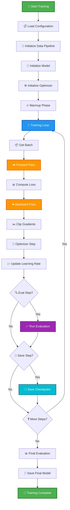

### Single Training Step Detail


---

## Model Architecture 🧠

### Transformer Layer Flow

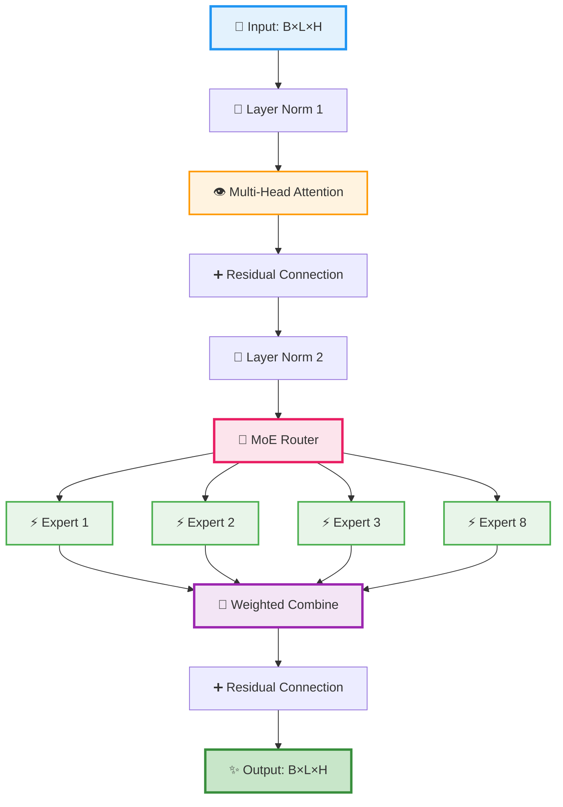

### Attention Mechanism Flow


---

## Expert Routing 🎯

### MoE Router Decision Flow

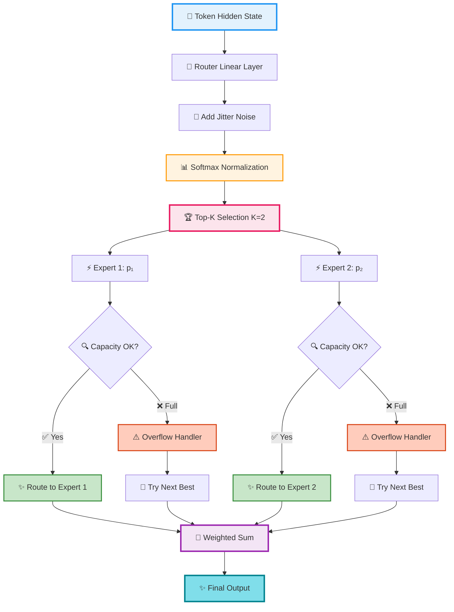

### Load Balancing Flow

```mermaid
graph LR
    A[📊 Router Probs] --> B[📈 Compute Expert Fractions]
    B --> C[📊 Compute Avg Probs]
    C --> D[⚖️ Balance Loss]
    D --> E[➕ Add to Total Loss]
    E --> F[⬅️ Backprop]
    F --> G[🔄 Update Router Weights]
    G --> H[✨ Balanced Routing]

    style A fill:#E3F2FD,stroke:#2196F3,stroke-width:2px
    style B fill:#FFF3E0,stroke:#FF9800,stroke-width:2px
    style C fill:#FCE4EC,stroke:#E91E63,stroke-width:2px
    style D fill:#F3E5F5,stroke:#9C27B0,stroke-width:3px
    style F fill:#FFCCBC,stroke:#D84315,stroke-width:2px
    style G fill:#C8E6C9,stroke:#388E3C,stroke-width:2px
    style H fill:#80DEEA,stroke:#00838F,stroke-width:3px
```

---

## Gradient Flow 📉

### Backward Pass and Update

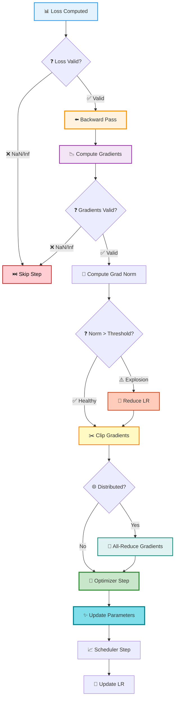

### Gradient Health Monitor

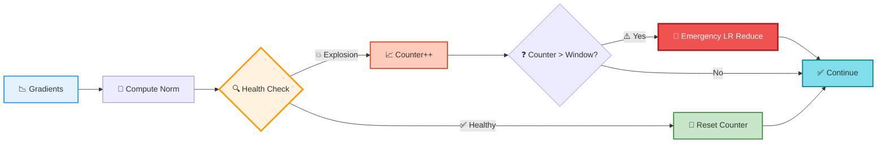

---

## Memory Management 💾

### GPU Memory Monitoring

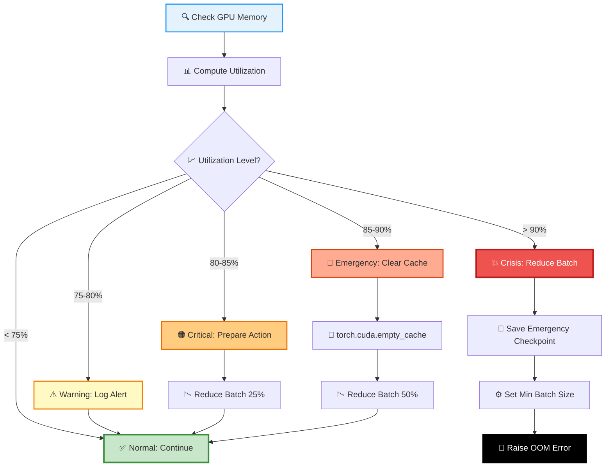

### OOM Recovery Strategy

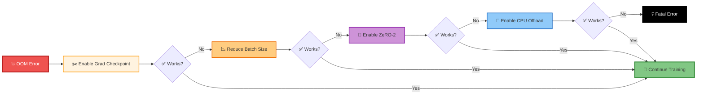

---

## Checkpoint Management 💾

### Save Checkpoint Flow

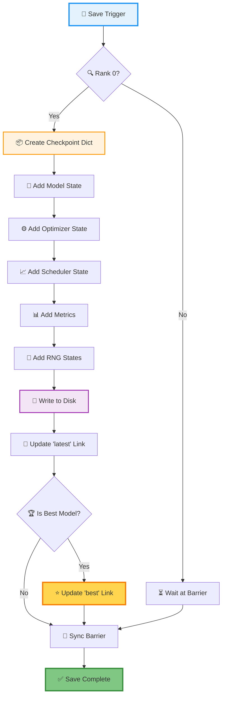

### Load Checkpoint Flow

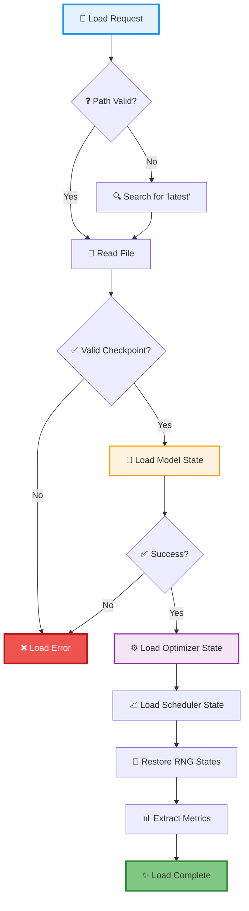

---

## Data Pipeline 📊

### Data Processing Flow

```mermaid
graph LR
    A[📁 Raw Files] --> B[🔍 Format Detection]
    B --> C[📖 Load Data]
    C --> D[✅ Validation]
    D --> E[🔬 Quality Filters]
    E --> F[🔤 Tokenization]
    F --> G[📦 Batching]
    G --> H[🔄 DataLoader]

    style A fill:#E3F2FD,stroke:#2196F3,stroke-width:2px
    style B fill:#FFF3E0,stroke:#FF9800,stroke-width:2px
    style C fill:#FCE4EC,stroke:#E91E63,stroke-width:2px
    style D fill:#F3E5F5,stroke:#9C27B0,stroke-width:2px
    style E fill:#E8F5E9,stroke:#4CAF50,stroke-width:2px
    style F fill:#FFF9C4,stroke:#FBC02D,stroke-width:2px
    style G fill:#E0F2F1,stroke:#009688,stroke-width:2px
    style H fill:#C8E6C9,stroke:#388E3C,stroke-width:3px
```

### Format Detection

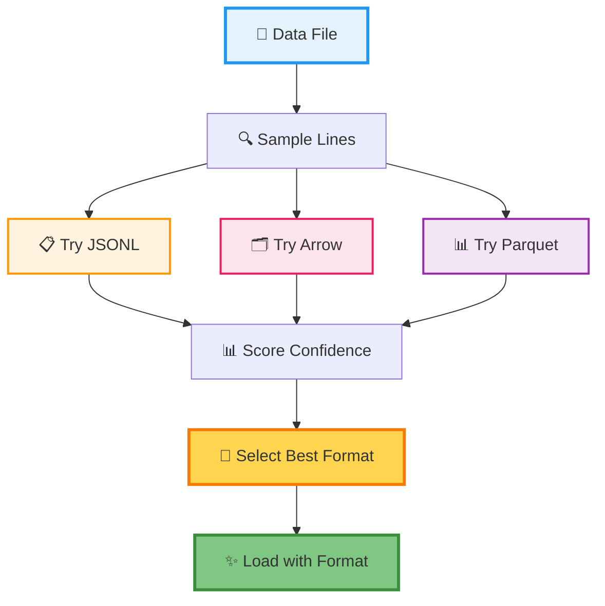

---

## Adaptive Learning Rate 📈

### LR Adjustment Flow

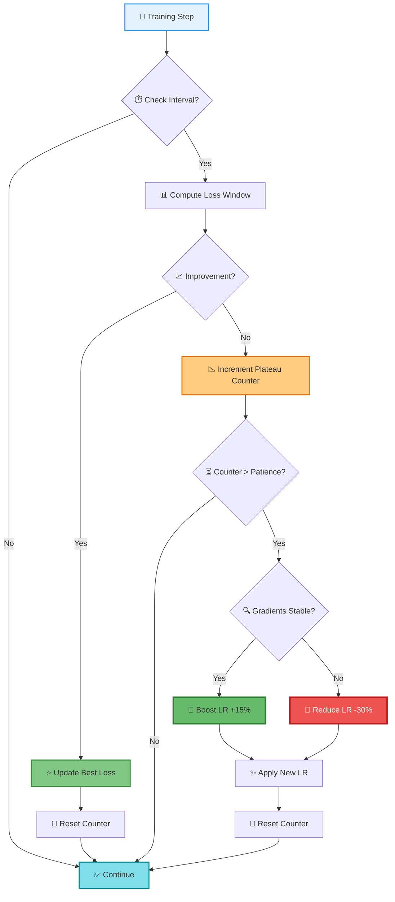

### LR Schedule Visualization

```mermaid
graph LR
    A[📍 Step 0] --> B[🔥 Warmup Phase]
    B --> C[🎯 Peak LR]
    C --> D[📉 Cosine Decay]
    D --> E[🔄 Restart 1]
    E --> F[🎯 Peak LR]
    F --> G[📉 Cosine Decay]
    G --> H[🏁 Final LR]

    style A fill:#E3F2FD,stroke:#2196F3,stroke-width:2px
    style B fill:#FFAB91,stroke:#D84315,stroke-width:2px
    style C fill:#FFD54F,stroke:#F57C00,stroke-width:3px
    style D fill:#90CAF9,stroke:#1565C0,stroke-width:2px
    style E fill:#CE93D8,stroke:#8E24AA,stroke-width:2px
    style F fill:#FFD54F,stroke:#F57C00,stroke-width:3px
    style G fill:#90CAF9,stroke:#1565C0,stroke-width:2px
    style H fill:#81C784,stroke:#388E3C,stroke-width:3px
```

---

## RLHF Training 🤖

### PPO Training Loop

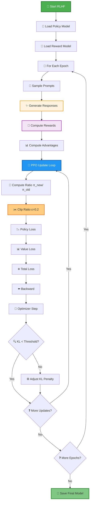

---

## Evaluation & Testing ✅

### Evaluation Flow

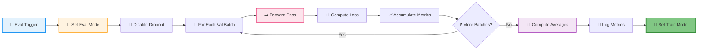

### Generation Quality Testing

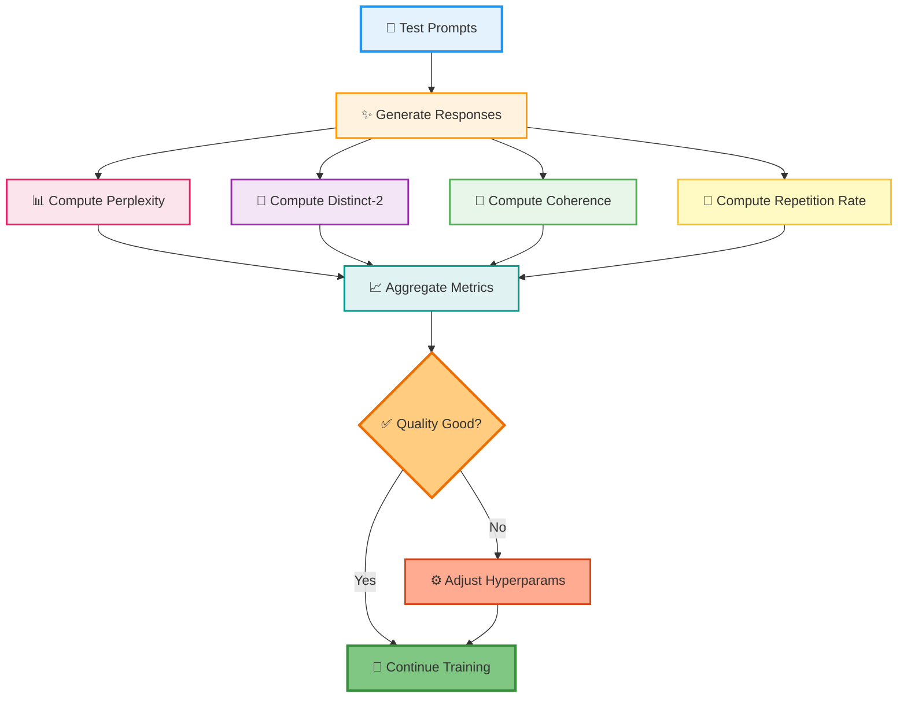

---

## Multi-GPU Training 🌐

### Distributed Training Flow

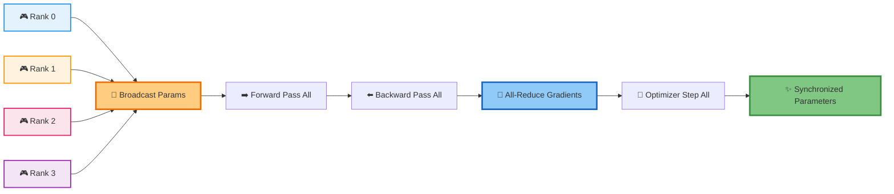

### DeepSpeed ZeRO Stages

```mermaid
graph TD
    A[📊 Standard DP] --> B[💾 All GPUs: Full Model Copy]

    C[⚡ ZeRO-1] --> D[🔧 Shard Optimizer States]

    E[⚡ ZeRO-2] --> F[🔧 Shard Optimizer + Gradients]

    G[⚡ ZeRO-3] --> H[🔧 Shard All States]

    B --> I[🔴 High Memory Usage]
    D --> J[🟡 Lower Memory]
    F --> K[🟢 Even Lower Memory]
    H --> L[🟢 Lowest Memory]

    style A fill:#FFCDD2,stroke:#C62828,stroke-width:2px
    style C fill:#FFF9C4,stroke:#F57C00,stroke-width:2px
    style E fill:#C8E6C9,stroke:#388E3C,stroke-width:2px
    style G fill:#80DEEA,stroke:#00838F,stroke-width:2px
    style I fill:#EF5350,stroke:#B71C1C,stroke-width:2px,color:#fff
    style J fill:#FFD54F,stroke:#F57C00,stroke-width:2px
    style K fill:#81C784,stroke:#388E3C,stroke-width:2px
    style L fill:#4DD0E1,stroke:#00838F,stroke-width:3px
```

---

## Error Recovery 🚨

### Error Handling Flow

```mermaid
graph TD
    A[⚠️ Error Detected] --> B{🔍 Error Type?}

    B -->|💥 NaN Loss| C[⏭️ Skip Step & Log]
    B -->|📈 Grad Explosion| D[🔻 Reduce LR & Clip]
    B -->|💾 OOM| E[🧹 Clear Cache & Reduce Batch]
    B -->|📁 Data Error| F[⏭️ Skip File & Continue]
    B -->|🌐 Network Error| G[🔄 Retry Connection]

    C --> H{📊 Frequency?}
    D --> H
    E --> H
    F --> H
    G --> H

    H -->|🟢 Rare| I[✅ Resume Training]
    H -->|🔴 Frequent| J[⚙️ Adjust Config]
    J --> I

    style A fill:#EF5350,stroke:#B71C1C,stroke-width:3px,color:#fff
    style C fill:#FFCC80,stroke:#EF6C00,stroke-width:2px
    style D fill:#FFAB91,stroke:#D84315,stroke-width:2px
    style E fill:#CE93D8,stroke:#8E24AA,stroke-width:2px
    style F fill:#90CAF9,stroke:#1565C0,stroke-width:2px
    style G fill:#80CBC4,stroke:#00695C,stroke-width:2px
    style I fill:#81C784,stroke:#388E3C,stroke-width:3px
```

---

## Legend 📖

### Color Coding System

```mermaid
graph LR
    A[🔵 Input/Start] --> B[🟠 Processing]
    B --> C[🟣 Computation]
    C --> D[🟢 Success/Output]

    E[🟡 Warning] --> F[🔴 Critical/Error]

    style A fill:#E3F2FD,stroke:#2196F3,stroke-width:2px
    style B fill:#FFF3E0,stroke:#FF9800,stroke-width:2px
    style C fill:#F3E5F5,stroke:#9C27B0,stroke-width:2px
    style D fill:#C8E6C9,stroke:#388E3C,stroke-width:3px
    style E fill:#FFF9C4,stroke:#F57C00,stroke-width:2px
    style F fill:#FFCDD2,stroke:#C62828,stroke-width:2px
```

### Icon Legend

- 🚀 Start/Launch
- 🔄 Loop/Cycle
- ✅ Success/Complete
- ❌ Error/Failure
- ⚠️ Warning
- 📊 Metrics/Data
- 🧠 Model/Intelligence
- ⚙️ Settings/Config
- 💾 Storage/Memory
- 🔍 Check/Verify
- ✨ Output/Result
- 🎯 Target/Goal
- 📈 Increase/Up
- 📉 Decrease/Down
- 🔧 Tool/Optimization
- ⚡ Fast/Expert
- 🎨 Combination
- 💥 Explosion/Critical
- 🌐 Network/Distributed

---

## Summary

These beautiful, color-coded flowcharts provide clear visualizations of all major Ava training framework components with an intuitive color scheme:

- **Blue** 🔵: Input, initialization, and starting points
- **Orange** 🟠: Processing and transformation steps
- **Purple** 🟣: Computation and analysis
- **Green** 🟢: Success, completion, and outputs
- **Yellow** 🟡: Warnings and attention points
- **Red** 🔴: Errors and critical situations

Each flowchart uses emojis for quick visual recognition and makes complex training workflows easy to understand at a glance! 🎉
