# Quick Reference Guide

**Fast Decision Trees & Cheat Sheets for Common Tasks**

---

## Table of Contents

1. [Training Setup](#training-setup)
2. [Optimizer Selection](#optimizer-selection)
3. [Configuration Choice](#configuration-choice)
4. [Loss Function Setup](#loss-function-setup)
5. [Generation Strategy](#generation-strategy)
6. [Troubleshooting](#troubleshooting)
7. [Command Cheat Sheet](#command-cheat-sheet)

---

## Training Setup

### Quick Start Decision Tree

```mermaid
flowchart TD
    Start([Start Training]) --> Q1{Have GPU?}

    Q1 -->|No| CPU[❌ Not Recommended<br/>Use tiny config<br/>for testing only]
    Q1 -->|Yes| Q2{Which GPU?}

    Q2 -->|Consumer<br/>4-16GB| Small["✅ Small Setup<br/>python train.py<br/>--config gpu/small.yaml"]
    Q2 -->|A100 40/80GB| A100["⭐ A100 Setup<br/>python train.py<br/>--config gpu/base.yaml<br/>--hardware_config hardware/a100_80gb.yaml"]
    Q2 -->|H100 80GB| H100["🚀 H100 Setup<br/>python train.py<br/>--config gpu/large.yaml<br/>--hardware_config hardware/h100_80gb.yaml"]

    Q2 --> Q3{Multiple<br/>GPUs?}

    Q3 -->|No| Single[Single GPU<br/>Training]
    Q3 -->|Yes| Multi{How many?}

    Multi -->|2-4| Z1["deepspeed train.py<br/>--distributed_config<br/>distributed/deepspeed_zero1.yaml"]
    Multi -->|4-8| Z2["deepspeed train.py<br/>--distributed_config<br/>distributed/deepspeed_zero2.yaml"]
    Multi -->|8+| Z3["deepspeed train.py<br/>--distributed_config<br/>distributed/deepspeed_zero3.yaml"]

    style H100 fill:#c8e6c9
    style A100 fill:#fff3e0
    style Z2 fill:#f3e5f5
```



---

## Optimizer Selection

### Quick Optimizer Decision

```mermaid
flowchart LR
    Start([Choose<br/>Optimizer]) --> Goal{Primary<br/>Goal?}

    Goal -->|Speed| Lion["🦁 Lion<br/>lr=1e-4<br/>wd=0.1"]
    Goal -->|Quality| Sophia["🧠 Sophia<br/>lr=2e-4<br/>wd=0.1"]
    Goal -->|Memory| AdaFactor["📊 AdaFactor<br/>lr=None<br/>adaptive"]
    Goal -->|Baseline| AdamW["AdamW<br/>lr=1e-3<br/>wd=0.01"]

    style Lion fill:#c8e6c9
    style Sophia fill:#fff3e0
```



### Optimizer Cheat Sheet

| Optimizer | Learning Rate | Weight Decay | Memory | Speed | Use Case |
|-----------|--------------|--------------|---------|-------|----------|
| **Lion** ⭐ | 1e-4 | 0.1 | 1x params | Fast | General, speed priority |
| **Sophia** | 2e-4 | 0.1 | 2x params | Medium | Best quality |
| **AdaFactor** | None (adaptive) | 0.0 | 0.5x params | Medium | Large models, memory-constrained |
| **AdamW** | 1e-3 | 0.01 | 2x params | Medium | Baseline, well-tested |

```python
# Lion (recommended)
from Ava.optimization import LionOptimizer
optimizer = LionOptimizer(model.parameters(), lr=1e-4, weight_decay=0.1)

# Sophia (best quality)
from Ava.optimization import SophiaOptimizer
optimizer = SophiaOptimizer(model.parameters(), lr=2e-4, weight_decay=0.1)

# AdaFactor (memory efficient)
from Ava.optimization import AdaFactorOptimizer
optimizer = AdaFactorOptimizer(model.parameters(), lr=None)
```

---

## Configuration Choice

### Configuration Matrix

| Hardware | Model Size | Config Command |
|----------|------------|----------------|
| **1x Consumer GPU** | Small | `--config gpu/small.yaml` |
| **1x A100 40GB** | Medium | `--config gpu/base.yaml --hardware_config hardware/a100_80gb.yaml` |
| **1x A100 80GB** | Large | `--config gpu/large.yaml --hardware_config hardware/a100_80gb.yaml` |
| **1x H100 80GB** | XL | `--config gpu/large.yaml --hardware_config hardware/h100_80gb.yaml` |
| **4x A100** | Large | `+ --distributed_config distributed/deepspeed_zero1.yaml` |
| **8x A100** | XL | `+ --distributed_config distributed/deepspeed_zero2.yaml` |
| **16+ GPUs** | XXL | `+ --distributed_config distributed/deepspeed_zero3.yaml` |

### Batch Size Quick Guide


**Gradient Accumulation Formula**:
```
effective_batch_size = batch_size × gradient_accumulation_steps × num_gpus

Example:
  batch_size = 4
  gradient_accumulation = 8
  num_gpus = 4
  → effective_batch_size = 128
```

---

## Loss Function Setup

### Loss Configuration Decision


### Loss Quick Setup

```python
from Ava.losses import UnifiedLoss

# 1. Standard LLM (RECOMMENDED)
loss_fn = UnifiedLoss(
    vocab_size=50257,
    primary_loss_type="deepseek",
    label_smoothing=0.1,
    use_ngram_penalty=True,
    use_immediate_repetition_penalty=True,
    eos_token_id=tokenizer.eos_token_id
)

# 2. MoE Model
loss_fn = UnifiedLoss(
    vocab_size=50257,
    num_experts=8,
    use_moe_balancing=True,
    gradient_balance_weight=0.1,
    use_diversity_loss=True
)

# 3. Anti-Repetition (for repetitive models)
loss_fn = UnifiedLoss(
    vocab_size=50257,
    ngram_penalty_weight=0.3,         # Higher
    immediate_repetition_weight=1.5,  # Much higher
    eos_penalty_weight=0.1,
    min_sequence_length=30
)
```

---

## Generation Strategy

### Generation Quick Decision

```mermaid
flowchart LR
    Start([Generate<br/>Text]) --> Goal{Goal?}

    Goal -->|Creative| Creative["Top-p Nucleus<br/>p=0.95<br/>temp=1.0<br/>rep_penalty=1.2"]

    Goal -->|Balanced| Balanced["⭐ Top-p<br/>p=0.92<br/>temp=0.8<br/>rep_penalty=1.2"]

    Goal -->|Factual| Factual["Beam Search<br/>num_beams=4<br/>or low temp<br/>temp=0.3"]

    Goal -->|Fast Debug| Greedy["Greedy<br/>do_sample=False"]

    style Balanced fill:#c8e6c9
    style Creative fill:#fff3e0
    style Factual fill:#f3e5f5
```



### Generation Cheat Sheet

| Use Case | Temperature | Top-p | Top-k | Rep. Penalty | Code |
|----------|------------|-------|-------|--------------|------|
| **Creative Writing** | 0.9-1.2 | 0.95 | 50 | 1.2 | Below ↓ |
| **Dialogue** ⭐ | 0.7-0.9 | 0.92 | 40 | 1.15 | Below ↓ |
| **Technical** | 0.3-0.5 | 0.88 | 25 | 1.1 | Below ↓ |
| **Code** | 0.2 | 0.85 | 20 | 1.0 | Below ↓ |
| **Factual QA** | 0.3 | 0.88 | 30 | 1.05 | Below ↓ |

**Dialogue (Recommended)**:
```python
outputs = model.generate(
    input_ids,
    max_length=200,
    do_sample=True,
    temperature=0.8,
    top_p=0.92,
    top_k=40,
    repetition_penalty=1.15,
    no_repeat_ngram_size=3
)
```

**Creative Writing**:
```python
outputs = model.generate(
    input_ids,
    max_length=500,
    do_sample=True,
    temperature=1.0,
    top_p=0.95,
    repetition_penalty=1.2
)
```

**Technical/Factual**:
```python
outputs = model.generate(
    input_ids,
    max_length=200,
    num_beams=4,
    do_sample=False,
    early_stopping=True,
    no_repeat_ngram_size=4
)
```

---

## Troubleshooting

### Quick Diagnostic Tree


### Error Code Quick Fix

| Error | Quick Fix | Command/Code |
|-------|-----------|--------------|
| **CUDA OOM** | Reduce batch size | `--batch_size 4 --gradient_accumulation_steps 8` |
| **Loss = NaN** | Lower LR, add clipping | `--learning_rate 1e-5 --max_gradient_norm 1.0` |
| **Slow training** | Increase batch, use Lion | `--batch_size 16` + Lion optimizer |
| **Config not found** | Check path | `ls configs/gpu/base.yaml` |
| **Import error** | Check installation | `pip install -e .` |
| **Data not found** | Verify data path | `ls /project/code/data/processed` |

---

## Command Cheat Sheet

### Training Commands

```bash
# ============================================================================
# BASIC TRAINING
# ============================================================================

# Tiny model (testing)
python code/scripts/5_training/train.py --config code/configs/gpu/tiny.yaml

# Base model (standard)
python code/scripts/5_training/train.py --config code/configs/gpu/base.yaml

# With hardware optimization (A100)
python code/scripts/5_training/train.py \
  --config code/configs/gpu/base.yaml \
  --hardware_config code/configs/hardware/a100_80gb.yaml

# With hardware optimization (H100)
python code/scripts/5_training/train.py \
  --config code/configs/gpu/large.yaml \
  --hardware_config code/configs/hardware/h100_80gb.yaml

# ============================================================================
# DISTRIBUTED TRAINING
# ============================================================================

# 4 GPUs with DeepSpeed ZeRO-1
deepspeed code/scripts/5_training/train.py \
  --config code/configs/gpu/base.yaml \
  --distributed_config code/configs/distributed/deepspeed_zero1.yaml \
  --num_gpus 4

# 8 GPUs with DeepSpeed ZeRO-2
deepspeed code/scripts/5_training/train.py \
  --config code/configs/gpu/base.yaml \
  --hardware_config code/configs/hardware/a100_80gb.yaml \
  --distributed_config code/configs/distributed/deepspeed_zero2.yaml \
  --num_gpus 8

# Multi-node (2 nodes, 16 GPUs total)
deepspeed --num_nodes 2 --num_gpus 8 code/scripts/5_training/train.py \
  --config code/configs/gpu/large.yaml \
  --distributed_config code/configs/distributed/deepspeed_zero3.yaml

# ============================================================================
# EVALUATION
# ============================================================================

# Evaluate checkpoint
python code/scripts/evaluation/evaluate.py \
  --checkpoint_path outputs/runs/run_20250103/checkpoint-10000 \
  --eval_dataset data/processed/val.jsonl

# Generate samples
python code/scripts/7_generation/generate.py \
  --checkpoint_path outputs/runs/run_20250103/checkpoint-10000 \
  --prompts "Once upon a time" "The future of AI is"

# Quick coherence test
python code/scripts/evaluation/measure_coherence.py \
  --checkpoint_path outputs/runs/run_20250103/checkpoint-10000

# ============================================================================
# RLHF TRAINING
# ============================================================================

# Train reward model
python code/scripts/6_rhlf_Finetuning/train_reward_model.py \
  --preference_data data/preferences.jsonl \
  --output_dir outputs/reward_models

# Run PPO training
python code/scripts/6_rhlf_Finetuning/train_rlhf.py \
  --model_path outputs/runs/run_20250103/checkpoint-10000 \
  --reward_model_path outputs/reward_models/best \
  --prompt_dataset data/prompts.jsonl

# ============================================================================
# LR FINDER
# ============================================================================

# Find optimal learning rate
python code/scripts/4_Find_Lr/run_lr_finder_enhanced.py \
  --config code/configs/gpu/base.yaml \
  --min_lr 1e-7 \
  --max_lr 1.0 \
  --num_steps 100

# ============================================================================
# UTILITIES
# ============================================================================

# Download & process data
python code/scripts/1_data_download/unified_download.py

# Test training setup (quick)
python code/scripts/5_training/train.py \
  --config code/configs/gpu/tiny.yaml \
  --max_steps 100

# Validate all checkpoints
python code/scripts/validation/test_all_latest_checkpoints.py

# Clean up old checkpoints
find code/outputs/runs -name "checkpoint-*" -type d -mtime +7 -exec rm -rf {} +
```

### Common Override Patterns

```bash
# Override batch size
--batch_size 32

# Override learning rate
--learning_rate 5e-5

# Override epochs
--num_epochs 20

# Override warmup
--warmup_steps 5000

# Multiple overrides
--batch_size 16 --learning_rate 3e-5 --num_epochs 15 --warmup_steps 3000

# Override precision
--mixed_precision bf16

# Override save frequency
--save_steps 500

# Override evaluation frequency
--eval_steps 250
```

### Python Code Snippets

```python
# ============================================================================
# QUICK TRAINING SETUP
# ============================================================================

from Ava.losses import UnifiedLoss
from Ava.optimization import LionOptimizer, OneCycleLR
from Ava.training import EnhancedTrainer

# Loss function
loss_fn = UnifiedLoss(
    vocab_size=50257,
    primary_loss_type="deepseek",
    use_ngram_penalty=True,
    eos_token_id=tokenizer.eos_token_id
)

# Optimizer (Lion recommended)
optimizer = LionOptimizer(
    model.parameters(),
    lr=1e-4,
    weight_decay=0.1
)

# LR Scheduler (OneCycle recommended)
scheduler = OneCycleLR(
    optimizer,
    max_lr=1e-3,
    total_steps=10000,
    pct_start=0.3
)

# Trainer
trainer = EnhancedTrainer(
    model=model,
    optimizer=optimizer,
    scheduler=scheduler,
    loss_fn=loss_fn,
    train_dataloader=train_loader,
    val_dataloader=val_loader
)

# Train
trainer.train(num_epochs=10)

# ============================================================================
# QUICK GENERATION
# ============================================================================

# Load model
from transformers import AutoModelForCausalLM, AutoTokenizer

model = AutoModelForCausalLM.from_pretrained("path/to/checkpoint")
tokenizer = AutoTokenizer.from_pretrained("path/to/tokenizer")

# Generate (recommended settings)
prompt = "Once upon a time"
inputs = tokenizer(prompt, return_tensors="pt").to(model.device)

outputs = model.generate(
    **inputs,
    max_length=200,
    do_sample=True,
    temperature=0.8,
    top_p=0.92,
    repetition_penalty=1.15,
    no_repeat_ngram_size=3
)

text = tokenizer.decode(outputs[0], skip_special_tokens=True)
print(text)

# ============================================================================
# QUICK EVALUATION
# ============================================================================

from Ava.evaluation import ComprehensiveEvaluator

evaluator = ComprehensiveEvaluator(model, tokenizer)
results = evaluator.evaluate(val_dataloader)

print(f"Perplexity: {results['perplexity']:.2f}")
print(f"Accuracy: {results['accuracy']:.2%}")
print(f"Coherence: {results['coherence']['overall']:.2f}")
```

---

## Summary

### Most Common Workflows

**1. Standard Training (Single A100)**
```bash
python code/scripts/5_training/train.py \
  --config code/configs/gpu/base.yaml \
  --hardware_config code/configs/hardware/a100_80gb.yaml
```

**2. Fast Training (Single H100)**
```bash
python code/scripts/5_training/train.py \
  --config code/configs/gpu/large.yaml \
  --hardware_config code/configs/hardware/h100_80gb.yaml
```

**3. Multi-GPU Training (8x A100)**
```bash
deepspeed code/scripts/5_training/train.py \
  --config code/configs/gpu/base.yaml \
  --hardware_config code/configs/hardware/a100_80gb.yaml \
  --distributed_config code/configs/distributed/deepspeed_zero2.yaml \
  --num_gpus 8
```

**4. Evaluation**
```bash
python code/scripts/evaluation/evaluate.py \
  --checkpoint_path outputs/runs/latest/checkpoint-best
```

**5. Generation**
```bash
python code/scripts/7_generation/generate.py \
  --checkpoint_path outputs/runs/latest/checkpoint-best \
  --temperature 0.8 \
  --top_p 0.92
```

### Key Recommendations

- ⭐ **Optimizer**: Use Lion for speed, Sophia for quality
- ⭐ **LR Scheduler**: OneCycleLR for fastest convergence
- ⭐ **Loss**: DeepSeek-style with n-gram penalties
- ⭐ **Generation**: Top-p nucleus (p=0.92, T=0.8)
- ⭐ **Precision**: FP8 on H100, BF16 on A100
- ⭐ **Distributed**: ZeRO-2 for 4-8 GPUs, ZeRO-3 for 8+

---

**Last Updated**: 2025-11-03
**Version**: 1.0.0
**Maintainer**: Ava AI Team
